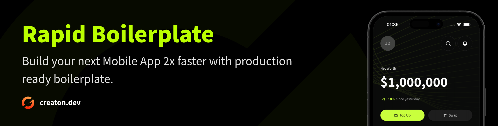

# 🚀 React Native Rapid Boilerplate

A production-ready React Native boilerplate with modern architecture and comprehensive UI components. Built with TypeScript, Redux Toolkit, NativeWind, and React Navigation.

## ✨ Key Features

- **🧩 Rich UI Components** - 13+ pre-built components (Button, Input, Avatar, Badge, Checkbox, Switch, etc.)
- **📝 Form System** - Complete form management inspired by react-hook-form & shadcn/ui
- **🌍 Internationalization** - Multi-language support with react-i18next (English, Vietnamese)
- **🎨 Theme System** - Dark/Light mode with automatic detection and 100+ color tokens
- **📱 Type-safe Navigation** - React Navigation 7 with TypeScript integration
- **💾 MMKV Storage** - High-performance storage (10x faster than AsyncStorage)
- **🎯 Form Validation** - Zod schemas with TypeScript integration
- **🔄 Redux Toolkit** - State management with persistence
- **🎭 Animations** - Smooth animations with Reanimated 3
- **🛠️ Developer Tools** - ESLint, TypeScript, path aliases, custom hooks


## 📝 Guidance
- See [Translation Script](scripts/translator/readme.md) for more information. Guidance on how to use the translation script and customize it for your needs.
- See [Fastlane Docs](fastlane/README.md) for more information. Guidance on how to use Fastlane to automate play store deployment.
- See [XCode Cloud Docs](ios/README.md) to learn how to configure XCode Cloud for iOS CI/CD.

## 🚀 Quick Start

### Installation

```bash
# Clone and install
git clone <your-repo-url>
cd react-native-boilerplate
yarn install

# iOS setup
cd ios && bundle install && bundle exec pod install && cd ..

# Start development
yarn start
yarn android  # or yarn ios
```

### Change App Name and Bundle ID

Use `react-native-rename` to rename your app:

```bash
# Rename your app
npx react-native-rename "Your App Name" -b com.yourcompany.yourapp

# Yarn install to update workspace
yarn install

# For iOS, you may need to run pod install again
cd ios && bundle exec pod install && cd ..
```

### Change App Icon

Use `rn-app-icons` to generate app icons from a single source image:

```bash
# Generate icons from your source image
npx rn-app-icons --input ./path/to/your-icon.png
```

See [rn-app-icons documentation](https://www.npmjs.com/package/rn-app-icons) for more options.


## 📦 Tech Stack

**Core:** React Native 0.80, TypeScript 5.0, React 19.1
**State:** Redux Toolkit, MMKV Storage, Redux Persist
**Navigation:** React Navigation 7 (Stack + Tabs)
**Styling:** NativeWind 4, Tailwind CSS, Class Variance Authority
**UI:** Lucide Icons, React Native SVG, Reanimated 3
**i18n:** react-i18next, react-native-localize
**Validation:** Zod schemas
**Tools:** ESLint, Babel, Metro

## 🎣 Custom Hooks

- `useColors()` - Theme-aware color access
- `useInsets()` - Safe area insets management
- `useAppState()` - App foreground/background state
- `useAsyncStorage()` - MMKV storage with React state sync
- `useDebounce()` - Value debouncing for search/input
- `useForm()` - Form management with Zod validation
- `usePrevious()` - Previous state value access
- `useTranslation()` - i18n translation
- `useToast()` - Toast notification management
- `useDialog()` - Dialog management

## 📄 License

MIT License - see [LICENSE](LICENSE) file for details.

---

**Ready to build something amazing? Start customizing this boilerplate for your next project!**
