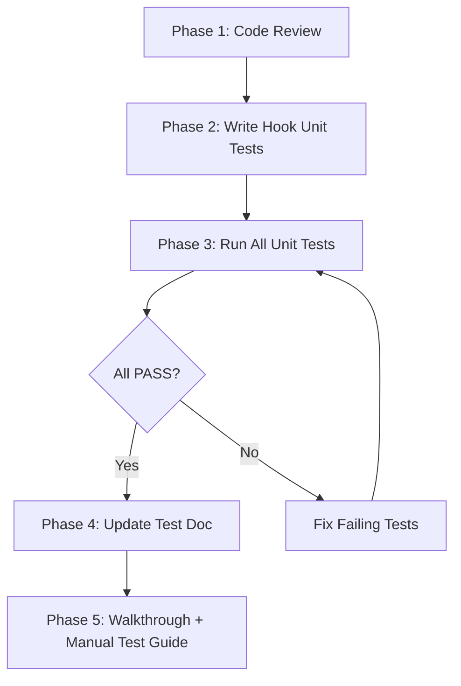

# 📖 Plan: Reading Feature — Code Review & Test Verification

> **Mục đích:** Review code và kiểm tra toàn bộ Reading feature đáp ứng 108+ test cases  
> **Skills áp dụng:** `testing-patterns`, `tdd-workflow`, `webapp-testing`  
> **Agent:** `project-planner` + `debugger`  
> **Date:** 2026-02-19

---

## 📊 Hiện Trạng

### Source Files (9 files)

| File | Lines | Đánh giá |
|------|-------|----------|
| [useReadingStore.ts](file:///Users/thanhvuqlud/ThanhData/CODE/StudyLanguage/apps/mobile/src/store/useReadingStore.ts) | 107 | ✅ Clean, đủ state |
| [reading.ts](file:///Users/thanhvuqlud/ThanhData/CODE/StudyLanguage/apps/mobile/src/services/api/reading.ts) | 236 | ✅ 7 API functions, mapper |
| [ConfigScreen.tsx](file:///Users/thanhvuqlud/ThanhData/CODE/StudyLanguage/apps/mobile/src/screens/reading/ConfigScreen.tsx) | 258 | Cần review |
| [ArticleScreen.tsx](file:///Users/thanhvuqlud/ThanhData/CODE/StudyLanguage/apps/mobile/src/screens/reading/ArticleScreen.tsx) | 654 | 🔍 File lớn nhất, cần review kỹ |
| [PracticeScreen.tsx](file:///Users/thanhvuqlud/ThanhData/CODE/StudyLanguage/apps/mobile/src/screens/reading/PracticeScreen.tsx) | 399 | Cần review |
| [useReadingPractice.ts](file:///Users/thanhvuqlud/ThanhData/CODE/StudyLanguage/apps/mobile/src/hooks/useReadingPractice.ts) | 204 | ⚠️ **Chưa có unit test** |
| [useTtsReader.ts](file:///Users/thanhvuqlud/ThanhData/CODE/StudyLanguage/apps/mobile/src/hooks/useTtsReader.ts) | 188 | ⚠️ **Chưa có unit test** |
| [usePinchZoom.ts](file:///Users/thanhvuqlud/ThanhData/CODE/StudyLanguage/apps/mobile/src/hooks/usePinchZoom.ts) | 88 | ⚠️ **Chưa có unit test** |
| [ReadingStack.tsx](file:///Users/thanhvuqlud/ThanhData/CODE/StudyLanguage/apps/mobile/src/navigation/stacks/ReadingStack.tsx) | 34 | ✅ Simple, đúng 3 screens |

### Unit Tests Hiện Tại (42/42 ✅)

| File | Tests | Coverage |
|------|-------|----------|
| [useReadingStore.test.ts](file:///Users/thanhvuqlud/ThanhData/CODE/StudyLanguage/apps/mobile/src/__tests__/store/useReadingStore.test.ts) | 24 | Store state: config, article, error, fontSize, savedWords, focusMode, articleSaved, reset |
| [readingApi.test.ts](file:///Users/thanhvuqlud/ThanhData/CODE/StudyLanguage/apps/mobile/src/__tests__/services/readingApi.test.ts) | 18 | API: generateArticle, saveWord, getSavedWords, deleteWord, analyzePractice, saveReadingSession |

### Test Scenarios từ [04_reading_tests.md](file:///Users/thanhvuqlud/ThanhData/CODE/StudyLanguage/docs/tests/mobile/04_reading_tests.md)

| Loại | Số lượng | Trạng thái |
|------|----------|------------|
| Unit Tests (Jest) | 42 | ✅ 42/42 passed |
| Smoke Tests (Manual) | 8 | 🔲 0% |
| Enhanced Feature Tests (Manual) | 32 | 🔲 0% |
| Monkey Tests (Free-form) | 14 | 🔲 0% |
| Edge Case Tests (Manual) | 12 | 🔲 0% |

> [!IMPORTANT]
> **3 hooks chưa có unit tests** — đây là khoảng trống lớn nhất. `useReadingPractice`, `useTtsReader`, `usePinchZoom` chứa core logic nhưng chỉ được test gián tiếp qua manual testing.

---

## Proposed Changes

### Component 1: Code Review — Kiểm tra code vs test specs

Không thay đổi file, chỉ audit logic trong code so với expected behavior trong test document.

#### Mục tiêu review

| Screen/Hook | Test IDs cần đối chiếu | Focus |
|-------------|------------------------|-------|
| `ConfigScreen.tsx` | FT-RCFG-01 → 07 | Validation, error handling, chip selection |
| `ArticleScreen.tsx` | SMK-R01→08, FT-TTS-01→06, FT-FOC-01→05, FT-PZ-01→05, FT-HL-01→03, FT-DS-01→04, FT-DA-01→02 | TTS, Focus Mode, Pinch, Highlight, Save |
| `PracticeScreen.tsx` | FT-RP-01→12 | Record, STT, AI Analysis, Navigation |
| `useReadingPractice.ts` | FT-RP-02→05, FT-RP-11→12 | State machine: idle→recording→analyzing→result |
| `useTtsReader.ts` | FT-TTS-01→06 | Play/pause/stop, paragraph tracking |
| `usePinchZoom.ts` | FT-PZ-01→05 | Min/max boundaries, scale calculation |

---

### Component 2: Hook Unit Tests (NEW files)

#### [NEW] [useReadingPractice.test.ts](file:///Users/thanhvuqlud/ThanhData/CODE/StudyLanguage/apps/mobile/src/__tests__/hooks/useReadingPractice.test.ts)

**Estimated: ~12-15 tests**

| # | Test Group | Cases | Maps to Test IDs |
|---|-----------|-------|------------------|
| 1 | Initial state | phase='idle', transcript='', result=null | — |
| 2 | startRecording | phase→'recording', isRecording=true, Voice.start called | FT-RP-02 |
| 3 | onSpeechResults | transcript cập nhật realtime | FT-RP-03 |
| 4 | stopRecording → analyzing → result | phase transitions, API called | FT-RP-04, FT-RP-05 |
| 5 | stopRecording empty transcript | error set, phase→'idle' | FT-RP-11 |
| 6 | API analyze fail | error set, phase→'idle' | FT-RP-12 |
| 7 | resetPractice | all state reset, Voice.cancel called | FT-RP-07 |
| 8 | Voice.start fail (no permission) | error message, phase→'idle' | FT-RP-11 |

**Mock strategy:** `jest.mock('@react-native-voice/voice')`, `jest.mock('@/services/api/reading')`

---

#### [NEW] [useTtsReader.test.ts](file:///Users/thanhvuqlud/ThanhData/CODE/StudyLanguage/apps/mobile/src/__tests__/hooks/useTtsReader.test.ts)

**Estimated: ~10-12 tests**

| # | Test Group | Cases | Maps to Test IDs |
|---|-----------|-------|------------------|
| 1 | Initial state | isReading=false, isPaused=false, index=-1 | — |
| 2 | play() | isReading=true, Tts.speak called, index=0 | FT-TTS-01 |
| 3 | pause() | Tts.stop called, isPaused=true | FT-TTS-02 |
| 4 | resume after pause | Tts.speak resumed at correct index | FT-TTS-02 |
| 5 | stop() | full reset, Tts.stop called | FT-TTS-05 |
| 6 | auto-advance (tts-finish event) | index increments, next paragraph spoken | FT-TTS-03, FT-TTS-04 |
| 7 | finish last paragraph | isReading=false, index reset | — |
| 8 | skipTo(n) | index=n, Tts.speak(paragraphs[n]) | — |
| 9 | play() with empty paragraphs | no-op | Edge |

**Mock strategy:** `jest.mock('react-native-tts')`

---

#### [NEW] [usePinchZoom.test.ts](file:///Users/thanhvuqlud/ThanhData/CODE/StudyLanguage/apps/mobile/src/__tests__/hooks/usePinchZoom.test.ts)

**Estimated: ~6-8 tests**

| # | Test Group | Cases | Maps to Test IDs |
|---|-----------|-------|------------------|
| 1 | onPinchStart | baseFontSize captured | — |
| 2 | onPinchUpdate scale > 1 | fontSize increases | FT-PZ-01 |
| 3 | onPinchUpdate scale < 1 | fontSize decreases | FT-PZ-02 |
| 4 | Max boundary (28) | fontSize clamped at 28 | FT-PZ-03 |
| 5 | Min boundary (12) | fontSize clamped at 12 | FT-PZ-03 |
| 6 | Same value no-op | setFontSize not called if unchanged | Performance |

**Mock strategy:** `jest.mock('@/store/useReadingStore')` — mock `getState()` and `setFontSize`

---

### Component 3: Cập nhật Test Document

#### [MODIFY] [04_reading_tests.md](file:///Users/thanhvuqlud/ThanhData/CODE/StudyLanguage/docs/tests/mobile/04_reading_tests.md)

- Cập nhật unit test count: 42 → ~72 (sau khi thêm hook tests)
- Cập nhật coverage table

---

## Verification Plan

### Automated Tests

**Chạy toàn bộ unit tests:**
```bash
cd apps/mobile && npx jest --testPathPatterns="useReadingStore|readingApi|useReadingPractice|useTtsReader|usePinchZoom" --verbose
```

**Chạy riêng tests mới:**
```bash
cd apps/mobile && npx jest --testPathPatterns="useReadingPractice|useTtsReader|usePinchZoom" --verbose
```

**Expected:**
- 42 tests cũ: tất cả PASS (regression check)
- ~28-35 tests mới: tất cả PASS
- Total: ~70-77 tests

---

### Manual Test Execution (Yêu cầu device thật hoặc simulator)

> [!WARNING]
> Manual tests (66 scenarios) **cần anh zai chạy trên device**. Huynh đệ sẽ tạo checklist chi tiết trong walkthrough sau khi hoàn thành code review + unit tests.

**Smoke Tests (8 items — ~5 phút):**
1. SMK-R01→08: Luồng cơ bản Config → Generate → Read → Practice → Back

**Enhanced Features (32 items — ~30 phút):**
- TTS Auto-Read (6 tests)
- Focus Mode (5 tests)
- Pinch-to-Zoom (5 tests)
- Highlight Saved Vocabulary (3 tests)
- Direct Save to History (4 tests)
- Dictionary Audio (2 tests)
- Reading Practice (12 tests)

**Monkey Tests (14 items — ~15 phút):**
- Spam taps, interrupts, mode combinations

**Edge Cases (12 items — ~15 phút):**
- Dark mode, iPad, slow network, boundary conditions

---

## Execution Order



---

## Timeline Estimate

| Phase | Thời gian | Output |
|-------|-----------|--------|
| Code Review | ~15 phút | Findings report |
| Hook Unit Tests | ~25 phút | 3 new test files (~30 tests) |
| Run & Fix Tests | ~10 phút | All green |
| Update Docs | ~5 phút | Updated 04_reading_tests.md |
| Walkthrough | ~5 phút | walkthrough.md |
| **Total** | **~60 phút** | |
