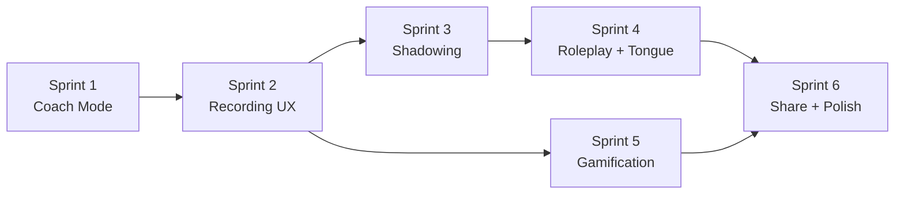

# 🗣️ Speaking Feature - Complete Implementation Plan

> **Mục tiêu:** Triển khai toàn bộ tính năng Speaking còn thiếu (18 Enhanced + 12 Advanced + 1 MVP)
> **Chia thành:** 6 Sprint, mỗi sprint ~1 tuần
> **Stack:** React Native CLI + NativeWind + Zustand + TanStack Query

---

## API Coverage Analysis

### ✅ Backend API ĐÃ CÓ (không cần bổ sung)

| Endpoint | Method | Dùng cho |
|----------|--------|----------|
| `/ai/transcribe` | POST | STT — Whisper transcribe audio → text |
| `/conversation-generator/continue-conversation` | POST | Coach Mode — AI phản hồi hội thoại |
| `/conversation-generator/generate-scenario-conversation` | POST | Roleplay — sinh hội thoại theo scenario |
| `/conversation-generator/generate-interactive-conversation` | POST | Roleplay — hội thoại có `[YOUR_TURN]` markers |
| `/conversation-generator/evaluate-pronunciation` | POST | Chấm điểm phát âm word-by-word |
| `/conversation-generator/generate-text` | POST | Sinh câu practice |
| `/speaking/tongue-twisters?level=` | GET | Tongue Twister Mode |
| `/speaking/stats` | GET | Speaking stats |
| `/speaking/voice-clone` | POST | AI Voice Clone (skeleton) |
| `/custom-scenarios` | CRUD | Custom Scenarios (dùng chung Listening/Speaking via `category`) |
| `/ai/generate-conversation-audio` | POST | TTS cho AI response |

### ⚠️ Backend API CẦN BỔ SUNG

| Endpoint cần thêm | Method | Mục đích | Effort |
|--------------------|--------|----------|--------|
| `/speaking/sessions` | POST | Lưu coach session vào history | 4h |
| `/speaking/sessions/:id` | GET | Lấy coach session transcript | 2h |
| `/speaking/progress` | GET | Radar chart data (pronunciation/fluency/vocab/grammar) | 4h |
| `/speaking/daily-goal` | GET/PATCH | Lấy/cập nhật daily speaking goal | 2h |
| `/speaking/badges` | GET | Lấy badges đã unlock | 2h |
| `/speaking/weak-sounds` | GET | Thống kê phoneme yếu | 3h |
| `/speaking/shadowing/compare` | POST | So sánh pitch/tempo user vs AI | 6h |
| `/speaking/weekly-report` | GET | Weekly speaking report | 3h |

> **Tổng effort API bổ sung: ~26h** (có thể implement song song với mobile)

---

## Sprint Breakdown

---

### 🏃 Sprint 1: Conversation Coach (Enhanced Core)

**Mục tiêu:** Hoàn thành Conversation Coach — tính năng lớn nhất

#### Screens mới

##### [NEW] `screens/speaking/CoachSetupScreen.tsx`
- Topic dropdown (Tình huống hằng ngày, Kinh doanh, Du lịch, v.v.)
- Duration selector: chip row (3, 5, 10, 15, 20 min)
- Feedback mode: radio group (Beginner / Intermediate / Advanced)
- CTA "🗣️ Bắt đầu nói"
- Glassmorphism card style matching app theme

##### [NEW] `screens/speaking/CoachSessionScreen.tsx`
- Chat UI: AI bubbles (left) + User bubbles (right)
- Timer countdown ở header (auto-end khi hết)
- Voice/Text input toggle ở bottom bar
- Hold-to-record khi voice mode (reuse pattern từ PracticeScreen)
- Voice Visualizer: animated waveform khi recording
- Pronunciation Alert cards inline giữa messages
- Grammar Fix cards inline
- Suggested Responses (2-3 chips cho beginner mode)
- "Nói lại" button trên user bubbles
- Auto-scroll khi có message mới

#### Components mới

##### [NEW] `components/speaking/VoiceVisualizer.tsx`
- Animated waveform bars (react-native-reanimated)
- Input: `isRecording: boolean`, `audioLevel: number`
- Dark/light theme aware

##### [NEW] `components/speaking/ChatBubble.tsx`
- Role-based (AI / User)
- Props: `message`, `audioUrl?`, `onReSpeak?`
- AI bubble: có 🔊 play button
- User bubble: có "Nói lại" button

##### [NEW] `components/speaking/PronunciationAlert.tsx`
- Inline card: word, IPA, tip
- Orange/yellow accent color, compact

##### [NEW] `components/speaking/GrammarFix.tsx`
- Inline card: original → corrected, explanation
- Blue accent, expandable

##### [NEW] `components/speaking/SuggestedResponses.tsx`
- Horizontal chip list: 2-3 suggestions
- Tap → auto-fill text input

#### Store changes

##### [MODIFY] `store/useSpeakingStore.ts`
- Thêm `coachSession` state: setup, messages[], remainingTime, inputMode
- Thêm actions: `addMessage`, `setInputMode`, `tickTimer`, `endSession`

#### Navigation changes

##### [MODIFY] `navigation/stacks/SpeakingStack.tsx`
- Thêm routes: `CoachSetup`, `CoachSession`

#### API changes (mobile)

##### [MODIFY] `services/api/speaking.ts`
- Thêm `continueConversation()` — gọi `/conversation-generator/continue-conversation`
- Thêm `generateCoachAudio()` — gọi `/ai/generate-conversation-audio`

---

### 🏃 Sprint 2: Recording UX, Custom Scenarios & Haptic

**Mục tiêu:** Polish recording UX + Custom Scenarios + Haptic feedback

#### Screen changes

##### [MODIFY] `screens/speaking/PracticeScreen.tsx`
- Thêm Countdown animation (3→2→1→GO!) trước khi ghi
- Thêm Swipe-to-cancel gesture (vuốt lên)
- Thêm Preview before submit (nghe lại → gửi hoặc ghi lại)
- Thêm IPA toggle + Word stress display
- Thêm Tap-to-pronounce word (popup IPA + audio)
- Tích hợp haptic feedback (start/stop/score)

##### [NEW] `screens/speaking/CustomScenariosScreen.tsx`
- List saved scenarios (FlatList)
- Create form: name + description
- Quick Use / Save toggle
- Favorite toggle, Delete with swipe
- Reuse pattern từ Listening CustomScenarios (nếu có)

#### Components mới

##### [NEW] `components/speaking/CountdownOverlay.tsx`
- Fullscreen overlay: 3 → 2 → 1 → GO!
- Animated scale + fade (react-native-reanimated)
- Haptic on each number

##### [NEW] `components/speaking/RecordingPreview.tsx`
- Mini player: play/pause recorded audio
- Progress bar
- Buttons: "Ghi lại" / "Gửi"

##### [NEW] `components/speaking/IPAPopup.tsx`
- Modal/Tooltip: word + IPA + audio play
- Trigger: tap any word in sentence

#### Navigation changes

##### [MODIFY] `navigation/stacks/SpeakingStack.tsx`
- Thêm route: `CustomScenarios`

---

### 🏃 Sprint 3: Shadowing Mode & Waveform Comparison

**Mục tiêu:** Shadowing Mode + enhanced feedback screen

#### Screens mới

##### [NEW] `screens/speaking/ShadowingScreen.tsx`
- Sentence display
- AI playback: waveform bar + progress
- Simultaneous record: waveform bar bên dưới
- Delay control: chip row (0s, 0.5s, 1s, 2s)
- Speed control: chip row (0.5x, 1.0x, 1.5x)
- Score breakdown: Rhythm / Intonation / Accuracy (star rating)
- Repeat / Bắt đầu Shadow buttons

#### Screen changes

##### [MODIFY] `screens/speaking/FeedbackScreen.tsx`
- Thêm Phoneme Heatmap section
- Thêm AI Voice Clone Before/After (2 play buttons)
- Thêm Confetti animation khi score ≥ 90
- Thêm "Luyện âm này" button cho weak words
- Thêm Share result card button

#### Components mới

##### [NEW] `components/speaking/WaveformComparison.tsx`
- Dual waveform bars: AI (top) + User (bottom)
- Overlay mode toggle
- Play buttons per track

##### [NEW] `components/speaking/PhonemeHeatmap.tsx`
- Grid: phoneme symbols + colored dots (🟢🟡🔴)
- Tap phoneme → navigate to practice

##### [NEW] `components/speaking/ScoreBreakdown.tsx`
- Row: label + star rating (1-5 stars)
- Animated fill

##### [NEW] `components/speaking/ConfettiAnimation.tsx`
- Lottie animation hoặc react-native-reanimated particles
- Trigger khi score ≥ 90

#### Navigation changes

##### [MODIFY] `navigation/stacks/SpeakingStack.tsx`
- Thêm route: `Shadowing`

---

### 🏃 Sprint 4: Roleplay Mode & Tongue Twister

**Mục tiêu:** 2 game-like modes: Roleplay + Tongue Twister

#### Screens mới

##### [NEW] `screens/speaking/RoleplaySelectScreen.tsx`
- Scenario cards list: icon + title + description + difficulty badge + turn count
- Preview text (2-3 câu đầu)
- Difficulty filter: Easy / Medium / Hard
- Tap → start roleplay

##### [NEW] `screens/speaking/RoleplaySessionScreen.tsx`
- Turn counter (x/10) ở header
- AI dialogue bubble + 🔊 audio
- "Đến lượt bạn!" prompt
- Hold-to-record (reuse)
- Timer countdown per turn
- Hints / Script / Skip buttons ở bottom
- Overall feedback khi kết thúc

##### [NEW] `screens/speaking/TongueTwisterScreen.tsx`
- Phoneme category selector: chip row (/θ/, /ʃ/, /r/ vs /l/, ...)
- Level selector: Easy → Hard
- Sentence display + 🔊 mẫu
- Speed challenge: Slow → Normal → Fast → 🔥
- Best time + Leaderboard top score
- Hold-to-record + instant score

#### Components mới

##### [NEW] `components/speaking/ScenarioCard.tsx`
- Icon + Title + Description + DifficultyBadge + TurnCount
- Preview text (2 lines)
- Pressable with haptic

##### [NEW] `components/speaking/TurnCounter.tsx`
- Compact: "Turn 3/10" with progress dots
- Animated step indicator

##### [NEW] `components/speaking/SpeedChallengeMeter.tsx`
- Gauge/meter showing speed level
- Animated fill based on timer

#### Navigation changes

##### [MODIFY] `navigation/stacks/SpeakingStack.tsx`
- Thêm routes: `RoleplaySelect`, `RoleplaySession`, `TongueTwister`

---

### 🏃 Sprint 5: Gamification & Progress Dashboard

**Mục tiêu:** Achievement system + progress tracking

#### Screens mới

##### [NEW] `screens/speaking/ProgressDashboardScreen.tsx`
- 🔥 Streak count + Daily Goal progress bar
- ⏱️ Total hours
- 📊 Radar Chart (Pronunciation/Fluency/Vocabulary/Grammar) — `react-native-svg` or `victory-native`
- 📅 Calendar Heatmap (green dots for practice days)
- 🔥 Weak Sounds section: phoneme → accuracy %
- 🏆 Badges grid: earned + locked
- "Luyện âm yếu" CTA button

#### Components mới

##### [NEW] `components/speaking/RadarChart.tsx`
- SVG-based radar (4 axes)
- Animated data update
- Labels around chart

##### [NEW] `components/speaking/CalendarHeatmap.tsx`
- 7×N grid: M-S columns
- Color: green (practiced), gray (missed)
- Current week highlighted

##### [NEW] `components/speaking/BadgeGrid.tsx`
- Grid: badge icon + name + unlock date
- Locked badges: grayscale + 🔓
- Tap → detail modal

##### [NEW] `components/speaking/DailyGoalCard.tsx`
- Circular progress: completed/target sentences
- Animated ring

##### [NEW] `components/speaking/WeakSoundsCard.tsx`
- Horizontal bars: phoneme → accuracy %
- Color-coded: red < 50%, yellow 50-80%, green > 80%

#### Store changes

##### [MODIFY] `store/useSpeakingStore.ts`
- Thêm `gamification` state: dailyGoal, streak, badges, weakSounds
- Thêm `progress` state: radar data, calendarData

#### API changes (mobile)

##### [MODIFY] `services/api/speaking.ts`
- Thêm `getProgress()`, `getDailyGoal()`, `updateDailyGoal()`, `getBadges()`, `getWeakSounds()`, `getWeeklyReport()`

---

### 🏃 Sprint 6: Save & Share, Background Audio, TTS Settings, Onboarding

**Mục tiêu:** Polish features + misc remaining items

#### Screen changes

##### [MODIFY] `screens/speaking/FeedbackScreen.tsx`
- Share Card: react-native-view-shot → capture result card → react-native-share

##### [NEW] `screens/speaking/RecordingHistoryScreen.tsx`
- FlatList: recordings by date
- Play/compare old vs new
- Progress timeline: same sentence recordings over time

##### [MODIFY] `screens/speaking/CoachSessionScreen.tsx`
- Background Audio: react-native-track-player notification khi minimize
- Session persist: save state khi app background, resume khi foreground

##### [MODIFY] `screens/speaking/ConfigScreen.tsx`
- Thêm TTS Provider Settings section (parity với Listening)
- Voice selection dropdown
- Thêm Onboarding overlay cho user mới (3 steps, AsyncStorage flag)

#### Components mới

##### [NEW] `components/speaking/ShareResultCard.tsx`
- Capturable result card (score, topic, date, streak)
- Beautiful gradient background
- App branding

##### [NEW] `components/speaking/OnboardingOverlay.tsx`
- 3-step tooltip tour: 1) Hold mic, 2) Listen feedback, 3) Streak
- Dimmed background + spotlight
- AsyncStorage flag: `speaking_onboarding_done`

---

## UI Mock Plan

> Tất cả screens sẽ được mock trước bằng **generate_image** tool để anh zai review trước khi code.

### Mock screens cần generate

| # | Screen | Mô tả |
|---|--------|--------|
| 1 | Coach Setup Screen | Dark glassmorphism, topic/duration/feedback mode |
| 2 | Coach Session Screen | Chat UI, voice visualizer, pronunciation alerts |
| 3 | Recording UX (Countdown + Preview) | 3-2-1-GO animation, preview player |
| 4 | Shadowing Mode Screen | Dual waveform, delay/speed controls |
| 5 | Roleplay Select Screen | Scenario cards with difficulty badges |
| 6 | Roleplay Session Screen | Turn counter, AI dialogue, hold-to-record |
| 7 | Tongue Twister Screen | Phoneme chips, speed challenge, leaderboard |
| 8 | Custom Scenarios Screen | List + Create form |
| 9 | Progress Dashboard | Radar chart, calendar heatmap, badges |
| 10 | Enhanced Feedback Screen | Phoneme heatmap, confetti, share button |
| 11 | Onboarding Overlay | 3-step tooltip tour |

---

## Thứ tự ưu tiên

---

## User Review Required

> [!IMPORTANT]
> **Quyết định cần anh xác nhận:**
> 1. **Thứ tự sprint** — Anh muốn bắt đầu từ sprint nào? Em đề xuất Sprint 1 (Coach) vì nó là feature lớn nhất và có giá trị user cao nhất.
> 2. **API backend** — Cần bổ sung 8 endpoints mới (~26h). Anh muốn implement API trước hay mock data cho mobile trước?
> 3. **UI Mocks** — Em sẽ generate 11 UI mockup screens. Anh muốn xem hết 11 cái hay chỉ focus vào Sprint 1 trước?
> 4. **Libraries mới** — Cần thêm `lottie-react-native` (confetti), `react-native-view-shot` (share card), `react-native-share`, `victory-native` hoặc `react-native-svg` (radar chart). Anh OK không?

---

## Verification Plan

### Unit Tests (Jest)
- `__tests__/store/useSpeakingStore.test.ts` — test tất cả actions mới (coach, gamification)
- `__tests__/services/speakingApi.test.ts` — test API service functions mới
- Chạy: `cd apps/mobile && npx jest --testPathPattern=speaking`

### Component Tests
- `__tests__/components/speaking/` — test render cho mỗi component mới
- Focus: VoiceVisualizer, ChatBubble, PhonemeHeatmap, RadarChart

### Manual Testing (trên iPad)
- Mỗi sprint: build → run trên iPad → test flow end-to-end
- Checklist per sprint cụ thể (sẽ viết chi tiết khi bắt đầu mỗi sprint)

### Browser Mock Review
- Generate UI mockups → review với anh trước khi code
