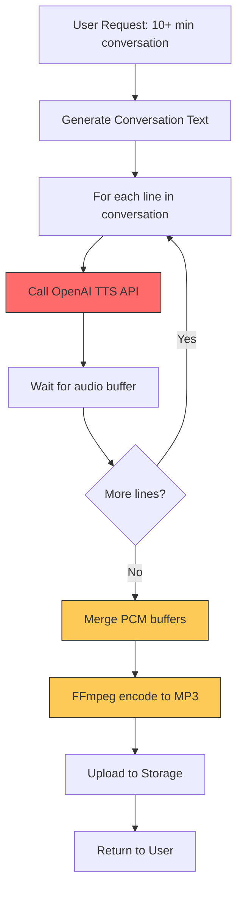
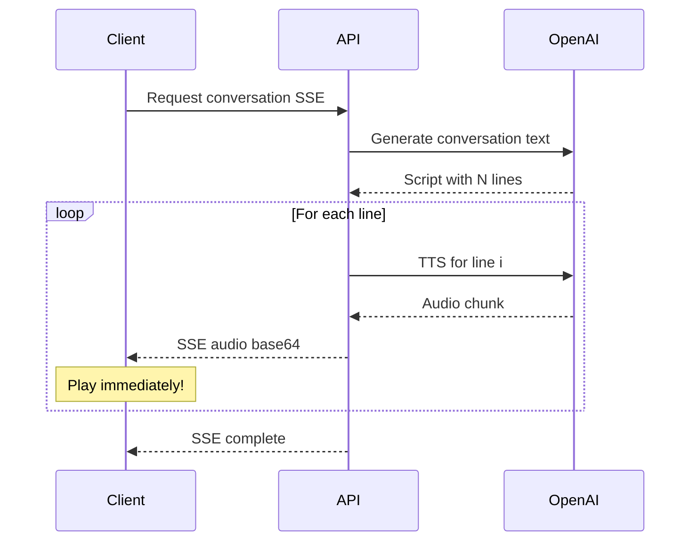
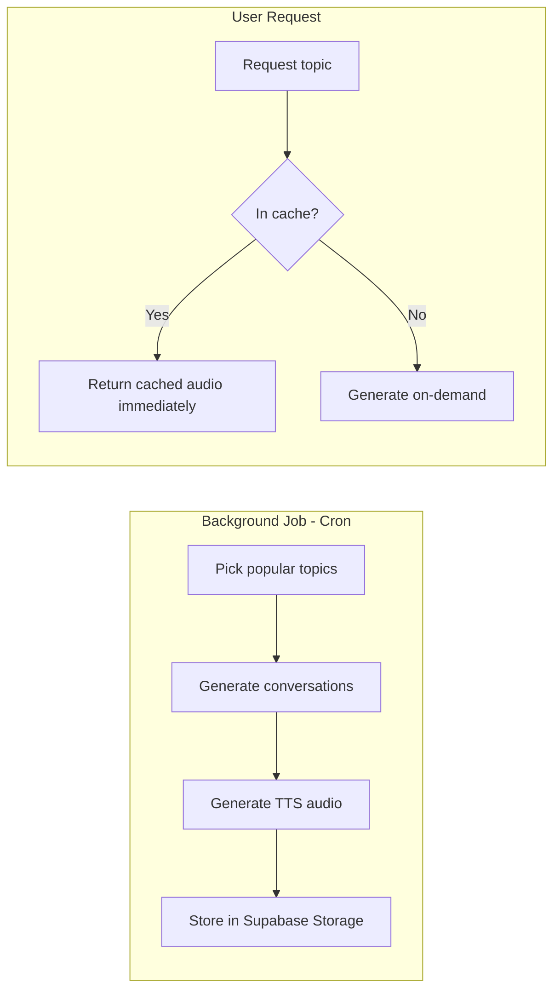
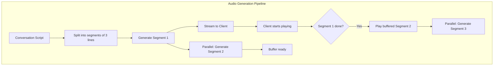
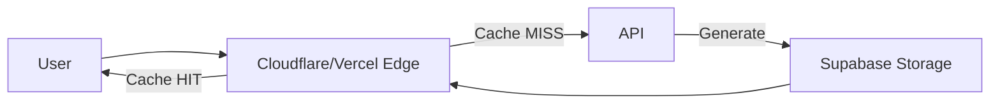

# 🎧 Listening API Performance Solutions

## Phân tích vấn đề hiện tại

### Root Cause Analysis



### Bottlenecks đã xác định

| Bottleneck | Vị trí | Thời gian ước tính | Mức độ |
|------------|--------|-------------------|--------|
| **Sequential TTS** | `ai.service.ts:686-722` | ~1-2s/câu × N câu | 🔴 Critical |
| **FFmpeg Encoding** | `ai.service.ts:598-650` | ~5-10s cho 10 phút audio | 🟡 Medium |
| **Sequential Conversation Gen** | `radio.service.ts:198-244` | ~5-10s/topic × M topics | 🔴 Critical |
| **Upload to Storage** | `ai.service.ts:735` | ~2-5s | 🟡 Medium |

### Code hiện tại (Sequential Processing)

```typescript
// ai.service.ts - Line 686-722
for (const line of conversation) {
  // ⚠️ SEQUENTIAL: Mỗi câu phải chờ câu trước hoàn thành
  const audioBuffer = await this.textToSpeechPcm(line.text, voice);
  audioBuffers.push(audioBuffer);
  // ...
}
```

---

## 💡 Giải pháp đề xuất

### Solution 1: Parallel TTS Generation (Quick Win ⚡)

**Ý tưởng:** Sinh audio song song thay vì tuần tự

```typescript
// BEFORE: Sequential (N × 1.5s = N × 1.5s)
for (const line of conversation) {
  const audio = await this.textToSpeechPcm(line.text, voice);
}

// AFTER: Parallel (N × 1.5s / concurrency = much faster)
const BATCH_SIZE = 5; // Parallel 5 requests at a time
const batches = chunk(conversation, BATCH_SIZE);

for (const batch of batches) {
  const results = await Promise.all(
    batch.map(line => this.textToSpeechPcm(line.text, voice))
  );
  audioBuffers.push(...results);
}
```

**Ưu điểm:**
- ✅ Không thay đổi infrastructure
- ✅ Giảm ~70-80% thời gian chờ
- ✅ Dễ implement

**Nhược điểm:**
- ⚠️ Rate limit OpenAI API (cần điều chỉnh batch size)
- ⚠️ Memory usage tăng

**Estimate:** 2-4 hours implementation

---

### Solution 2: Streaming Progressive Playback 🎵

**Ý tưởng:** Client có thể bắt đầu nghe ngay khi có câu đầu tiên



**Frontend Implementation:**

```typescript
// Progressive audio player
const audioQueue: AudioBuffer[] = [];
let isPlaying = false;

eventSource.onmessage = (event) => {
  const data = JSON.parse(event.data);
  
  if (data.audio) {
    const audioBuffer = decodeBase64Audio(data.audio);
    audioQueue.push(audioBuffer);
    
    // Start playing immediately if not already playing
    if (!isPlaying) {
      playNextInQueue();
    }
  }
};

async function playNextInQueue() {
  if (audioQueue.length === 0) {
    isPlaying = false;
    return;
  }
  
  isPlaying = true;
  const audio = audioQueue.shift();
  await playAudio(audio);
  playNextInQueue(); // Play next when current finishes
}
```

**Ưu điểm:**
- ✅ User nghe được ngay trong 2-3 giây
- ✅ UX cực tốt - không thấy chờ đợi
- ✅ Đã có SSE endpoint (`generateConversationAudioSSE`)

**Nhược điểm:**
- ⚠️ Phức tạp hơn về frontend
- ⚠️ Cần handle edge cases (network issues, buffer underrun)

**Estimate:** 4-6 hours implementation

---

### Solution 3: Pre-generation & Caching 📦

**Ý tưởng:** Sinh sẵn các cuộc hội thoại phổ biến, cache audio



**Database Schema:**

```sql
CREATE TABLE cached_conversations (
  id UUID PRIMARY KEY,
  topic TEXT NOT NULL,
  duration_minutes INT NOT NULL,
  num_speakers INT DEFAULT 2,
  conversation JSONB NOT NULL,
  audio_url TEXT NOT NULL,
  timestamps JSONB NOT NULL,
  created_at TIMESTAMP DEFAULT NOW(),
  expires_at TIMESTAMP,
  usage_count INT DEFAULT 0,
  
  UNIQUE(topic, duration_minutes, num_speakers)
);

CREATE INDEX idx_cached_topic ON cached_conversations(topic);
CREATE INDEX idx_cached_popular ON cached_conversations(usage_count DESC);
```

**Ưu điểm:**
- ✅ Response time < 1 giây cho cached content
- ✅ Tiết kiệm API cost cho popular topics

**Nhược điểm:**
- ⚠️ Storage cost tăng
- ⚠️ Cần background job infrastructure
- ⚠️ Custom topics không có sẵn

**Estimate:** 6-8 hours implementation

---

### Solution 4: Faster TTS Provider 🚀

**Ý tưởng:** Thay thế OpenAI TTS bằng provider nhanh hơn

| Provider | Latency | Quality | Giá | Streaming |
|----------|---------|---------|-----|-----------|
| OpenAI TTS-1 | ~500-1000ms | ⭐⭐⭐⭐ | $15/1M chars | ❌ |
| **Cartesia Sonic** | **40-90ms** | ⭐⭐⭐⭐⭐ | $8/1M chars | ✅ WebSocket |
| Deepgram Aura | <200ms | ⭐⭐⭐⭐ | $15/1M chars | ✅ |
| ElevenLabs | ~300ms | ⭐⭐⭐⭐⭐ | $11/1M chars | ✅ |
| Google Cloud TTS | ~200ms | ⭐⭐⭐⭐ | $4/1M chars | ✅ |
| Amazon Polly | ~150ms | ⭐⭐⭐ | $4/1M chars | ✅ |

**Cartesia Implementation (Recommended):**

```typescript
import Cartesia from '@cartesia/cartesia-js';

const cartesia = new Cartesia({
  apiKey: process.env.CARTESIA_API_KEY,
});

async function textToSpeechCartesia(text: string, voiceId: string): Promise<Buffer> {
  const response = await cartesia.tts.bytes({
    model_id: 'sonic-english',
    voice: { id: voiceId },
    transcript: text,
    output_format: {
      container: 'mp3',
      bit_rate: 128000,
      sample_rate: 24000,
    },
  });
  
  return Buffer.from(response);
}

// WebSocket streaming version
async function streamTTS(text: string, onChunk: (chunk: Buffer) => void) {
  const ws = cartesia.tts.websocket({ container: 'raw' });
  
  ws.on('message', (chunk) => {
    onChunk(Buffer.from(chunk));
  });
  
  await ws.send({
    model_id: 'sonic-english',
    voice: { id: 'voice-id' },
    transcript: text,
  });
}
```

**Ưu điểm:**
- ✅ 5-10x nhanh hơn OpenAI
- ✅ Native streaming support
- ✅ Giá tương đương hoặc rẻ hơn

**Nhược điểm:**
- ⚠️ Cần setup new provider
- ⚠️ Voice options khác với OpenAI
- ⚠️ Dependency mới

**Estimate:** 4-6 hours implementation

---

### Solution 5: Hybrid Buffer-While-Playing 🔄

**Ý tưởng:** Kết hợp parallel generation + streaming + buffering thông minh



**Implementation:**

```typescript
async function generateWithSmartBuffer(
  conversation: ConversationLine[],
  onReady: (audio: Buffer, segment: number) => void,
) {
  const LOOKAHEAD = 2; // Always have 2 segments ready
  const SEGMENT_SIZE = 3; // 3 lines per segment
  
  const segments = chunk(conversation, SEGMENT_SIZE);
  const bufferQueue: Map<number, Buffer> = new Map();
  
  // Start generating first LOOKAHEAD segments in parallel
  const initialPromises = segments
    .slice(0, LOOKAHEAD)
    .map((segment, idx) => 
      generateSegmentAudio(segment).then(audio => {
        bufferQueue.set(idx, audio);
        if (idx === 0) onReady(audio, 0); // First segment ready
      })
    );
  
  await Promise.all(initialPromises);
  
  // Continue generating rest while maintaining buffer
  let currentPlaying = 0;
  let currentGenerating = LOOKAHEAD;
  
  return {
    getNextSegment: () => {
      currentPlaying++;
      const audio = bufferQueue.get(currentPlaying);
      bufferQueue.delete(currentPlaying - 1); // Clean up
      
      // Trigger next generation
      if (currentGenerating < segments.length) {
        generateSegmentAudio(segments[currentGenerating]).then(a => {
          bufferQueue.set(currentGenerating, a);
        });
        currentGenerating++;
      }
      
      return audio;
    },
  };
}
```

**Ưu điểm:**
- ✅ Best of both worlds
- ✅ Luôn có buffer sẵn
- ✅ Memory efficient

**Nhược điểm:**
- ⚠️ Complex implementation
- ⚠️ Cần careful tuning

**Estimate:** 8-12 hours implementation

---

### Solution 6: Edge Caching with CDN 🌐

**Ý tưởng:** Cache audio ở edge locations gần user



**Implementation với Cloudflare Workers:**

```typescript
// Edge function
export default {
  async fetch(request: Request, env: Env) {
    const url = new URL(request.url);
    const cacheKey = new Request(url.toString(), request);
    const cache = caches.default;
    
    // Check cache
    let response = await cache.match(cacheKey);
    if (response) {
      return response;
    }
    
    // Generate audio
    response = await fetch(env.API_URL + '/ai/generate-audio', {
      method: 'POST',
      body: request.body,
    });
    
    // Cache for 24 hours
    response = new Response(response.body, response);
    response.headers.set('Cache-Control', 's-maxage=86400');
    
    await cache.put(cacheKey, response.clone());
    return response;
  },
};
```

---

## 📊 So sánh giải pháp

| Solution | Effort | Impact | Risk | Recommend |
|----------|--------|--------|------|-----------|
| **Parallel TTS** | 🟢 Low | 🟡 Medium | 🟢 Low | ✅ **Quick Win** |
| **Streaming Progressive** | 🟡 Medium | 🔴 High | 🟡 Medium | ✅ **Priority** |
| **Pre-generation Cache** | 🟡 Medium | 🟡 Medium | 🟢 Low | 🔄 Later |
| **Faster TTS Provider** | 🟡 Medium | 🔴 High | 🟡 Medium | ✅ **Priority** |
| **Hybrid Buffer** | 🔴 High | 🔴 High | 🟡 Medium | 🔄 Later |
| **Edge Caching** | 🟡 Medium | 🟡 Medium | 🟢 Low | 🔄 Later |

---

## 🎯 Recommended Implementation Roadmap

### Phase 1: Quick Wins (1-2 days)

1. **Implement Parallel TTS** trong `generateConversationAudio()`
   - Batch 5 requests song song
   - Giảm 60-70% thời gian

2. **Optimize Radio Mode** - Generate conversations song song
   - Sử dụng `Promise.all` cho multiple topics

### Phase 2: Streaming UX (3-5 days)

1. **Enhance SSE endpoint** với progressive audio delivery
2. **Build frontend audio queue player**
3. **Add buffering logic** với loading indicators

### Phase 3: Infrastructure (1-2 weeks)

1. **Evaluate & integrate Cartesia/Deepgram** cho faster TTS
2. **Add conversation caching layer**
3. **Setup background pre-generation jobs**

---

## 📝 Code Changes Summary

### Files cần sửa đổi:

1. **[MODIFY]** [ai.service.ts](file:///Users/thanhvuqlud/ThanhData/CODE/StudyLanguage/apps/api/src/ai/ai.service.ts)
   - Add parallel TTS generation
   - Add segment-based generation
   - Optional: Integrate new TTS provider

2. **[MODIFY]** [radio.service.ts](file:///Users/thanhvuqlud/ThanhData/CODE/StudyLanguage/apps/api/src/radio/radio.service.ts)
   - Parallel conversation generation
   - Add caching layer

3. **[NEW]** `cache.service.ts`
   - Conversation cache management
   - Pre-generation logic

4. **[MODIFY]** Frontend: `use-listening-playlist.ts`
   - Progressive audio playback
   - Buffer management

---

## ❓ Câu hỏi cần quyết định

1. **Budget cho TTS provider mới?** (Cartesia, Deepgram có thể rẻ hơn)
2. **Chấp nhận trade-off quality vs speed?** (tts-1 vs tts-1-hd)
3. **Có cần support offline/download?** (ảnh hưởng đến caching strategy)
4. **Storage budget cho cached audio?** (~50-100MB/topic @ 10 min)
