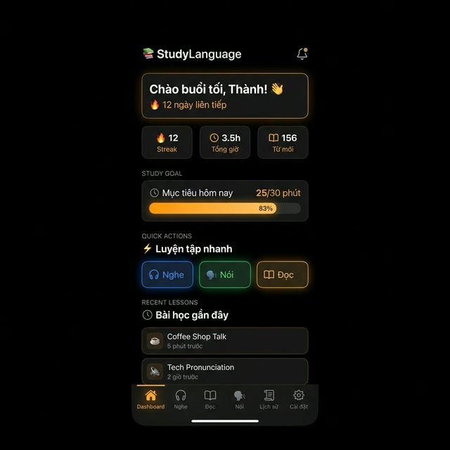
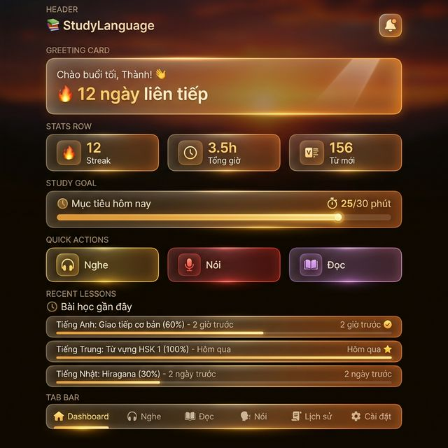
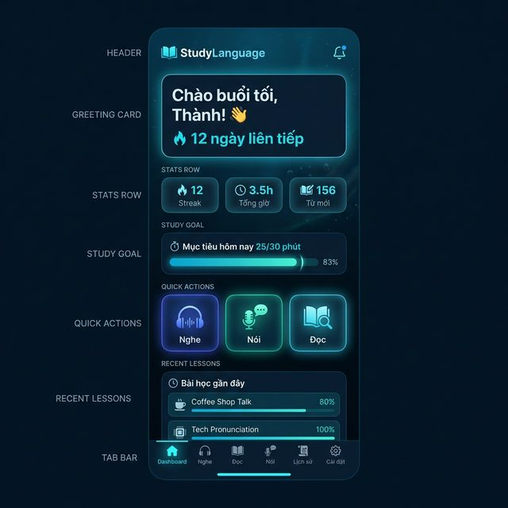

# 🏠 Dashboard Feature - Mobile

> **Module:** Dashboard  
> **Priority:** P0 (Core)  
> **Phase:** MVP → Enhanced

---

## 1. Overview

Module trang chủ hiển thị tổng quan tiến trình học tập, và quick access đến 3 skills. Thiết kế tối giản, thoáng, phù hợp mobile.

### 1.1 Dashboard Views

| View | Condition | Key Elements |
|------|-----------|--------------|
| **Auth Dashboard** | User đã đăng nhập | Greeting, Streak, Quick Actions |

### 1.2 Widget Selection (Mobile-Optimized)

Chỉ giữ các widget phù hợp mobile, loại bỏ chart phức tạp:

| Widget | MVP | Enhanced | Lý do |
|--------|-----|----------|-------|
| **Greeting + Streak** | ✅ | ✅ | Nhẹ, motivating |
| **Quick Actions** (3 skills) | ✅ | ✅ | Navigation chính |


---

## 2. User Flows

### 2.1 Auth User Flow

```
┌─────────────────────────────────────────────────────────────┐
│                                                             │
│ [App Launch] → [Splash] → [Dashboard]                       │
│                              │                              │
│                              │                              │
│                       [Quick Actions]                       │
│                              ↓                              │
│              [Listening] [Speaking] [Reading]               │
│                                                             │
└─────────────────────────────────────────────────────────────┘
```

---

## 3. UI Mockups

### 3.1 Design Style: Dark Glassmorphism

| Theme | Preview |
|-------|---------|
| 🌅 **Sunset Dark** |  |
| ☀️ **Sunset Light** |  |
| 🌇 **Glass Sunset Dark** |  |
| 🌤️ **Glass Sunset Light** |  |
| 🌊 **Ocean Dark** |  |
| 💎 **Ocean Light** |  |

### 3.2 Design Specs

#### Background
- **Color:** Deep navy gradient (`#0A0E1A` → `#0F1628`)
- **Effects:** Subtle light streaks và lens flare ở các cạnh
- **Atmosphere:** Premium, dark mode, không gian vũ trụ

#### Header
- Logo "📚 StudyLanguage" bên trái, white text
- Notification bell 🔔 bên phải
- Padding: `16px` horizontal

#### Greeting Card (Glassmorphism)
- **Background:** `rgba(255,255,255,0.08)` với `backdrop-filter: blur(20px)`
- **Border:** `1px solid rgba(255,255,255,0.12)` với subtle blue-teal glow
- **Border Radius:** `16px`
- **Content:** Greeting text + Streak count
- **Shadow:** `0 8px 32px rgba(0,0,0,0.3)`

#### Quick Action Cards (3 columns)
| Card | Glow Color | Background |
|------|-----------|------------|
| 🎧 Nghe | `#4F7CFF` → `#6C5CE7` (Blue/Indigo) | `rgba(79,124,255,0.1)` |
| 🗣️ Nói | `#00B894` → `#55EFC4` (Green/Emerald) | `rgba(0,184,148,0.1)` |
| 📖 Đọc | `#FDCB6E` → `#E17055` (Amber/Orange) | `rgba(253,203,110,0.1)` |

- **Border:** `1px solid` với gradient tương ứng
- **Border Radius:** `14px`
- **Glassmorphism:** `backdrop-filter: blur(16px)`
- **Icon Size:** `32px`, centered
- **Label:** Bold, white, centered dưới icon

#### Recent Lessons (Bài học gần đây)
- **Header:** "🕐 Bài học gần đây" + "Xem tất cả →" (accent color)
- **Layout:** Vertical list, glassmorphism rows
- **Each item:**
  - Skill icon (color-coded: 🎧 xanh, 🗣️ xanh lá, 📖 cam)
  - Title + thời gian (relative time) + duration
  - Play/resume button ▶️
- **Row background:** `var(--bg-tertiary)`, border-radius `12px`
- **Max:** 2-3 items hiển thị, scroll nếu nhiều hơn

#### Bottom Tab Bar (6 Tabs — Gradient Glow)

| Tab | Icon | Color (Active) |
|-----|------|---------------|
| Dashboard | 🏠 | Theme accent |
| Listening | 🎧 | `#4F6BED` (Indigo) |
| Reading | 📖 | `#D97706` (Amber) |
| Speaking | 🗣️ | `#22C55E` (Green) |
| History | 📜 | Theme accent |
| Settings | ⚙️ | Theme accent |

**Design Effects:**
- **Background:** Frosted glass `rgba(10,10,26,0.75)` + `backdrop-filter: blur(24px)`
- **Top border:** Rainbow gradient line (`cyan → violet → pink → transparent`)
- **Active indicator:** Glowing bar phía trên tab (`width: 24px, height: 3px`)
  - Gradient: `linear-gradient(90deg, #06b6d4, #a78bfa)`
  - Glow: `box-shadow: 0 0 10px`, pulsing animation `2s`
- **Active icon:** `drop-shadow(0 0 6px)` + `scale(1.1)`
- **Tap:** Scale `0.9` on press, smooth `0.25s` transition
- **Font size:** `9px` (compact cho 6 tabs)
- **Safe Area:** Bottom padding cho notch devices

#### Typography
- **Font:** SF Pro Display / Inter
- **Greeting:** `24px`, Bold, White
- **Streak:** `16px`, Regular, `rgba(255,255,255,0.7)`
- **Card Label:** `14px`, SemiBold, White
- **Section Title:** `18px`, SemiBold, White
- **Tab Label:** `9px`, Weight 500 (inactive) / 600 (active)

---

## 4. Features Detail

### 4.1 Greeting Logic

| Time Range | Greeting |
|-----------|----------|
| 05:00 - 11:59 | Chào buổi sáng ☀️ |
| 12:00 - 17:59 | Chào buổi chiều 🌤️ |
| 18:00 - 21:59 | Chào buổi tối 🌙 |
| 22:00 - 04:59 | Chào khuya 🌃 |


### 4.2 Quick Actions

| Skill | Icon | Color | Navigate To |
|-------|------|-------|-------------|
| Nghe | 🎧 | Blue/Indigo | `/listening` |
| Nói | 🗣️ | Green | `/speaking` |
| Đọc | 📖 | Amber | `/reading` |

**Interaction:**
- Tap: Navigate to skill page
- Animation: Scale press effect (0.95x)
- Haptic: Light impact on tap

---

## 5. Technical Implementation

### 5.1 State Structure

```typescript
interface DashboardState {
  // User stats
  stats: {
    streak: number;

  
  // Loading
  loading: boolean;
}
```

### 5.2 API Endpoints

| Endpoint | Method | Description |
|----------|--------|-------------|
| `/api/user/stats` | GET | Streak, total minutes, level |


### 5.3 Data Flow

```
┌─────────────────────────────────────────────────────────────┐
│                                                             │
│ [App Launch] → [Fetch Stats] → [Cache] → [Render Dashboard] │
│                     │                                       │
│               [TanStack Query]                              │
│               staleTime: 5min                               │
│                                                             │
└─────────────────────────────────────────────────────────────┘
```

### 5.4 Libraries

```typescript

react-native-reanimated   // Animations
react-native-haptic-feedback // Tap feedback
```

---

## 6. Implementation Tasks

### MVP Phase
- [ ] Dashboard screen layout (auth/guest views)
- [ ] Greeting component (time-based)
- [ ] Streak display (inline)

- [ ] Quick Actions (3 skill cards)
- [ ] Guest Dashboard hero + CTA
- [ ] Navigate to skill pages

### Enhanced Phase

- [ ] Pull-to-refresh stats
- [ ] Animated transitions


---

## 7. API Reference

> **Base URL:** `/api`  
> **Auth:** Tất cả endpoints yêu cầu `Authorization: Bearer <Supabase JWT>`

### 7.1 User Module (`/api/user`)

#### `GET /api/user/stats`

> Lấy stats tổng quan cho Dashboard widgets

**Response:**

```json
{
  "streak": 7,
  "totalMinutes": 500,
  "level": "intermediate",
  "goals": { "daily": 30, "completed": 25 },
  "totalSessions": 42
}
```

---

#### `GET /api/user/word-of-the-day`

> Lấy từ vựng hàng ngày cho Word of Day widget

**Response:**

```json
{
  "success": true,
  "word": {
    "word": "serendipity",
    "ipa": "/ˌsɛr.ənˈdɪp.ɪ.ti/",
    "meaning": "Sự tình cờ may mắn",
    "example": "Finding that book was pure serendipity."
  }
}
```

---

#### `GET /api/user/last-session`

> Lấy session cuối cùng cho "Continue Last Lesson" card

**Response:**

```json
{
  "id": "uuid",
  "type": "listening",
  "title": "Business Meeting",
  "date": "2025-01-15T10:30:00Z",
  "duration": 5,
  "progress": 60
}
```

> Trả về `null` nếu chưa có session nào

---

## 8. Related Documents

- [00_Mobile_Overview.md](../00_Mobile_Overview.md) - Project overview
- [01_Authentication.md](01_Authentication.md) - Auth flows
- [07_History.md](07_History.md) - Learning data source
- [Architecture.md](../technical/Architecture.md) - Data flow
