# 🗣️ Speaking — Navigation & Practice Mode

> **Module:** Speaking
> **Features:** Navigation Entry Points + Practice Mode
> **Priority:** P0 (Core)
> **Tham chiếu chính:** [03_Speaking.md](../03_Speaking.md)

---

## Mục lục

1. [Feature 1: Navigation — Entry Points](#feature-1-navigation--entry-points)
2. [Feature 2: Practice Mode](#feature-2-practice-mode)
3. [Shared Components](#shared-components)
4. [API Endpoints](#api-endpoints)
5. [Test Cases](#test-cases)
6. [Edge Cases & Potential Issues](#edge-cases--potential-issues)

---

## Feature 1: Navigation — Entry Points

### 1.1 Yêu cầu tổng quan

Speaking Home là điểm vào duy nhất của module Speaking. Màn hình này **CHỈ** cho phép user chọn **MODE** luyện tập, không hiển thị topics/scenarios.

#### Functional Requirements

| ID | Yêu cầu | Mức ưu tiên |
|----|---------|-------------|
| NAV-01 | Home hiển thị 4 mode cards: Practice, Shadowing, AI Conversation, Tongue Twister | P0 | ✅ Done |
| NAV-02 | Home hiển thị Daily Goal card với progress ring + streak | P0 | ✅ Done (SVG ring) |
| NAV-03 | Tap "Xem Dashboard →" trên Daily Goal → navigate đến Progress Dashboard | P1 | ✅ Done |
| NAV-04 | Tap ⚙️ (top-right) → mở TTS Settings Bottom Sheet (overlay, không rời Home) | P0 | ✅ Done |
| NAV-05 | Home **KHÔNG** hiển thị topics/scenarios. Chọn topic xảy ra trong config screen của mỗi mode | P0 | ✅ Done |
| NAV-06 | Hỗ trợ cả Dark Mode và Light Mode | P0 | ✅ Done (useSkillColor) |
| NAV-07 | First-time user → hiện Onboarding Overlay (5 steps) | P2 | ✅ Done |

#### Non-Functional Requirements

| ID | Yêu cầu | Chi tiết |
|----|---------|----------|
| NAV-NF01 | Thời gian load Home ≤ 300ms | Không fetch API khi mở Home | ✅ Done |
| NAV-NF02 | Animation mode cards | Fade-in staggered khi first mount | ✅ Done |
| NAV-NF03 | Haptic feedback | Light haptic khi tap mode card | ✅ Done |
| NAV-NF04 | Accessibility | VoiceOver labels cho mọi interactive element | ✅ Done |

### 1.2 Kiến trúc màn hình

```
┌──────────────────────────────────────────────────────────────────┐
│                      [Home / Tab Bar]                            │
│                           │                                      │
│                      [Speaking Tab]                               │
│                           │                                      │
│                  [Speaking Home Screen]                           │
│                  ┌──────────────────┐                             │
│                  │ ⚙️ TTS Settings  │ ← overlay bottom sheet     │
│                  │ Daily Goal card   │ → tap "Dashboard →"        │
│                  │ 4 Mode Cards     │                            │
│                  └──────────────────┘                             │
│                           │                                      │
│           (user tap 1 trong 4 mode cards)                        │
│                           │                                      │
│      ┌────────┬───────────┼───────────┬──────────┐               │
│      ▼        ▼           ▼           ▼          │               │
│ [Practice] [AI Conv.] [Shadowing] [Tongue T.]    │               │
│ [Config]   [Setup]    [Config]    [Screen]       │               │
│   │          │           │           │       [Dashboard]         │
│   ▼          ▼           ▼           ▼      (from Daily Goal)    │
│ [Session] [Session]   [Session]  [Practice]                      │
└──────────────────────────────────────────────────────────────────┘
```

### 1.3 Navigation Routes

| Route Name | Screen | Params | Từ đâu tới |
|------------|--------|--------|------------|
| `SpeakingHome` | Speaking Home Screen | — | Tab Bar |
| `PracticeConfig` | Practice Config | — | Home → 🎤 Practice card |
| `PracticeSession` | Practice Session | `{ topic, level, sentences }` | PracticeConfig → "Bắt đầu" |
| `ConversationSetup` | AI Conv. Setup | — | Home → 💬 AI Conversation card |
| `ConversationSession` | AI Conv. Session | `{ setup }` | ConversationSetup → "Bắt đầu" |
| `ShadowingConfig` | Shadowing Config | — | Home → 🔊 Shadowing card |
| `ShadowingSession` | Shadowing Session | `{ topic, speed, delay, scoringMode }` | ShadowingConfig → "Bắt đầu" |
| `TongueTwister` | Tongue Twister | — | Home → 👅 Tongue Twister card |
| `ProgressDashboard` | Progress Dashboard | — | Home → Daily Goal → "Dashboard →" |

### 1.4 Thành phần UI — Speaking Home

| Vùng | Component | Tap Action |
|------|-----------|------------|
| Header | `AppText` "Speaking" + `TouchableOpacity` ⚙️ | ⚙️ → `setShowTtsSettings(true)` |
| Daily Goal | `DailyGoalCard` (ring + streak + link) | "Xem Dashboard →" → `navigate('ProgressDashboard')` |
| Mode Cards | 4× `ModeCard` (icon + title + subtitle + gradient) | Tap → `navigate('{mode}Config')` |

#### Mode Cards Data

| Key | Icon | Title | Subtitle | Gradient | Navigate To |
|-----|------|-------|----------|----------|------------|
| `practice` | 🎤 | Practice | Luyện từng câu | Blue-Cyan | `PracticeConfig` |
| `shadowing` | 🔊 | Shadowing | Nhại theo AI | Purple-Pink | `ShadowingConfig` |
| `conversation` | 💬 | AI Conversation | Hội thoại với AI | Green-Teal | `ConversationSetup` |
| `tongue-twister` | 👅 | Tongue Twister | Nói lái vui | Orange-Yellow | `TongueTwister` |

### 1.5 TTS Settings Bottom Sheet

> Mở bằng tap ⚙️ trên Home. Config **độc lập** với Listening module.

| Setting | UI | Range | Default |
|---------|-----|-------|---------|
| Giọng mẫu | Dropdown | Azure voices (Jenny, Sara, Guy...) | Jenny |
| Random giọng | Toggle | ON/OFF | OFF |
| Cảm xúc | Pill chips | Cheerful / Neutral / Friendly / Newscast | Cheerful |
| Auto emotion | Toggle | ON/OFF | ON |
| Tốc độ đọc (Rate) | Slider | 0.5x — 2.0x | 1.0x |
| Cao độ giọng (Pitch) | Slider | -50% — +50% | 0% |

> ⚠️ **Tại sao independent?** Speaking cần giọng chậm/rõ để user nghe phát âm chuẩn. Listening cần giọng tự nhiên/đa dạng. Hai mục đích khác nhau → 2 bộ config riêng.

### 1.6 Design Reference — Hi-Fi Mockups

| Màn hình | Dark Mode | Light Mode |
|----------|-----------|------------|
| Speaking Home | 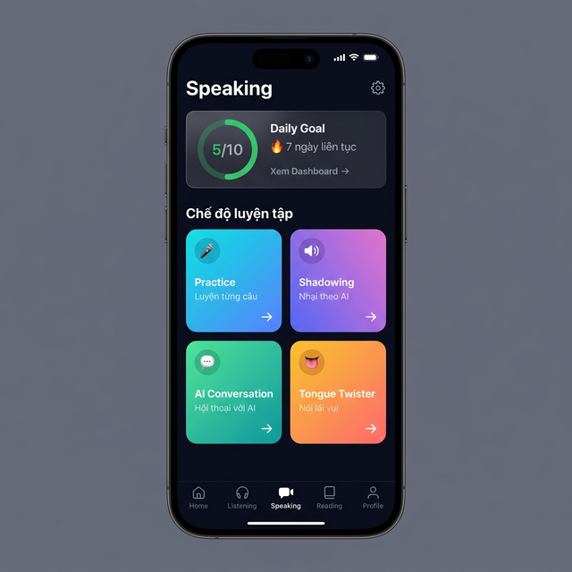 | 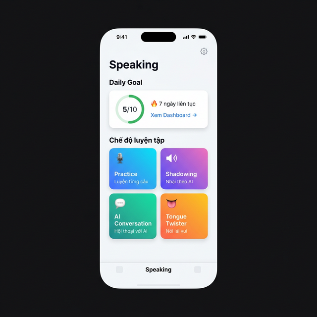 |
| AI Conv. Setup | 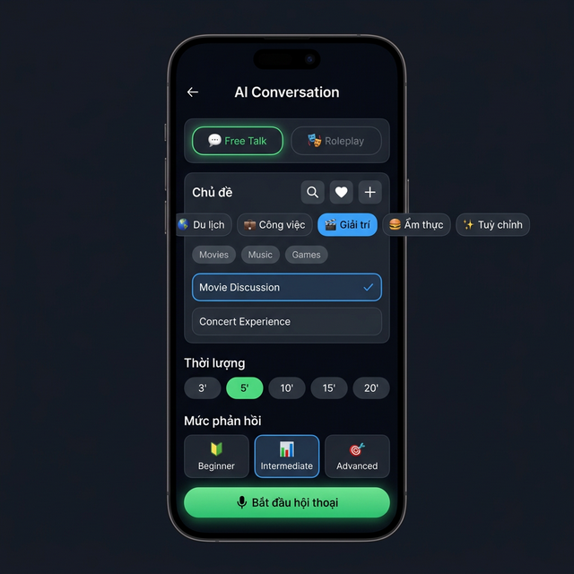 | 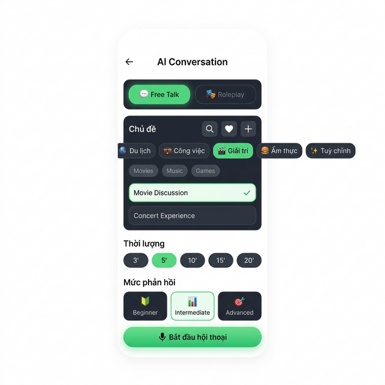 |
| Progress Dashboard | 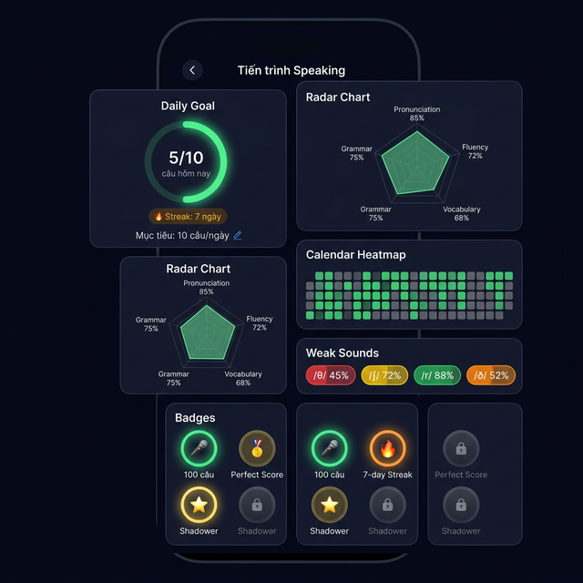 | 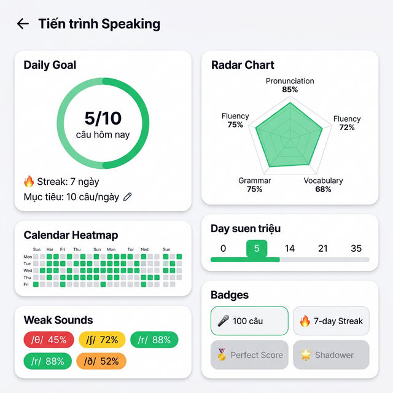 |
| TTS Settings | 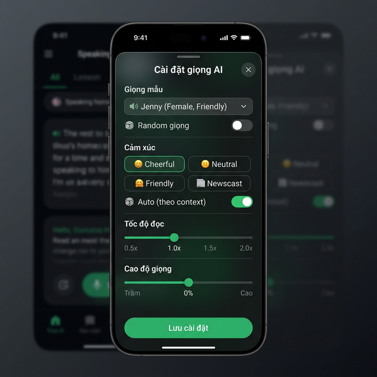 | 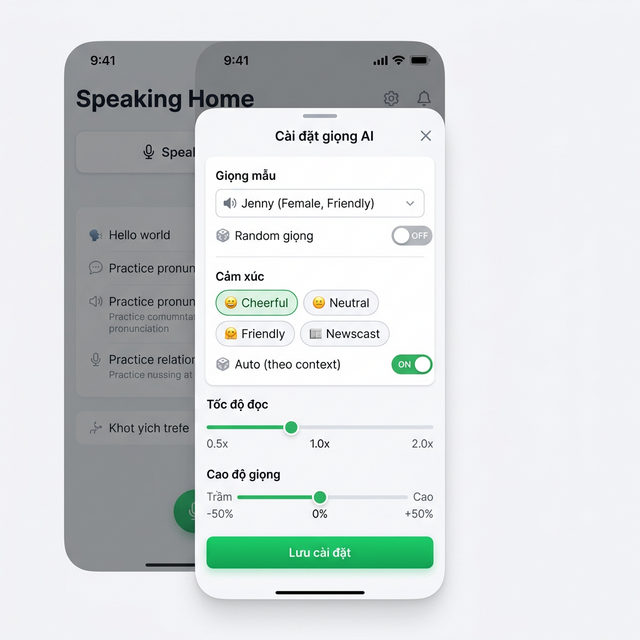 |

---

## Feature 2: Practice Mode

### 2.1 Yêu cầu tổng quan

Practice Mode cho phép user luyện phát âm từng câu: nghe mẫu → ghi âm → nhận feedback chi tiết từ AI.

#### Functional Requirements

| ID | Yêu cầu | Mức ưu tiên |
|----|---------|-------------|
| PRC-01 | Config screen: chọn topic bằng **Listening Topic Picker** (reuse component) | P0 | ✅ Done |
| PRC-02 | Config screen: chọn level Beginner / Intermediate / Advanced | P0 | ✅ Done |
| PRC-03 | Session screen: hiển thị câu mẫu (English) + IPA (toggle ẩn/hiện) | P0 | ✅ Done |
| PRC-04 | Nút "Nghe mẫu" → phát audio câu bằng Azure TTS | P0 | ✅ Done |
| PRC-05 | Hold mic → ghi âm (max 15s) + waveform animation | P0 | ✅ Done |
| PRC-06 | Release mic → submit audio → AI scoring | P0 | ✅ Done |
| PRC-07 | Swipe up khi đang ghi → hủy recording | P0 | ⚠️ Partial (hint text present, gesture TODO) |
| PRC-08 | Feedback: overall score (0-100 + grade), word-by-word, phoneme heatmap | P0 | ✅ Done (ScoreRing SVG) |
| PRC-09 | Feedback: AI tips phát âm + AI Voice Clone (Before/After) | P1 | ✅ Done |
| PRC-10 | Navigation: "Nói lại" (retry) và "Câu tiếp theo" (next) | P0 | ✅ Done |
| PRC-11 | Confetti animation khi score ≥ 90 | P2 | ✅ Done |
| PRC-12 | Preview recording trước khi submit (toggle setting) | P2 | ✅ Done |
| PRC-13 | Countdown 3→2→1→GO! trước recording (toggle setting) | P2 | ✅ Done |
| PRC-14 | Tap vào từ bất kỳ trong feedback → popup IPA + audio phát âm chuẩn | P1 | ✅ Done |
| PRC-15 | Auto-save session vào history khi hoàn thành | P0 | ✅ Done — saveSpeakingSession helper + POST /history |
| PRC-16 | Share result dưới dạng image card → social media | P2 | ✅ Done (ViewShot + Share) |

#### Non-Functional Requirements

| ID | Yêu cầu | Chi tiết |
|----|---------|----------|
| PRC-NF01 | Latency feedback ≤ 3s | Từ lúc submit audio → hiện feedback |
| PRC-NF02 | Audio recording quality | Sample rate 16kHz, mono, WAV/M4A |
| PRC-NF03 | Haptic feedback | Medium khi bắt đầu ghi, Light khi dừng, Success khi có feedback |
| PRC-NF04 | Offline resilience | Cache audio locally nếu network fail → retry khi có mạng |
| PRC-NF05 | Memory | Buffer audio ≤ 15s → ~240KB (16kHz mono) — không gây OOM |

### 2.2 User Flow chi tiết

```
[Speaking Home] → [🎤 Practice card] → [Practice Config Screen]
                    │
                    ├─ Chọn topic (REUSE Listening Topic Picker):
                    │    ├─ 🔍 Search | ❤️ Favorites | ➕ Create
                    │    ├─ Category tabs: Du lịch / Công việc / Giải trí / ✨ Tuỳ chỉnh
                    │    ├─ Subcategory chips
                    │    ├─ Scenario cards: tap chọn → blue border ✓
                    │    └─ Hoặc gõ topic tự do (text input)
                    ├─ Chọn level (Beginner / Intermediate / Advanced)
                    └─ [Bắt đầu luyện tập]
                         │
                         ▼
                  [Practice Session Screen]
                    │
                    ├─ Progress: "Câu 3/10"
                    ├─ Câu mẫu + IPA (toggle 👁️ Ẩn IPA)
                    ├─ [🔊 Nghe mẫu] → Azure TTS phát audio
                    │
                    ├─ [🎤 Giữ mic] (hold-to-record)
                    │    ├─ (Nếu Countdown bật) → 3→2→1→GO!
                    │    ├─ Haptic medium
                    │    ├─ Waveform animation + timer
                    │    ├─ Max 15s
                    │    ├─ Swipe up → hủy, discard audio
                    │    └─ Release → Haptic light
                    │         │
                    │         ├─ (Nếu Preview bật) → [Preview]
                    │         │    ├─ Nghe lại → [Gửi] hoặc [Ghi lại]
                    │         │
                    │         └─ Submit audio → [Loading: AI đang phân tích...]
                    │              │
                    │              ▼
                    │       [Feedback Screen]
                    │         ├─ Score ring: 85/100, Grade A
                    │         ├─ (≥90) → Confetti 🎉
                    │         ├─ Word-by-word: color-coded (xanh>80%, vàng 60-80%, đỏ<60%)
                    │         ├─ Tap từ → IPA popup + audio
                    │         ├─ Phoneme Heatmap: bar xanh→vàng→đỏ
                    │         ├─ AI Tips: gợi ý phát âm cụ thể
                    │         ├─ AI Voice Clone: [Bản gốc] vs [AI sửa]
                    │         ├─ [🔄 Nói lại] → retry (same sentence)
                    │         ├─ [→ Câu tiếp theo] → next sentence
                    │         └─ [📤 Share] → Share Card
                    │
                    └─ [← Câu trước] / [Câu sau →] navigate giữa câu
```

### 2.3 Màn hình chi tiết

#### 2.3.1 Practice Config Screen

**Mục đích:** User chọn topic + level trước khi bắt đầu luyện tập.

| Section | Component | Data Source | Tương tác |
|---------|-----------|-------------|-----------|
| Topic Picker | **Reuse `<TopicPicker>` từ Listening** | `TOPIC_CATEGORIES` + `customScenarioApi` | Tap scenario → ✓ selected |
| Level | 3× `LevelCard` | Static data | Tap → green border |
| CTA | `AppButton` "🎤 Bắt đầu luyện tập" | Disabled nếu chưa chọn topic | Tap → gọi API generate sentences → navigate |

**Topic Picker reuse từ Listening:**
- Cùng `TOPIC_CATEGORIES` data (11 categories: Du lịch, Công việc, Giải trí...)
- Cùng `customScenarioApi` (`/custom-scenarios` endpoint) cho tab "✨ Tuỳ chỉnh"
- Cùng UI: 🔍 Search | ❤️ Favorites | ➕ Create buttons
- Cùng `TopicPickerModal` cho full-screen search
- User tạo scenario ở Listening → thấy ở Speaking và ngược lại

**Level data:**

| Level | ID | Emoji | Câu mẫu |
|-------|----|-------|---------|
| Cơ bản | `beginner` | 🌱 | Câu ngắn, từ vựng A1-A2, phát âm đơn giản |
| Trung bình | `intermediate` | 🌿 | Câu trung bình, B1-B2, có âm khó |
| Nâng cao | `advanced` | 🌳 | Câu phức tạp, C1-C2, connected speech |

#### 2.3.2 Practice Session Screen

**Mục đích:** Hiển thị câu cần đọc, cho user nghe mẫu và ghi âm.

| Phần | Component | Chi tiết |
|------|-----------|----------|
| Header | Back + "Practice" + Progress | "Câu 3/10" |
| Sentence Card | `GlassmorphismCard` | Câu tiếng Anh (20px, bold) |
| IPA | `AppText` (gray) | IPA dưới câu, toggle "👁️ Ẩn IPA" |
| Listen Button | `AppButton` outlined | 🔊 "Nghe mẫu" → Azure TTS |
| Mic Button | `MicButton` (circular, 80px, green gradient) | Hold → recording |
| Hint | `AppText` (dimmed) | "Giữ để ghi âm" / "Vuốt lên để hủy" |
| Navigation | 2× `TextButton` | "← Câu trước" / "Câu sau →" |

#### 2.3.3 Recording State

**Mục đích:** Feedback visual khi user đang giữ mic ghi âm.

| Phần | Chi tiết |
|------|----------|
| Sentence | Vẫn hiện (dimmed) để user đọc theo |
| Timer | "00:03.2" xanh lá, đếm lên, max 15s |
| Waveform | `WaveformVisualizer` — thanh sóng âm real-time (xanh lá) |
| Mic Button | 100px, pulsing green glow (ring animation mở rộng) |
| Status | "Đang ghi âm..." (xanh lá) |
| Cancel | "⬆️ Vuốt lên để hủy" (dimmed) |

**Auto-stop:** Khi timer đạt 15s → auto-stop recording → submit.

#### 2.3.4 Feedback Screen

**Mục đích:** Hiển thị kết quả phân tích phát âm chi tiết từ AI.

| Section | Component | Data | Tương tác |
|---------|-----------|------|-----------|
| Score Hero | `ScoreRing` (0-100) + `GradeBadge` | `feedback.score`, `feedback.grade` | — |
| Confetti | `LottieView` | Trigger khi score ≥ 90 | Auto-play |
| Word Analysis | `WordScoreRow` | `feedback.wordScores[]` | Tap từ → IPA popup + audio |
| Phoneme Heatmap | `PhonemeBar` | `feedback.phonemeHeatmap[]` | — |
| AI Tips | `TipCard` | `feedback.tips[]` | Tap expand |
| Voice Clone | 2× `PlayButton` | `recording.audioUri`, `feedback.aiCorrectedAudioUrl` | Tap play A/B |
| Actions | `AppButton` × 2 + `IconButton` | — | Nói lại / Câu tiếp / Share |

**Grade scale:**

| Score | Grade | Color | Confetti |
|-------|-------|-------|----------|
| 90-100 | A+ / A | 🟢 Green | ✅ |
| 80-89 | B+ / B | 🟢 Green | ❌ |
| 70-79 | C+ / C | 🟡 Yellow | ❌ |
| 60-69 | D | 🟠 Orange | ❌ |
| < 60 | F | 🔴 Red | ❌ |

**Word color coding:**

| Score range | Color | Ý nghĩa |
|-------------|-------|----------|
| ≥ 80% | 🟢 Xanh lá | Tốt |
| 60-79% | 🟡 Vàng | Cần cải thiện |
| < 60% | 🔴 Đỏ (underline) | Sai rõ — cần luyện lại |

### 2.4 Design Reference — Hi-Fi Mockups

| Màn hình | Dark Mode | Light Mode |
|----------|-----------|------------|
| Practice Config | 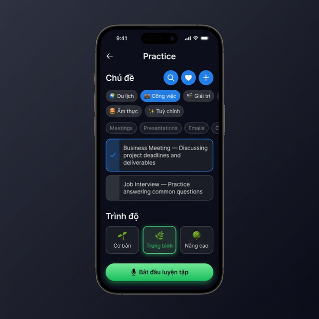 | 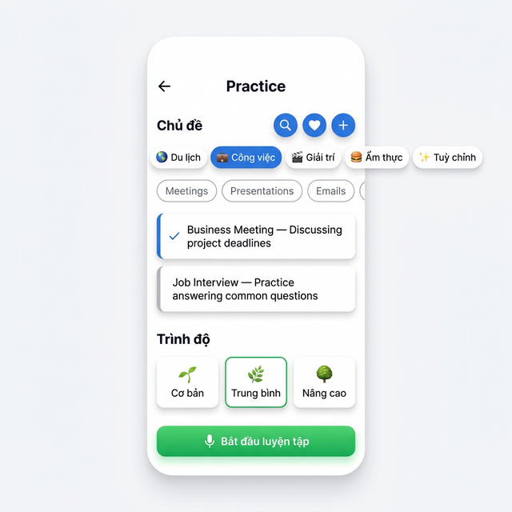 |
| Practice Session | 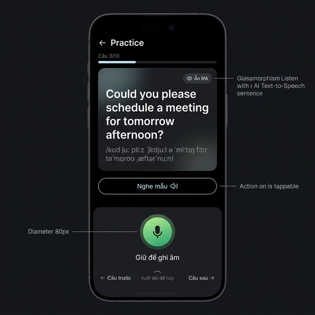 | 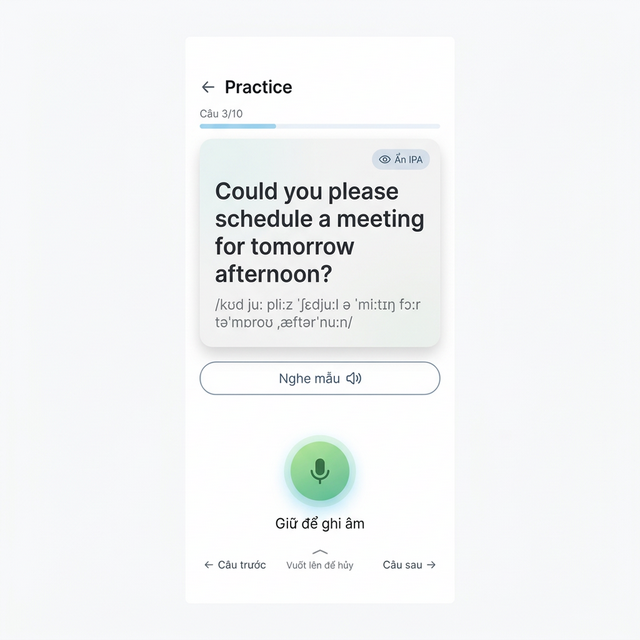 |
| Recording State | 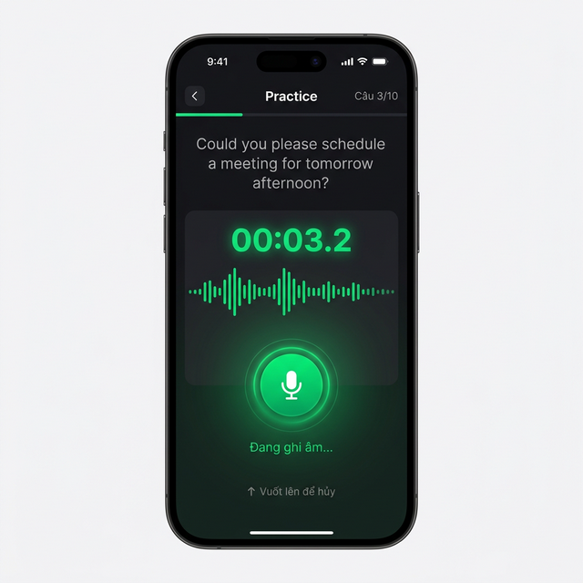 | 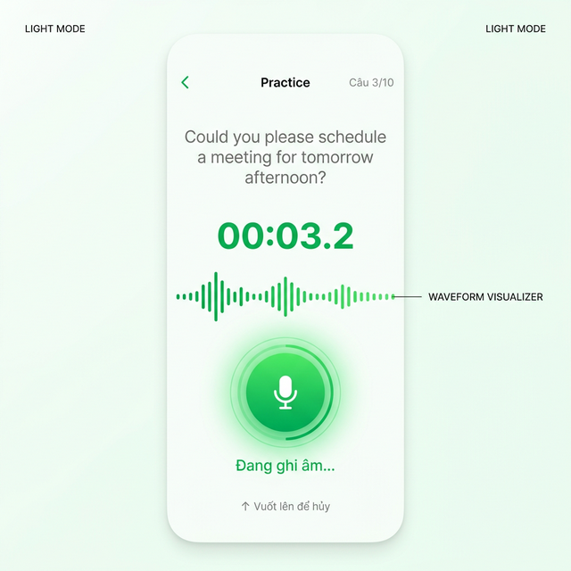 |
| Feedback | 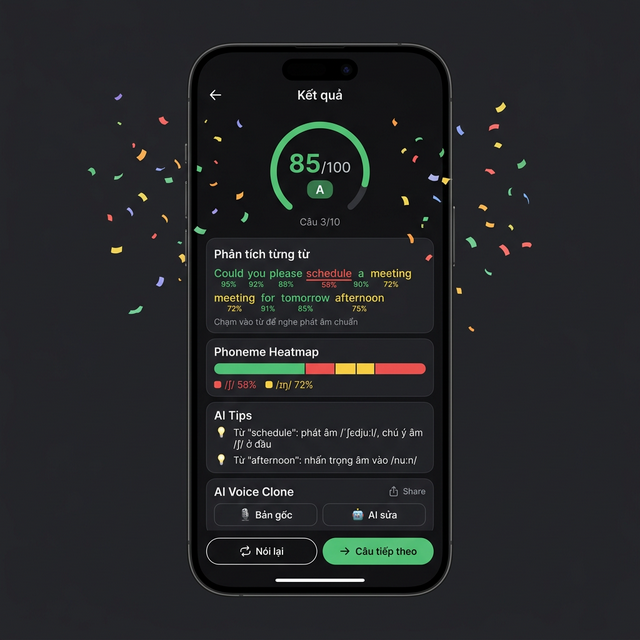 | 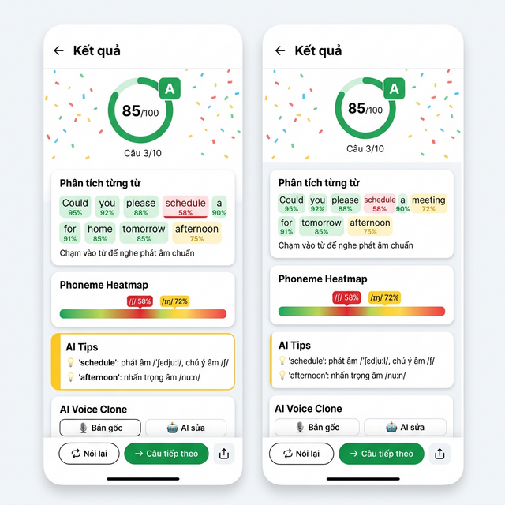 |

### 2.5 Kỹ thuật Implementation

#### 2.5.1 Libraries

| Library | Mục đích |
|---------|----------|
| `react-native-audio-recorder-player` | Ghi âm audio |
| `react-native-haptic-feedback` | Haptic khi record start/stop/feedback |
| `react-native-reanimated` | Waveform animation, confetti, pulsing mic |
| `@tanstack/react-query` | Cache + manage API state cho feedback |
| `react-native-view-shot` | Capture feedback screen → share card |
| `lottie-react-native` | Confetti, countdown animations |
| `react-native-share` | Share result image card |

#### 2.5.2 State Structure

```typescript
interface PracticeState {
  // Cấu hình — set ở Config Screen
  config: {
    topic: TopicScenario | CustomScenario | null;
    level: 'beginner' | 'intermediate' | 'advanced';
  };

  // Session — danh sách câu từ AI
  session: {
    sentences: Sentence[];
    currentIndex: number;        // Câu đang luyện (0-based)
    totalSentences: number;
  };

  // Ghi âm — trạng thái mic
  recording: {
    isRecording: boolean;
    duration: number;            // Ms đã ghi
    audioUri: string | null;     // URI file audio vừa ghi
    waveformData: number[];      // Amplitude data cho visualizer
    showCountdown: boolean;
    showPreview: boolean;
  };

  // Feedback từ AI
  feedback: {
    isLoading: boolean;
    score: number | null;        // 0-100
    grade: string | null;        // A+, A, B+, B, C+, C, D, F
    wordScores: WordScore[];
    phonemeHeatmap: PhonemeScore[];
    tips: string[];
    aiCorrectedAudioUrl: string | null;
  };

  // UI settings
  displaySettings: {
    showIPA: boolean;
  };
}

interface Sentence {
  id: string;
  text: string;           // Câu tiếng Anh
  ipa: string;            // Phiên âm IPA
  audioUrl: string;       // Azure TTS audio URL
  difficulty: 'easy' | 'medium' | 'hard';
}

interface WordScore {
  word: string;
  score: number;          // 0-100
  phonemes: string;       // IPA của từ
  issues: string[];       // Lỗi cụ thể
}

interface PhonemeScore {
  phoneme: string;        // Ví dụ: '/θ/'
  accuracy: number;       // 0-100
  totalAttempts: number;
}
```

#### 2.5.3 Recording Flow (Pseudo-code)

```typescript
/**
 * Mục đích: Bắt đầu ghi âm khi user giữ mic
 * Tham số đầu vào: không
 * Tham số đầu ra: void
 * Khi nào sử dụng: User long-press mic button → onPressIn
 */
async function handleRecordStart() {
  // Haptic feedback — cảm giác bắt đầu
  ReactNativeHapticFeedback.trigger('impactMedium');

  // Bắt đầu ghi âm (16kHz mono)
  await AudioRecorderPlayer.startRecorder(undefined, {
    SampleRate: 16000,
    Channels: 1,
    AudioEncoding: 'aac',
  });

  // Bật waveform listener
  AudioRecorderPlayer.addRecordBackListener((e) => {
    setDuration(e.currentPosition);
    updateWaveform(e.currentMetering); // Amplitude → waveform bars
    
    // Auto-stop sau 15 giây
    if (e.currentPosition >= 15000) {
      handleRecordStop();
    }
  });
}

/**
 * Mục đích: Dừng ghi âm và submit audio cho AI phân tích
 * Tham số đầu vào: không
 * Tham số đầu ra: void
 * Khi nào sử dụng: User thả mic button → onPressOut
 */
async function handleRecordStop() {
  ReactNativeHapticFeedback.trigger('impactLight');
  const uri = await AudioRecorderPlayer.stopRecorder();

  // Kiểm tra duration — quá ngắn thì toast
  if (duration < 1000) {
    showToast('Hãy nói lâu hơn nhé!');
    return;
  }

  // Submit audio lên server
  setFeedbackLoading(true);
  const feedback = await speakingApi.analyze({
    audioUri: uri,
    targetSentence: currentSentence.text,
    level: config.level,
  });

  setFeedback(feedback);
  ReactNativeHapticFeedback.trigger('notificationSuccess');
}

/**
 * Mục đích: Hủy recording khi user swipe up
 * Tham số đầu vào: gestureEvent
 * Tham số đầu ra: void
 * Khi nào sử dụng: User swipe up khi đang ghi âm → cancel gesture
 */
function handleSwipeUpCancel() {
  AudioRecorderPlayer.stopRecorder();
  setIsRecording(false);
  setDuration(0);
  // Không submit, discard audio
}
```

#### 2.5.4 Gestures & Interactions

| Context | Gesture | Action | Haptic |
|---------|---------|--------|--------|
| Mic button | Long press (onPressIn) | Bắt đầu ghi âm | Medium |
| Mic button | Release (onPressOut) | Dừng + submit | Light |
| Recording | Swipe up (PanGesture dy < -50) | Hủy recording | Error |
| Feedback | Swipe right | Câu tiếp theo | Light |
| Feedback | Swipe left | Retry cùng câu | Light |
| Word in feedback | Tap | IPA popup + audio chuẩn | Selection |
| Nghe mẫu | Tap | Azure TTS play | Light |
| IPA toggle | Tap "👁️ Ẩn IPA" | Toggle show/hide IPA | Light |

---

## Shared Components

### Listening Topic Picker (Reuse)

Component được reuse từ Listening module cho cả Practice Config và AI Conversation Setup.

| Component | Source | Vai trò |
|-----------|--------|---------|
| `TOPIC_CATEGORIES` | `@/data/topic-data` | 11 built-in categories + scenarios |
| `customScenarioApi` | `@/services/api/customScenarios` | CRUD custom scenarios (shared DB) |
| `TopicPickerModal` | `@/components/listening/TopicPickerModal` | Full-screen search + filter |
| Category Tabs | Inline horizontal scroll | Filter by category |
| Subcategory Chips | Inline horizontal scroll | Filter by subcategory |
| Scenario Cards | `TouchableOpacity` cards | Select → blue border + ✓ |

> **Endpoint chung:** `GET/POST/PATCH/DELETE /custom-scenarios` — dùng cho cả Listening và Speaking.

### DailyGoalCard

| Prop | Type | Mô tả |
|------|------|-------|
| `target` | `number` | Mục tiêu câu/ngày |
| `completed` | `number` | Số câu đã hoàn thành |
| `streak` | `number` | Số ngày liên tiếp |
| `onDashboardPress` | `() => void` | Navigate to Dashboard |

### ModeCard

| Prop | Type | Mô tả |
|------|------|-------|
| `icon` | `string` | Emoji icon |
| `title` | `string` | Mode name |
| `subtitle` | `string` | Mô tả ngắn |
| `gradient` | `[string, string]` | Gradient colors |
| `onPress` | `() => void` | Navigate action |

---

## API Endpoints

### Practice Mode APIs

| Endpoint | Method | Mô tả | Request | Response |
|----------|--------|-------|---------|----------|
| `/speaking/generate-sentences` | POST | Tạo danh sách câu theo topic + level | `{ topic, level, count }` | `{ sentences: Sentence[] }` |
| `/speaking/analyze` | POST | Phân tích phát âm audio | `FormData { audio, targetSentence, level }` | `{ score, grade, wordScores, phonemeHeatmap, tips }` |
| `/speaking/tts` | POST | Azure TTS cho câu mẫu | `{ text, voice, rate, pitch }` | `{ audioUrl }` |
| `/speaking/voice-clone` | POST | AI sửa phát âm user | `{ audioUri, targetSentence }` | `{ correctedAudioUrl }` |
| `/api/history` | POST | Lưu session vào history | `{ type, mode, topic, scores, recordings }` | `{ id }` |

### Shared Topic APIs (từ Listening)

| Endpoint | Method | Mô tả |
|----------|--------|-------|
| `/custom-scenarios` | GET | Lấy danh sách custom scenarios |
| `/custom-scenarios` | POST | Tạo custom scenario mới |
| `/custom-scenarios/:id` | PATCH | Sửa scenario |
| `/custom-scenarios/:id` | DELETE | Xóa scenario |

---

## Test Cases

### 5.1 Navigation — Entry Points

| TC-ID | Tên | Precondition | Steps | Expected Result |
|-------|-----|-------------|-------|-----------------|
| NAV-TC01 | Hiển thị Home đầy đủ | User đã login, vào Speaking tab | Mở Speaking tab | 4 mode cards + Daily Goal hiện đúng | ✅ |
| NAV-TC02 | Tap Practice card | Ở Speaking Home | Tap 🎤 Practice | Navigate → PracticeConfig | ✅ |
| NAV-TC03 | Tap AI Conversation card | Ở Speaking Home | Tap 💬 AI Conversation | Navigate → ConversationSetup | ✅ |
| NAV-TC04 | Tap Shadowing card | Ở Speaking Home | Tap 🔊 Shadowing | Navigate → ShadowingConfig | ✅ |
| NAV-TC05 | Tap Tongue Twister card | Ở Speaking Home | Tap 👅 Tongue Twister | Navigate → TongueTwister | ✅ |
| NAV-TC06 | Mở TTS Settings | Ở Speaking Home | Tap ⚙️ | Bottom Sheet hiện ra với voice/rate/pitch | ✅ |
| NAV-TC07 | Navigate Dashboard | Ở Speaking Home | Tap "Xem Dashboard →" | Navigate → ProgressDashboard | ✅ |
| NAV-TC08 | Dark/Light mode | Đổi theme hệ thống | Toggle Dark ↔ Light | Tất cả UI adapt đúng theme | ✅ |
| NAV-TC09 | Daily Goal display | User đã làm 5/10 câu hôm nay | Mở Home | Ring hiện 5/10, streak đúng | ✅ |
| NAV-TC10 | Home không có topics | Ở Speaking Home | Observe UI | KHÔNG thấy section topics/scenarios nào | ✅ |

### 5.2 Practice Mode — Config Screen

| TC-ID | Tên | Steps | Expected |
|-------|-----|-------|----------|
| PRC-TC01 | Chọn topic từ category | Tap "Công việc" → "Business Meeting" | Card highlight + ✓ |
| PRC-TC02 | Chọn custom scenario | Tab "✨ Tuỳ chỉnh" → chọn custom scenario | Card highlight + ✓ |
| PRC-TC03 | Tạo custom scenario mới | Tap ➕ → nhập tên + mô tả → Lưu | Scenario xuất hiện ở tab Tuỳ chỉnh |
| PRC-TC04 | Chọn level | Tap "🌿 Trung bình" | Green border, text xanh |
| PRC-TC05 | Bắt đầu không có topic | Không chọn topic → tap "Bắt đầu" | Warning toast + button disabled |
| PRC-TC06 | Bắt đầu thành công | Chọn topic + level → "Bắt đầu" | Loading → navigate PracticeSession |

### 5.3 Practice Mode — Session Screen

| TC-ID | Tên | Steps | Expected |
|-------|-----|-------|----------|
| PRC-TC10 | Hiển thị câu + IPA | Vào Practice Session | Câu + IPA hiển thị |
| PRC-TC11 | Toggle IPA | Tap "👁️ Ẩn IPA" | IPA ẩn/hiện |
| PRC-TC12 | Nghe mẫu | Tap "🔊 Nghe mẫu" | Audio Azure TTS phát câu |
| PRC-TC13 | Ghi âm (hold mic) | Long press mic 3s → release | Waveform + timer → submit → feedback |
| PRC-TC14 | Hủy recording (swipe up) | Đang ghi → swipe up | Recording dừng, discard, trở về idle |
| PRC-TC15 | Recording quá ngắn | Hold mic <1s → release | Toast "Hãy nói lâu hơn nhé!" |
| PRC-TC16 | Max 15s auto-stop | Hold mic 15s+ | Auto-stop, auto-submit |
| PRC-TC17 | Navigation câu | Tap "← Câu trước" / "Câu sau →" | Chuyển câu đúng |
| PRC-TC18 | Progress update | Chuyển từ câu 3 → 4 | "Câu 4/10" |

### 5.4 Practice Mode — Feedback Screen

| TC-ID | Tên | Steps | Expected |
|-------|-----|-------|----------|
| PRC-TC20 | Score hiển thị | Submit audio thành công | Score ring + grade badge |
| PRC-TC21 | Confetti ≥90 | Score = 95 | Confetti animation |
| PRC-TC22 | Không confetti <90 | Score = 75 | Không confetti |
| PRC-TC23 | Word color coding | Score có từ đỏ (<60%) | Từ "schedule" đỏ, underline |
| PRC-TC24 | Tap word → IPA | Tap "schedule" (đỏ) | Popup: /ˈʃɛdjuːl/ + audio |
| PRC-TC25 | Phoneme heatmap | Có data phoneme | Bar gradient hiển thị |
| PRC-TC26 | AI Tips | Có tips | Hiện tips, tap mở rộng |
| PRC-TC27 | Voice Clone play | Tap "Bản gốc" → tap "AI sửa" | Audio A/B play |
| PRC-TC28 | Nói lại (Retry) | Tap "🔄 Nói lại" | Trở về Session cùng câu, clear feedback |
| PRC-TC29 | Câu tiếp theo | Tap "→ Câu tiếp theo" | Chuyển sang câu kế, clear feedback |
| PRC-TC30 | Share result | Tap 📤 Share | Capture card → react-native-share |

---

## Edge Cases & Potential Issues

### 6.1 Recording Edge Cases

| Case | Trigger | Xử lý | Mức rủi ro |
|------|---------|-------|------------|
| Micro permission denied | User chưa cấp quyền | Alert: "Cần quyền micro" → [Mở Settings] | ⚠️ Medium |
| Recording quá ngắn (<1s) | User tap nhanh | Toast: "Hãy nói lâu hơn nhé!" → discard | ✅ Low |
| Silence (không nghe gì) | User quên nói / mic bị mute | Toast: "Không nghe rõ, thử nói to hơn!" | ⚠️ Medium |
| Background noise quá lớn | Env ồn ào | AI scoring thấp → tips mention noise | ✅ Low |
| Swipe-to-cancel | User vuốt lên khi đang ghi | Discard recording → idle state | ✅ Low |
| Max timer (15s) | User giữ mic lâu | Auto-stop → auto-submit | ✅ Low |
| App minimize khi đang ghi | User switch app | Auto-stop recording, save audio locally | ⚠️ Medium |
| Incoming call khi ghi | Có cuộc gọi đến | Audio session bị interrupt → auto-stop → resume state khi quay lại | 🔴 High |

### 6.2 Network Edge Cases

| Case | Trigger | Xử lý | Mức rủi ro |
|------|---------|-------|------------|
| Mất mạng khi submit | API call fail | Audio cache locally + Toast "Mất kết nối" + [Thử lại] | 🔴 High |
| API timeout (>10s) | Server chậm | Cancel request + Toast + [Thử lại] | ⚠️ Medium |
| Groq Whisper quota exceeded | Rate limit | Fallback: `whisper-large-v3` → nếu vẫn lỗi: Toast "Hệ thống bận" | 🔴 High |
| Azure TTS fail | "Nghe mẫu" lỗi | Toast: "Không thể phát audio mẫu" + [↻] retry icon | ⚠️ Medium |
| Large audio file | Recording dài + noise | Compress trước khi upload, giới hạn 15s | ✅ Low |

### 6.3 UI/UX Edge Cases

| Case | Trigger | Xử lý | Mức rủi ro |
|------|---------|-------|------------|
| Câu quá dài | AI generate câu >100 ký tự | ScrollView auto, font size responsive | ✅ Low |
| IPA quá dài | IPA >80 ký tự | Line wrap, smaller font | ✅ Low |
| Score = 0 | User nói sai hoàn toàn | Hiện score 0/100, grade "F", tips "Hãy thử lại" | ✅ Low |
| Score = 100 | Perfect pronunciation | Confetti + "Perfect!" badge + special animation | ✅ Low |
| Empty topic | Topic không generate được câu | Error: "Không thể tạo câu cho chủ đề này" + suggest thay đổi | ⚠️ Medium |
| Keyboard overlap | User gõ topic tự do | KeyboardAvoidingView + ScrollView padding | ✅ Low |

### 6.4 Potential Issues (Tiềm ẩn)

| Issue | Mô tả | Mitigation |
|-------|-------|------------|
| **TTS voice mismatch** | User chỉnh voice ở TTS Settings nhưng "Nghe mẫu" vẫn dùng voice cũ | Luôn đọc TTS config mới nhất trước khi gọi API |
| **Topic sync delay** | User tạo custom scenario ở Listening → chưa thấy ở Speaking | Refetch `customScenarioApi.list()` khi useFocusEffect |
| **Memory leak waveform** | Waveform listener không cleanup | `addRecordBackListener` → return cleanup function trong useEffect |
| **Haptic trên Android** | Một số Android không có haptic motor | Check `HapticFeedback.canPerformHapticFeedback()` → fallback vibrate |
| **Audio session conflict** | User đang nghe nhạc → ghi âm interrupt | Set audio category `playAndRecord` → mix with others |
| **Offline first launch** | User mở Practice Config khi offline | Hiện cached categories, disable network-dependent actions |
| **Race condition feedback** | User tap "Câu tiếp" trước khi feedback load xong | Cancel pending API call, clear loading state |
| **Font rendering IPA** | IPA ký tự đặc biệt (/θ/ /ð/ /ʃ/) không render trên một số device | Fallback font stack: NotoSans → system |
| **Accessibility** | VoiceOver không đọc được score ring | Custom accessibilityLabel: "Điểm 85 trên 100, xếp loại A" |
