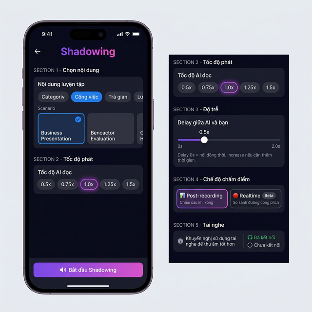
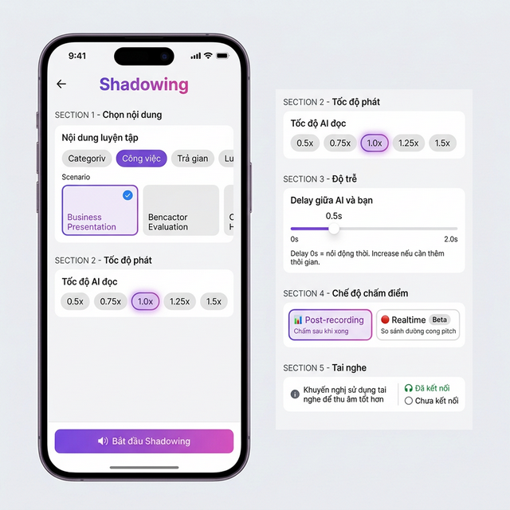
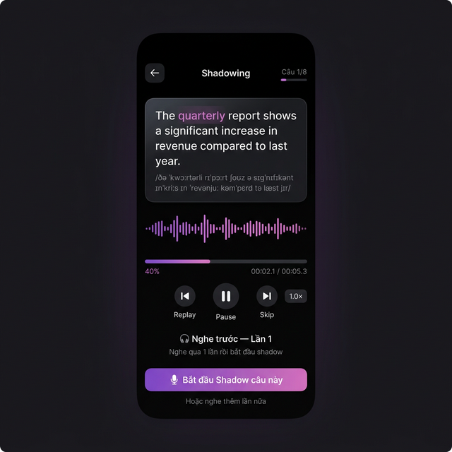
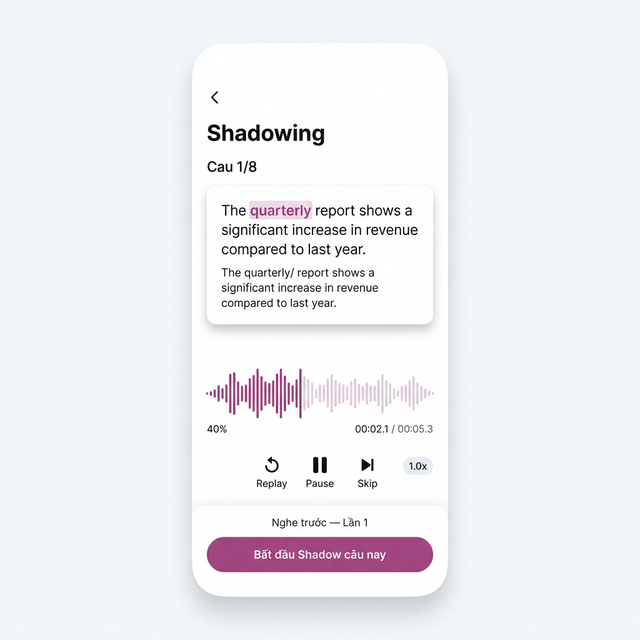
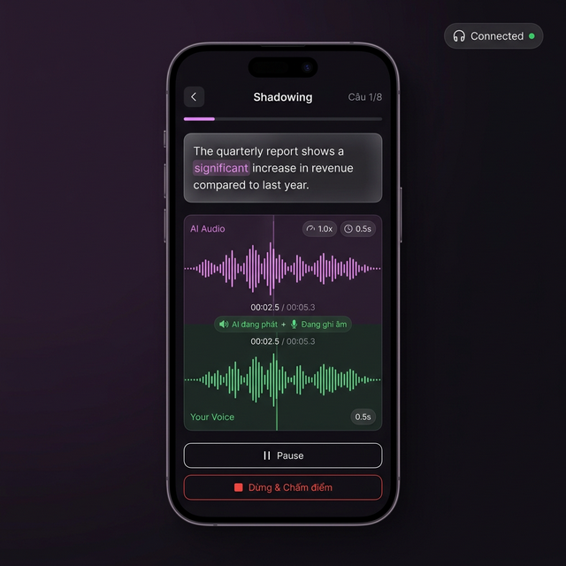
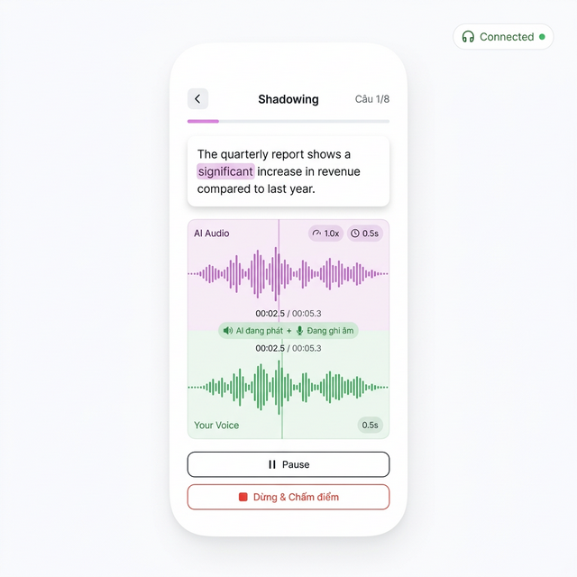
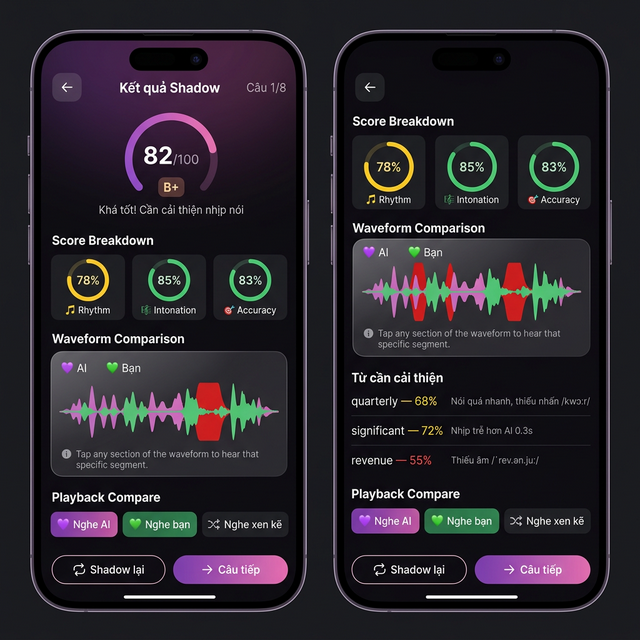
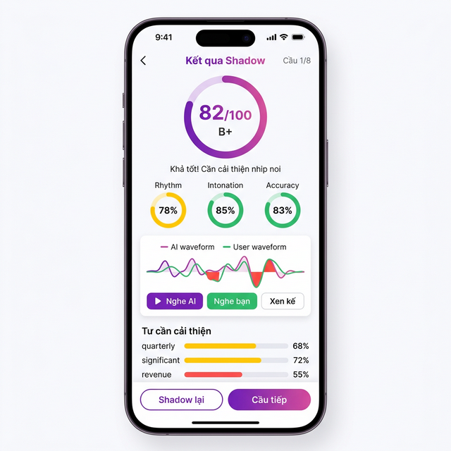
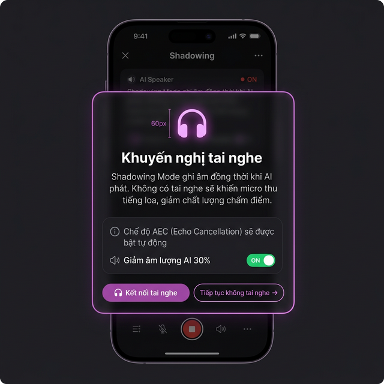
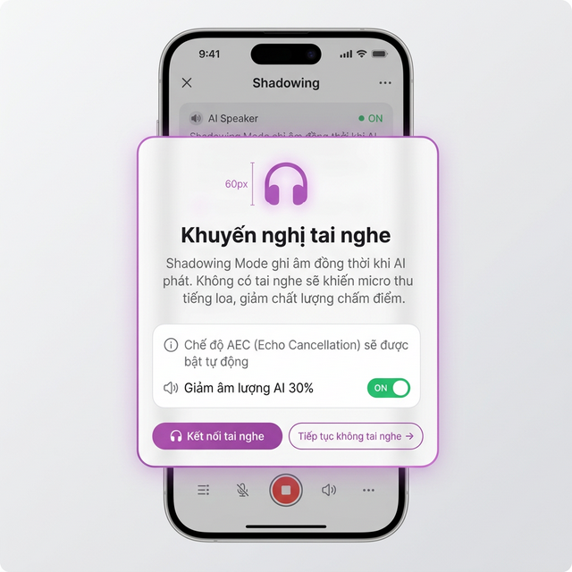

# 🔊 Speaking — Shadowing Mode

> **Module:** Speaking
> **Feature:** Shadowing Mode (B4)
> **Priority:** P0 (Core)
> **Tham chiếu chính:** [03_Speaking.md](../03_Speaking.md), [01_Navigation_PracticeMode.md](01_Navigation_PracticeMode.md)

---

## Mục lục

1. [Tổng quan](#1-tổng-quan)
2. [User Flow chi tiết](#2-user-flow-chi-tiết)
3. [Màn hình chi tiết](#3-màn-hình-chi-tiết)
4. [4-Phase Flow](#4-4-phase-flow)
5. [Audio Technical Architecture](#5-audio-technical-architecture)
6. [State Structure](#6-state-structure)
7. [API Endpoints](#7-api-endpoints)
8. [Test Cases](#8-test-cases)
9. [Edge Cases & Potential Issues](#9-edge-cases--potential-issues)
10. [Design Reference — Hi-Fi Mockups](#10-design-reference--hi-fi-mockups)

---

## 1. Tổng quan

Shadowing Mode là kỹ thuật luyện nói hiệu quả: nghe AI → nhại lại **đồng thời** → AI so sánh real-time. Core UX là **Dual Waveform Visualization** (AI track + User track song song).

### 1.1 Functional Requirements

| ID | Yêu cầu | Mức ưu tiên |
|----|---------|-------------|
| SHD-01 | Config screen: chọn topic bằng **Listening Topic Picker** (reuse component) | P0 |
| SHD-02 | Config screen: chọn speed (0.5x — 1.5x, default 1.0x) | P0 |
| SHD-03 | Config screen: chọn delay (slider 0s — 2.0s, default 0.5s) | P1 |
| SHD-04 | Config screen: chọn scoring mode (Post-recording / Realtime Beta) | P2 |
| SHD-05 | Config screen: hiển thị headphone status + recommendation | P0 |
| SHD-06 | Preview phase: AI phát câu mẫu + text highlight sync | P0 |
| SHD-07 | Shadow phase: AI phát lại + user ghi âm đồng thời + dual waveform | P0 |
| SHD-08 | Score phase: Rhythm / Intonation / Accuracy breakdown (0-100 each) | P0 |
| SHD-09 | Score phase: waveform comparison overlay (AI vs User) | P1 |
| SHD-10 | Action phase: Repeat / Next / Share | P0 |
| SHD-11 | Auto-stop recording khi AI phát xong | P0 |
| SHD-12 | Session Summary khi hết danh sách câu | P0 |

### 1.2 Non-Functional Requirements

| ID | Yêu cầu | Chi tiết |
|----|---------|----------|
| SHD-NF01 | Audio latency ≤ 50ms | Đồng bộ playback + recording không trễ |
| SHD-NF02 | Dual waveform render ≤ 16ms/frame | 60fps cho cả 2 tracks |
| SHD-NF03 | AEC (Acoustic Echo Cancellation) | Tự động bật khi không có tai nghe |
| SHD-NF04 | Haptic feedback | Medium khi bắt đầu shadow, Light khi phase kết thúc |
| SHD-NF05 | Memory | 2 audio streams + waveform data ≤ 30MB RAM |

---

## 2. User Flow chi tiết

```
[Speaking Home] → [🔊 Shadowing card] → [Shadowing Config]
                    │
                    ├─ Chọn topic (REUSE Listening Topic Picker):
                    │    ├─ 🔍 Search | ❤️ Favorites | ➕ Create
                    │    ├─ Category tabs: Du lịch / Công việc / Giải trí / ✨ Tuỳ chỉnh
                    │    └─ Scenario cards: tap chọn → purple border ✓
                    │
                    ├─ Speed: [0.5x] [0.75x] [1.0x ✓] [1.25x] [1.5x]
                    ├─ Delay: slider ──────●── 0.5s
                    ├─ Scoring: ○ Post-recording  ○ Realtime (Beta)
                    ├─ 🎧 "Tai nghe: Đã kết nối ✅" / "Không phát hiện ⚠️"
                    └─ [🔊 Bắt đầu Shadowing]
                         │
                         ▼
                  [Shadowing Screen — 4 Phase]
                    │
                    ├─ Phase 1: PREVIEW
                    │    ├─ "Nghe trước" label + 🔊 icon
                    │    ├─ AI phát câu mẫu (theo speed đã chọn)
                    │    ├─ Text highlight sync (từ đang phát → bold)
                    │    └─ AI phát xong → [🎤 Shadow!] button hiện
                    │
                    ├─ Phase 2: SHADOW (Active)
                    │    ├─ AI phát lại câu + User ghi âm đồng thời
                    │    ├─ Dual waveform:
                    │    │    ├─ 🟣 AI track (purple-pink bars)
                    │    │    └─ 🟢 User track (green bars)
                    │    ├─ Text highlight sync (tiếp tục)
                    │    ├─ Progress bar ──────●──
                    │    └─ AI phát xong → auto-stop recording
                    │
                    ├─ Phase 3: SCORE
                    │    ├─ Loading: "AI đang so sánh..."
                    │    ├─ Upload user audio → Groq Whisper → evaluate
                    │    ├─ 3 Score rings:
                    │    │    ├─ 🎵 Rhythm: 85/100
                    │    │    ├─ 🎶 Intonation: 78/100
                    │    │    └─ 🎯 Accuracy: 92/100
                    │    ├─ Waveform comparison overlay
                    │    ├─ Segment playback: [Nghe AI] [Nghe tôi] [Xen kẽ]
                    │    └─ AI Tips
                    │
                    └─ Phase 4: ACTION
                         ├─ [🔄 Lặp lại] → Phase 1 (cùng câu)
                         ├─ [→ Câu tiếp] → Phase 1 (câu mới)
                         ├─ [📤 Share] → Share Card flow
                         └─ Hết câu → [Session Summary]
```

---

## 3. Màn hình chi tiết

### 3.1 Shadowing Config Screen

**Mục đích:** User chọn topic, tốc độ, delay, và scoring mode trước khi bắt đầu.

| Section | Component | Data Source | Tương tác |
|---------|-----------|-------------|-----------|
| Topic Picker | **Reuse `<TopicPicker>` từ Listening** | `TOPIC_CATEGORIES` + `customScenarioApi` | Tap scenario → ✓ selected |
| Speed | 5× `PillButton` | Static: `[0.5, 0.75, 1.0, 1.25, 1.5]` | Tap → purple border |
| Delay | `Slider` (0s — 2.0s) | Default: 0.5s | Drag → value label cập nhật |
| Scoring | 2× `RadioButton` | Static | Tap chọn mode |
| Headphone | `HeadphoneStatusCard` | `useHeadphoneDetection()` | Auto-detect |
| CTA | `AppButton` "🔊 Bắt đầu Shadowing" | Disabled nếu chưa chọn topic | Tap → generate sentences → navigate |

**Speed data:**

| Label | Value | Mô tả |
|-------|-------|------|
| 0.5x | `0.5` | Rất chậm — Beginner |
| 0.75x | `0.75` | Chậm — Luyện rhythm |
| 1.0x | `1.0` | Bình thường (default) |
| 1.25x | `1.25` | Nhanh — Challenge |
| 1.5x | `1.5` | Rất nhanh — Advanced |

### 3.2 Shadowing Active Screen

**Mục đích:** Kết hợp nghe AI + ghi âm đồng thời. Core UX của mode này.

| Phần | Component | Chi tiết |
|------|-----------|----------|
| Header | Back + "Shadowing" + Phase badge | "Phase 1: Nghe trước" / "Phase 2: Shadow!" |
| Progress | `ProgressBar` | "Câu 3/8" + overall progress |
| Sentence | `SentenceCard` (glassmorphism) | Text + highlight sync word |
| AI Waveform | `WaveformVisualizer` (purple-pink) | AI playback amplitude |
| User Waveform | `WaveformVisualizer` (green) | User recording amplitude |
| Phase Button | `AppButton` dynamic | Phase 1: "🎤 Shadow!" / Phase 3-4: "🔄 Lặp lại" |
| Timer | `AppText` | "00:02.3 / 00:04.1" |

### 3.3 Shadowing Feedback Screen

**Mục đích:** Hiển thị kết quả so sánh phát âm chi tiết.

| Section | Component | Data | Tương tác |
|---------|-----------|------|-----------|
| Score Rings | 3× `ScoreRing` | `rhythm`, `intonation`, `accuracy` | — |
| Overall | `OverallScoreCard` | Trung bình 3 scores | — |
| Waveform Overlay | `WaveformComparison` | AI (purple) vs User (green) | Pinch zoom |
| Segment Play | 3× `PlayButton` | "Nghe AI" / "Nghe tôi" / "Xen kẽ" | Tap play |
| Tips | `TipCard` | AI-generated tips | Tap expand |
| Actions | `AppButton` × 2 + `IconButton` | — | Lặp lại / Câu tiếp / Share |

---

## 4. 4-Phase Flow

### 4.1 Phase Transitions

```
┌───────────┐    AI done    ┌───────────┐    AI done     ┌───────────┐   Score done  ┌───────────┐
│  PREVIEW  │ ─────────── → │  SHADOW   │ ──────────── → │   SCORE   │ ────────── → │  ACTION   │
│ (Phase 1) │    User taps  │ (Phase 2) │  Auto-stop     │ (Phase 3) │              │ (Phase 4) │
│           │    "Shadow!"  │           │  recording     │           │              │           │
└───────────┘               └───────────┘                └───────────┘              └───────────┘
      ▲                                                                                   │
      │                              [Lặp lại] ──────────────────────────────────────── ← ┘
      │                              [Câu tiếp] → load next sentence → ─────────────── → ▲
```

### 4.2 Phase Detail

| Phase | UI State | Audio State | Tương tác user |
|-------|----------|-------------|----------------|
| 1 — Preview | Sentence + AI waveform only | AI TTS playing | Chỉ nghe, không nói. Tap "Shadow!" khi AI xong |
| 2 — Shadow | Sentence + Dual waveform | AI TTS playing + User mic recording | Hold mic (auto-start), theo dõi dual waveform |
| 3 — Score | Score rings + comparison | Idle (upload done) | Tap segment play buttons |
| 4 — Action | Score + 3 buttons | Idle | Tap Repeat/Next/Share |

---

## 5. Audio Technical Architecture

### 5.1 Đồng thời Playback + Recording

```
┌────────────────────────────────────────────────────┐
│                    Audio Engine                      │
│                                                      │
│  ┌──────────────┐        ┌───────────────┐           │
│  │ AI Playback  │        │ User Recording│           │
│  │ (TTS Audio)  │        │ (Microphone)  │           │
│  └──────┬───────┘        └──────┬────────┘           │
│         │                       │                     │
│    ┌────▼────┐             ┌────▼────┐                │
│    │Speaker/ │             │  Mic    │                │
│    │Earphone │             │ Input   │                │
│    └────┬────┘             └────┬────┘                │
│         │                       │                     │
│    ┌────▼────────────┐    ┌────▼────────────┐        │
│    │ AI Waveform     │    │ User Waveform   │        │
│    │ (Purple-Pink)   │    │ (Green)         │        │
│    └─────────────────┘    └─────────────────┘        │
│                                                      │
│  🎧 Headphone? → Direct routing                      │
│  📱 Speaker? → AEC enabled + Volume ducking (30%)    │
│                                                      │
└────────────────────────────────────────────────────┘
```

### 5.2 Headphone Detection

| Trạng thái | UI | Hành vi |
|-------------|-----|---------|
| 🎧 Tai nghe kết nối | "✅ Tai nghe đã kết nối — Chất lượng tốt nhất" (green) | Direct audio routing, no AEC needed |
| 📱 Không có tai nghe | "⚠️ Nên dùng tai nghe" + Warning modal | AEC bật, volume ducking 30%, warning toast |
| 🔌 Tai nghe rút giữa session | Toast "Tai nghe bị ngắt!" + auto-pause | Switch sang AEC mode, pause để user quyết định |

### 5.3 Volume Ducking

Khi user KHÔNG dùng tai nghe, hệ thống tự giảm volume AI playback để mic không bắt echo:

| Setting | Default | Range |
|---------|---------|-------|
| AI playback volume | 30% | 10-50% |
| User recording gain | 100% | Auto |
| AEC mode | Auto | ON/OFF |

---

## 6. State Structure

```typescript
interface ShadowingState {
  // Cấu hình — set ở Config Screen
  config: {
    topic: TopicScenario | CustomScenario | null;
    speed: 0.5 | 0.75 | 1.0 | 1.25 | 1.5;   // Tốc độ AI playback
    delay: number;                              // Delay trước khi user bắt đầu (0-2.0s)
    scoringMode: 'post-recording' | 'realtime'; // Chế độ chấm điểm
    hasHeadphones: boolean;                     // Từ useHeadphoneDetection()
  };

  // Session — danh sách câu từ AI
  session: {
    sentences: ShadowingSentence[];
    currentIndex: number;
    totalSentences: number;
  };

  // Phase — trạng thái 4 giai đoạn
  phase: {
    current: 'preview' | 'shadow' | 'score' | 'action';
    isAIPlaying: boolean;        // AI TTS đang phát
    isRecording: boolean;         // User mic đang ghi
    aiProgress: number;           // 0-1 progress playback AI
    userProgress: number;         // 0-1 progress recording
  };

  // Waveform — dữ liệu hiển thị sóng âm
  waveform: {
    aiData: number[];             // Amplitude data AI (purple)
    userData: number[];           // Amplitude data User (green)
  };

  // Score — kết quả đánh giá
  score: {
    isLoading: boolean;
    rhythm: number | null;        // 0-100
    intonation: number | null;    // 0-100
    accuracy: number | null;      // 0-100
    overall: number | null;       // Trung bình 3 scores
    tips: string[];
    aiAudioUrl: string | null;    // Audio AI để replay
    userAudioUrl: string | null;  // Audio User để replay
  };
}

interface ShadowingSentence {
  id: string;
  text: string;           // Câu tiếng Anh
  ipa: string;            // Phiên âm IPA
  audioUrl: string;       // Azure TTS audio URL
  duration: number;        // Thời lượng audio (ms)
  difficulty: 'easy' | 'medium' | 'hard';
}
```

---

## 7. API Endpoints

| Endpoint | Method | Mô tả | Request | Response |
|----------|--------|-------|---------|----------|
| `/speaking/generate-sentences` | POST | Tạo câu để shadowing | `{ topic, level, count }` | `{ sentences: ShadowingSentence[] }` |
| `/speaking/tts` | POST | TTS cho câu mẫu (có speed) | `{ text, voice, rate, pitch }` | `{ audioUrl, duration }` |
| `/speaking/transcribe` | POST | STT audio user (Groq Whisper) | `FormData { audio }` | `{ transcript }` |
| `/speaking/evaluate-shadowing` | POST | So sánh AI vs User | `{ aiAudioUrl, userAudioUri, targetText, speed }` | `{ rhythm, intonation, accuracy, tips }` |
| `/api/history` | POST | Lưu session | `{ type, mode, topic, scores }` | `{ id }` |

---

## 8. Test Cases

### 8.1 Shadowing Config

| TC-ID | Tên | Steps | Expected |
|-------|-----|-------|----------|
| SHD-TC01 | Chọn topic | Topic picker → chọn "Business" | Card highlight + ✓ |
| SHD-TC02 | Chọn custom scenario | Tab ✨ → chọn custom | Card highlight + ✓ |
| SHD-TC03 | Speed selection | Tap "0.75x" | Purple border, khác default |
| SHD-TC04 | Delay slider | Drag slider tới 1.5s | Label "1.5s" cập nhật |
| SHD-TC05 | Headphone detected | Cắm tai nghe | "✅ Tai nghe kết nối" green |
| SHD-TC06 | No headphone | Rút tai nghe | "⚠️ Nên dùng tai nghe" warning |
| SHD-TC07 | Start without topic | Tap CTA không chọn topic | Button disabled / toast |
| SHD-TC08 | Start thành công | Chọn topic + config → tap CTA | Loading → navigate Shadowing Screen |

### 8.2 Phase 1 — Preview

| TC-ID | Tên | Steps | Expected |
|-------|-----|-------|----------|
| SHD-TC10 | AI phát câu | Vào Phase 1 | AI TTS phát + text highlight sync |
| SHD-TC11 | Speed applied | Config 0.75x → Phase 1 | AI phát chậm hơn bình thường |
| SHD-TC12 | Shadow button | AI phát xong | "🎤 Shadow!" button hiện lên |
| SHD-TC13 | Progress | Câu 3/8 | "Câu 3/8" + progress bar 37.5% |

### 8.3 Phase 2 — Shadow (Active)

| TC-ID | Tên | Steps | Expected |
|-------|-----|-------|----------|
| SHD-TC20 | Dual waveform | Tap "Shadow!" | AI waveform (purple) + User waveform (green) render |
| SHD-TC21 | Recording auto-start | Phase 2 bắt đầu | Mic tự động bắt đầu ghi + haptic medium |
| SHD-TC22 | Text highlight sync | Đang shadowing | Từ đang phát → bold highlight |
| SHD-TC23 | Auto-stop | AI phát xong | Recording tự dừng → haptic light → Phase 3 |
| SHD-TC24 | AEC active | Không tai nghe + đang Shadow | AI audio giảm 30%, AEC bật |

### 8.4 Phase 3 — Score

| TC-ID | Tên | Steps | Expected |
|-------|-----|-------|----------|
| SHD-TC30 | Score loading | Phase 2 → 3 | "AI đang so sánh..." loading indicator |
| SHD-TC31 | Score display | Score loaded | 3 rings: Rhythm + Intonation + Accuracy |
| SHD-TC32 | Waveform overlay | Score loaded | AI (purple) vs User (green) overlay |
| SHD-TC33 | Segment play AI | Tap "Nghe AI" | Phát audio AI |
| SHD-TC34 | Segment play User | Tap "Nghe tôi" | Phát audio User |
| SHD-TC35 | Alternating play | Tap "Xen kẽ" | Phát AI → User → AI → User |
| SHD-TC36 | Tips display | Score loaded | AI tips hiển thị |

### 8.5 Phase 4 — Action

| TC-ID | Tên | Steps | Expected |
|-------|-----|-------|----------|
| SHD-TC40 | Repeat | Tap "🔄 Lặp lại" | Quay về Phase 1, cùng câu |
| SHD-TC41 | Next | Tap "→ Câu tiếp" | Phase 1, câu tiếp theo |
| SHD-TC42 | Share | Tap "📤 Share" | Capture score card → share sheet |
| SHD-TC43 | Last sentence | Câu cuối → tap Next | Navigate → Session Summary |
| SHD-TC44 | Session Summary | Hết câu | Tổng kết: avg scores + thời gian + tips |

---

## 9. Edge Cases & Potential Issues

### 9.1 Audio Edge Cases

| Case | Trigger | Xử lý | Rủi ro |
|------|---------|-------|--------|
| Không cắm tai nghe | User bắt đầu | Warning modal: "Nên dùng tai nghe 🎧" + cho phép tiếp | ⚠️ Medium |
| Rút tai nghe giữa session | Jack/BT disconnect | Toast + auto-pause + switch AEC mode | 🔴 High |
| AEC không hiệu quả | Loa ngoài + mic kém | Score thấp → tips "Thử dùng tai nghe" | ⚠️ Medium |
| User nói quá nhỏ | Mic không bắt | Toast "Hãy nói to hơn nhé!" + low amplitude indicator | ⚠️ Medium |
| Device nóng (thermal) | CPU cao do dual stream | Auto-pause + "Thiết bị cần nghỉ" (hiếm gặp) | ✅ Low |

### 9.2 Recording & Playback

| Case | Trigger | Xử lý | Rủi ro |
|------|---------|-------|--------|
| AI audio fail load | TTS server lỗi | Toast + retry: "Không thể phát câu mẫu" | 🔴 High |
| Recording overlap | User nói trước AI xong | Trim recording → align với AI | ⚠️ Medium |
| Speed 1.5x quá nhanh | User không theo kịp | Score thấp → tips "Thử giảm tốc độ" | ✅ Low |
| App minimize | User switch app | Auto-stop recording + save state → resume khi quay lại | ⚠️ Medium |
| Incoming call | Cuộc gọi đến | Audio interrupt → auto-stop → resume sau | 🔴 High |

### 9.3 Network

| Case | Trigger | Xử lý | Rủi ro |
|------|---------|-------|--------|
| Mất mạng khi load sentences | Offline | Cache locally + "Mất kết nối" | 🔴 High |
| Mất mạng khi scoring | Upload fail | Audio cache locally + retry khi có mạng | 🔴 High |
| Score timeout (>15s) | Server chậm | Cancel + Toast + [Thử lại] | ⚠️ Medium |
| Groq Whisper quota | Rate limit | Fallback model → toast nếu vẫn lỗi | 🔴 High |

### 9.4 Potential Issues

| Issue | Mô tả | Mitigation |
|-------|-------|------------|
| **Audio sync drift** | AI playback và recording bị lệch timing | Timestamp-based alignment + NTP sync |
| **Waveform memory leak** | 2 waveform listeners không cleanup | `removeRecordBackListener` trong useEffect cleanup |
| **Speed affects STT** | 0.5x tạo ra audio dài → STT chậm hơn | Pre-trim silence + chunked upload |
| **Dual audio session conflict** | playAndRecord + route switching | Set `AVAudioSession` category chính xác per headphone state |
| **Bluetooth latency** | BT headphones có latency ~150ms | Bù delay tự động dựa trên BT codec detection |
| **Battery drain** | Dual stream consume nhiều battery | Optimize polling interval cho waveform: 50ms thay 16ms |

---

## 10. Design Reference — Hi-Fi Mockups

| Màn hình | Dark Mode | Light Mode |
|----------|-----------|------------|
| Shadowing Config |  |  |
| Shadowing Preview |  |  |
| Shadowing Active |  |  |
| Shadowing Feedback |  |  |
| Headphone Warning |  |  |
