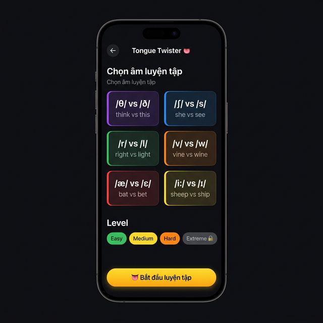
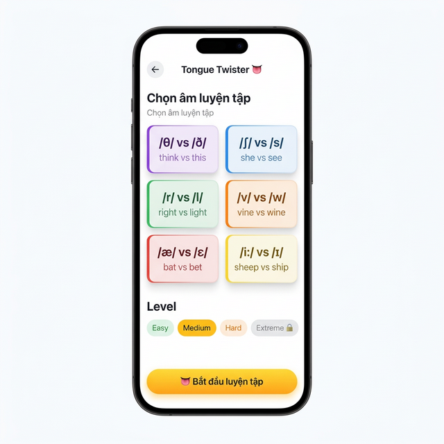
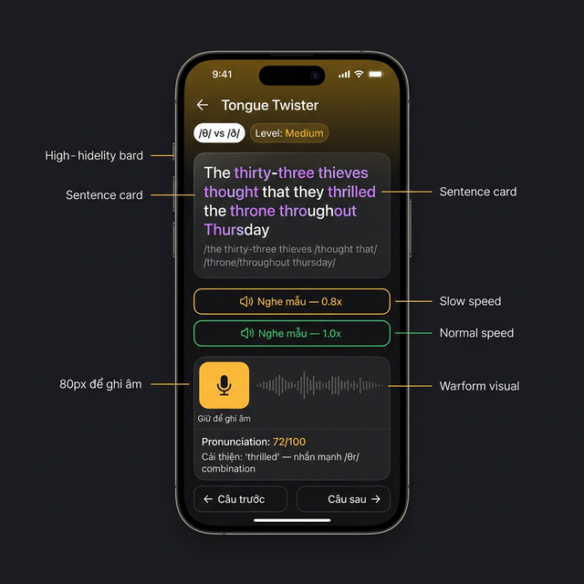
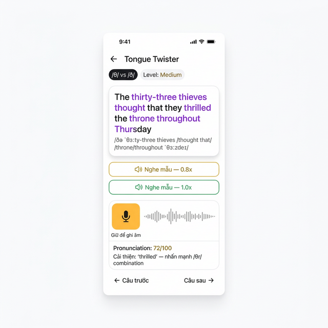
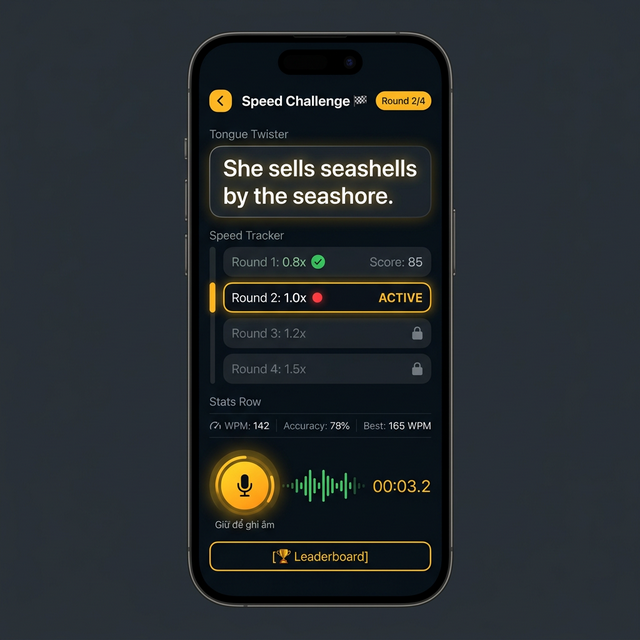
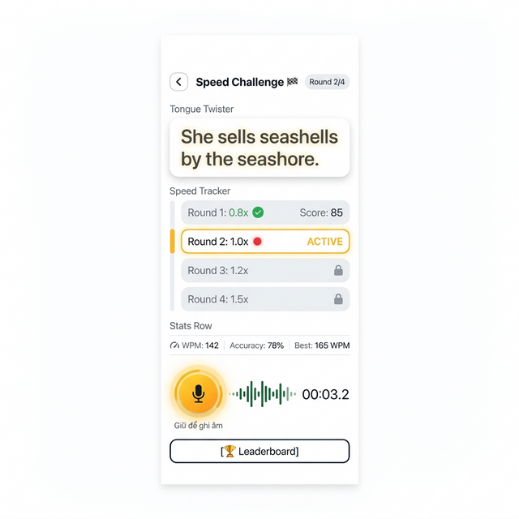

# 👅 Speaking — Tongue Twister Mode

> **Module:** Speaking
> **Feature:** Tongue Twister Mode (B5)
> **Priority:** P1 (Gamification)
> **Tham chiếu chính:** [03_Speaking.md](../03_Speaking.md), [01_Navigation_PracticeMode.md](01_Navigation_PracticeMode.md)

---

## Mục lục

1. [Tổng quan](#1-tổng-quan)
2. [User Flow chi tiết](#2-user-flow-chi-tiết)
3. [Màn hình chi tiết](#3-màn-hình-chi-tiết)
4. [Speed Challenge System](#4-speed-challenge-system)
5. [Gamification & Leaderboard](#5-gamification--leaderboard)
6. [State Structure](#6-state-structure)
7. [API Endpoints](#7-api-endpoints)
8. [Test Cases](#8-test-cases)
9. [Edge Cases & Potential Issues](#9-edge-cases--potential-issues)
10. [Design Reference — Hi-Fi Mockups](#10-design-reference--hi-fi-mockups)

---

## 1. Tổng quan

Tongue Twister Mode là chế độ gamified tập trung luyện phát âm **phoneme cụ thể** thông qua câu nói lái (tongue twisters) và thử thách tốc độ. Mục tiêu: cải thiện articulation và fluency cho những âm mà user yếu nhất.

### 1.1 So sánh với Practice Mode

| | 🎤 Practice Mode | 👅 Tongue Twister |
|---|---|---|
| **Focus** | Phát âm tổng quát | Phoneme cụ thể |
| **Nội dung** | Câu giao tiếp (từ topic) | Câu nói lái (tongue twisters) |
| **Tốc độ** | Bình thường | Progressive: 0.8x → 1.5x |
| **Gamification** | Score + Confetti | Score + WPM + Leaderboard + Badges |
| **Level** | Beginner / Intermediate / Advanced | Easy → Medium → Hard → Extreme 🔒 |
| **Topic selection** | REUSE Listening Topic Picker | Chọn Phoneme Category |

### 1.2 Functional Requirements

| ID | Yêu cầu | Mức ưu tiên |
|----|---------|-------------|
| TT-01 | Phoneme category selection (6+ categories) | P0 |
| TT-02 | Level selection: Easy → Medium → Hard → Extreme 🔒 | P0 |
| TT-03 | Level unlock: hoàn thành level trước → mở khóa sau | P1 |
| TT-04 | Hiển thị tongue twister text + IPA + phoneme highlight | P0 |
| TT-05 | Nghe mẫu: AI TTS phát câu ở tốc độ chậm (0.8x) + bình thường (1.0x) | P0 |
| TT-06 | Hold mic → ghi âm → AI scoring (phoneme-focused) | P0 |
| TT-07 | Speed Challenge: 4 rounds tăng tốc (0.8x → 1.0x → 1.2x → 1.5x) | P1 |
| TT-08 | WPM (Words Per Minute) tracking mỗi round | P1 |
| TT-09 | Leaderboard: xếp hạng theo speed + accuracy | P2 |
| TT-10 | Badges: speed milestones (100 WPM, 120 WPM, 150 WPM...) | P2 |
| TT-11 | Navigation: "← Câu trước" / "Câu sau →" | P0 |

### 1.3 Non-Functional Requirements

| ID | Yêu cầu | Chi tiết |
|----|---------|----------|
| TT-NF01 | Scoring latency ≤ 3s | Từ submit → hiện score |
| TT-NF02 | Audio quality | 16kHz mono, AAC, max 10s per round |
| TT-NF03 | Haptic | Medium start, Light stop, Success khi hoàn thành round |
| TT-NF04 | WPM calculation accuracy | ±5 WPM tolerance |

---

## 2. User Flow chi tiết

```
[Speaking Home] → [👅 Tongue Twister card] → [Tongue Twister Screen]
                    │
                    ├─ Chọn Phoneme Category:
                    │    ├─ 🟣 /θ/ vs /ð/ — "think vs this"
                    │    ├─ 🔵 /ʃ/ vs /s/ — "she vs see"
                    │    ├─ 🟢 /r/ vs /l/ — "right vs light"
                    │    ├─ 🟠 /v/ vs /w/ — "vine vs wine"
                    │    ├─ 🔴 /æ/ vs /ɛ/ — "bat vs bet"
                    │    └─ 🟡 /iː/ vs /ɪ/ — "sheep vs ship"
                    │
                    ├─ Chọn Level:
                    │    ├─ 🌱 Easy (unlocked)
                    │    ├─ 🌿 Medium (unlocked nếu Easy ≥ 70%)
                    │    ├─ 🌳 Hard (unlocked nếu Medium ≥ 70%)
                    │    └─ 🔒 Extreme (unlocked nếu Hard ≥ 70%)
                    │
                    └─ [👅 Bắt đầu luyện tập]
                         │
                         ▼
                  [Tongue Twister Practice Screen]
                    │
                    ├─ Sentence card:
                    │    ├─ Text: "She sells seashells by the seashore"
                    │    ├─ Phoneme highlights (purple): "she" "sells" "seashells" "seashore"
                    │    └─ IPA below (gray, toggle)
                    │
                    ├─ [🔊 Nghe mẫu — 0.8x] → TTS chậm
                    ├─ [🔊 Nghe mẫu — 1.0x] → TTS bình thường
                    │
                    ├─ [🎤 Giữ mic] → Record → Score
                    │    ├─ Pronunciation: 72/100
                    │    └─ Tip: "Cải thiện: 'seashells' — nhấn mạnh /ʃ/"
                    │
                    ├─ [🏁 Speed Challenge] → (nếu score ≥ 60)
                    │    ├─ Round 1: 0.8x → Score + WPM
                    │    ├─ Round 2: 1.0x → Score + WPM
                    │    ├─ Round 3: 1.2x → Score + WPM
                    │    ├─ Round 4: 1.5x → Score + WPM
                    │    └─ Final: Best WPM + Accuracy combo
                    │
                    └─ Footer: [← Câu trước] / [Câu sau →] + [🏆 Leaderboard]
```

---

## 3. Màn hình chi tiết

### 3.1 Phoneme Select Screen

**Mục đích:** User chọn phoneme category + difficulty level trước khi luyện tập.

| Section | Component | Data | Tương tác |
|---------|-----------|------|-----------|
| Header | Back + "Tongue Twister 👅" | — | Back → Speaking Home |
| Title | "Chọn âm luyện tập" | — | — |
| Phoneme Grid | 2-column grid, `PhonemeCard` | 6 categories | Tap → selected (colored border) |
| Level | 4× `LevelPill` | easy/medium/hard/extreme | Tap → select (locked = disabled) |
| CTA | `AppButton` "👅 Bắt đầu luyện tập" | Disabled nếu chưa chọn | Tap → generate twisters → navigate |

**Phoneme Categories:**

| Key | Phoneme Pair | Example | Color | Icon |
|-----|-------------|---------|-------|------|
| `th_sounds` | /θ/ vs /ð/ | think vs this | 🟣 Purple | — |
| `sh_s` | /ʃ/ vs /s/ | she vs see | 🔵 Blue | — |
| `r_l` | /r/ vs /l/ | right vs light | 🟢 Green | — |
| `v_w` | /v/ vs /w/ | vine vs wine | 🟠 Orange | — |
| `ae_e` | /æ/ vs /ɛ/ | bat vs bet | 🔴 Red | — |
| `ee_i` | /iː/ vs /ɪ/ | sheep vs ship | 🟡 Yellow | — |

**Level Unlock Logic:**

| Level | Requirement | Badge |
|-------|-------------|-------|
| Easy | Luôn mở | 🌱 |
| Medium | Easy avg score ≥ 70% | 🌿 |
| Hard | Medium avg score ≥ 70% | 🌳 |
| Extreme | Hard avg score ≥ 70% | 🔥 |

### 3.2 Practice Screen

**Mục đích:** Hiển thị tongue twister, cho user nghe mẫu và ghi âm.

| Phần | Component | Chi tiết |
|------|-----------|----------|
| Header | Back + "Tongue Twister" + Phoneme badge + Level badge | "/θ/ vs /ð/" + "Level: Medium" |
| Sentence | `GlassmorphismCard` | Tongue twister text (20px), phoneme words highlighted |
| IPA | `AppText` (gray) | IPA transcription, toggle ẩn/hiện |
| Listen Slow | `AppButton` outlined yellow | "🔊 Nghe mẫu — 0.8x" |
| Listen Normal | `AppButton` outlined green | "🔊 Nghe mẫu — 1.0x" |
| Mic | `MicButton` (80px, yellow-orange gradient) | Hold → record → score |
| Waveform | `WaveformVisualizer` | Green bars real-time |
| Score | `ScoreDisplay` inline | "Pronunciation: 72/100" + tip |
| Footer | `TextButton` × 2 | "← Câu trước" / "Câu sau →" |

### 3.3 Speed Challenge Screen

**Mục đích:** Thử thách user phát âm ở tốc độ tăng dần.

| Phần | Component | Chi tiết |
|------|-----------|----------|
| Header | Back + "Speed Challenge 🏁" + "Round 2/4" badge | — |
| Sentence | `GlassmorphismCard` | Cùng tongue twister text |
| Speed Tracker | 4× `RoundCard` (vertical list) | Round status: ✅ / 🔴 ACTIVE / 🔒 |
| Stats | 3× `StatChip` | WPM / Accuracy / Best WPM |
| Mic | `MicButton` (80px, pulsing) + Timer | "00:03.2" countdown |
| Waveform | `WaveformVisualizer` | Green bars |
| CTA | `AppButton` outlined | "🏆 Leaderboard" |

---

## 4. Speed Challenge System

### 4.1 Round Progression

| Round | Target Speed | Target WPM | Pass Threshold |
|-------|-------------|-----------|----------------|
| 1 | 0.8x | ~100 WPM | Accuracy ≥ 50% |
| 2 | 1.0x | ~125 WPM | Accuracy ≥ 50% |
| 3 | 1.2x | ~150 WPM | Accuracy ≥ 45% |
| 4 | 1.5x | ~180 WPM | Accuracy ≥ 40% |

### 4.2 WPM Calculation

```typescript
/**
 * Mục đích: Tính Words Per Minute cho tongue twister recording
 * Tham số đầu vào: totalWords - số từ trong câu, durationSeconds - thời gian ghi âm
 * Tham số đầu ra: WPM (number)
 * Khi nào sử dụng: Sau khi user ghi âm xong mỗi round
 */
function calculateWPM(totalWords: number, durationSeconds: number): number {
  // Chỉ tính các từ phát âm đúng
  const correctWords = totalWords * (accuracy / 100);
  return Math.round((correctWords / durationSeconds) * 60);
}
```

### 4.3 Scoring Formula

```
Tổng điểm = (Accuracy × 0.7) + (Speed × 0.3)

Accuracy = phần trăm phoneme đúng trong câu
Speed = WPM / Target WPM × 100 (cap ở 100)
```

---

## 5. Gamification & Leaderboard

### 5.1 Leaderboard

| Column | Data | Sort |
|--------|------|------|
| Rank | 1, 2, 3... 🏆🥈🥉 | — |
| User | Avatar + Name | — |
| Best WPM | Highest WPM achieved | Primary DESC |
| Accuracy | Avg accuracy % | Tiebreaker DESC |
| Phoneme | Category played | Filter |

**Scope:** Per phoneme category (e.g., "/θ/ vs /ð/ Leaderboard")

### 5.2 Badges

| Badge | Requirement | Icon |
|-------|-------------|------|
| Speed Demon | 150+ WPM any twister | ⚡ |
| Phoneme Master | 90%+ accuracy all categories | 🏅 |
| 120 WPM Club | 120+ WPM | 🏃 |
| Speed King | 180+ WPM | 👑 |
| Tongue Tied | Complete 50 twisters | 👅 |
| Perfect Round | 100% accuracy any round | 💎 |

---

## 6. State Structure

```typescript
interface TongueTwisterState {
  // Cấu hình — set ở Select Screen
  config: {
    phonemeCategory: PhonemeCategory;   // 'th_sounds' | 'sh_s' | 'r_l' | ...
    level: 'easy' | 'medium' | 'hard' | 'extreme';
  };

  // Session — danh sách tongue twisters
  session: {
    twisters: TongueTwister[];
    currentIndex: number;
    totalTwisters: number;
  };

  // Ghi âm — trạng thái mic
  recording: {
    isRecording: boolean;
    duration: number;
    audioUri: string | null;
    waveformData: number[];
  };

  // Score — kết quả practice
  score: {
    isLoading: boolean;
    pronunciation: number | null;      // 0-100
    phonemeHits: PhonemeHit[];         // Chi tiết phoneme đúng/sai
    tip: string | null;
  };

  // Speed Challenge
  speedChallenge: {
    isActive: boolean;
    currentRound: 1 | 2 | 3 | 4;
    rounds: SpeedRound[];
    bestWPM: number;
  };

  // Level progress — unlock tracking
  levelProgress: {
    [category: string]: {
      easy: { avgScore: number; completed: boolean };
      medium: { avgScore: number; completed: boolean };
      hard: { avgScore: number; completed: boolean };
      extreme: { avgScore: number; completed: boolean };
    };
  };
}

interface TongueTwister {
  id: string;
  text: string;                // "She sells seashells..."
  ipa: string;                 // IPA transcription
  targetPhonemes: string[];    // ['/ʃ/', '/s/']
  highlightWords: string[];    // ["she", "sells", "seashells", "seashore"]
  difficulty: 'easy' | 'medium' | 'hard' | 'extreme';
}

interface SpeedRound {
  round: 1 | 2 | 3 | 4;
  targetSpeed: 0.8 | 1.0 | 1.2 | 1.5;
  status: 'locked' | 'active' | 'completed';
  score: number | null;
  wpm: number | null;
  accuracy: number | null;
}

interface PhonemeHit {
  phoneme: string;         // '/ʃ/'
  word: string;            // "seashells"
  isCorrect: boolean;
  userPhoneme?: string;    // Phoneme user thực tế phát âm
}

type PhonemeCategory = 'th_sounds' | 'sh_s' | 'r_l' | 'v_w' | 'ae_e' | 'ee_i';
```

---

## 7. API Endpoints

| Endpoint | Method | Mô tả | Request | Response |
|----------|--------|-------|---------|----------|
| `/speaking/tongue-twisters` | GET | Lấy danh sách twisters | `{ category, level, count }` | `{ twisters: TongueTwister[] }` |
| `/speaking/tts` | POST | TTS cho nghe mẫu (có speed) | `{ text, voice, rate }` | `{ audioUrl }` |
| `/speaking/analyze-phoneme` | POST | Phân tích phoneme-focused | `FormData { audio, targetPhonemes, targetText }` | `{ score, phonemeHits, tip }` |
| `/speaking/speed-challenge` | POST | Score Speed Challenge round | `FormData { audio, targetText, targetSpeed }` | `{ score, wpm, accuracy }` |
| `/speaking/leaderboard` | GET | Lấy leaderboard | `{ category, limit }` | `{ entries: LeaderboardEntry[] }` |
| `/speaking/leaderboard` | POST | Submit score | `{ category, wpm, accuracy }` | `{ rank }` |
| `/speaking/level-progress` | GET | Lấy level progress | `{ category }` | `{ levels: LevelProgress }` |
| `/speaking/level-progress` | PUT | Cập nhật progress | `{ category, level, score }` | `{ unlocked: string[] }` |

---

## 8. Test Cases

### 8.1 Phoneme Select

| TC-ID | Tên | Steps | Expected |
|-------|-----|-------|----------|
| TT-TC01 | Hiển thị categories | Mở Tongue Twister screen | 6 phoneme cards hiện |
| TT-TC02 | Chọn phoneme | Tap "/θ/ vs /ð/" | Card highlight purple border |
| TT-TC03 | Level locked | Chưa hoàn thành Easy | Medium/Hard/Extreme hiện 🔒 |
| TT-TC04 | Level unlocked | Easy avg ≥ 70% | Medium hiện unlocked |
| TT-TC05 | Start without selection | Tap CTA không chọn | Button disabled |
| TT-TC06 | Start thành công | Chọn phoneme + level → CTA | Navigate → Practice |

### 8.2 Practice

| TC-ID | Tên | Steps | Expected |
|-------|-----|-------|----------|
| TT-TC10 | Hiển thị twister | Vào Practice | Câu + IPA + phoneme highlight |
| TT-TC11 | Nghe mẫu chậm | Tap "🔊 Nghe mẫu — 0.8x" | TTS phát 0.8x speed |
| TT-TC12 | Nghe mẫu normal | Tap "🔊 Nghe mẫu — 1.0x" | TTS phát 1.0x speed |
| TT-TC13 | Ghi âm | Hold mic 3s → release | Waveform + timer → score |
| TT-TC14 | Score display | Sau ghi âm | "Pronunciation: 72/100" + tip |
| TT-TC15 | Phoneme highlight | Score < 80% cho "seashells" | Từ "seashells" highlight đỏ |
| TT-TC16 | Navigation câu | Tap "Câu sau →" | Chuyển twister tiếp theo |

### 8.3 Speed Challenge

| TC-ID | Tên | Steps | Expected |
|-------|-----|-------|----------|
| TT-TC20 | Enter Speed Challenge | Practice score ≥ 60 → tap "🏁" | Speed Challenge screen hiện |
| TT-TC21 | Round 1 active | Bắt đầu Speed Challenge | Round 1 (0.8x) ACTIVE, rest 🔒 |
| TT-TC22 | Complete round 1 | Ghi âm Round 1 | Score + WPM hiện, Round 2 unlock |
| TT-TC23 | Round 2 play | Tap Round 2 | Recording ở 1.0x target |
| TT-TC24 | All rounds complete | Hoàn thành 4 rounds | Final summary: Best WPM + combo |
| TT-TC25 | WPM display | Mỗi round xong | "WPM: 142" hiện đúng |
| TT-TC26 | Fail round | Accuracy < threshold | "Chưa đạt — thử lại!" + retry |

### 8.4 Leaderboard & Gamification

| TC-ID | Tên | Steps | Expected |
|-------|-----|-------|----------|
| TT-TC30 | View leaderboard | Tap "🏆 Leaderboard" | List rank + WPM + accuracy |
| TT-TC31 | Score submitted | Complete Speed Challenge | Score tự động submit → rank |
| TT-TC32 | Badge earned | 150+ WPM | "⚡ Speed Demon" badge notification |
| TT-TC33 | Level unlock | Easy avg ≥ 70% | Toast "🎉 Medium unlocked!" |

---

## 9. Edge Cases & Potential Issues

### 9.1 Recording Edge Cases

| Case | Trigger | Xử lý | Rủi ro |
|------|---------|-------|--------|
| Mic permission denied | Chưa cấp quyền | Alert → [Mở Settings] | ⚠️ Medium |
| Recording quá ngắn (<1s) | Tap nhanh | Toast "Nói lâu hơn nhé!" | ✅ Low |
| User nói quá nhanh (mumble) | Accuracy < 50% | Không tính WPM + "Nói rõ hơn nhé!" | ⚠️ Medium |
| Microphone clipping | High energy burst nhanh | Auto gain control | ⚠️ Medium |
| Overlapping sounds /s/ vs /ʃ/ | Phonemes quá gần nhau | Lower threshold, fuzzy matching | ⚠️ Medium |

### 9.2 Speed Challenge Edge Cases

| Case | Trigger | Xử lý | Rủi ro |
|------|---------|-------|--------|
| User fail 1 round | Accuracy < threshold | "Chưa đạt" + cho phép retry (max 3) | ✅ Low |
| User fail 3 lần | 3 retry liên tục fail | "Hãy luyện thêm ở tốc độ thấp hơn" → quay về practice | ⚠️ Medium |
| WPM = 0 | User im lặng | "Không nghe được — thử lại?" | ⚠️ Medium |
| Timer hết | User nói quá chậm | Auto-stop + tính score với recorded portion | ✅ Low |

### 9.3 Potential Issues

| Issue | Mô tả | Mitigation |
|-------|-------|------------|
| **Phoneme detection accuracy** | /θ/ vs /ð/ rất khó phân biệt qua STT | Dùng phonetic distance model thay vì exact match |
| **WPM inflation** | User nói nhanh nhưng sai → WPM cao giả | Chỉ tính correctly-pronounced words |
| **Level progress sync** | Offline → progress không lưu | Local-first + sync khi có mạng |
| **Leaderboard spam** | User submit score liên tục | Rate limit: 1 submit / phoneme / 5 phút |
| **Font IPA** | /θ/ /ð/ /ʃ/ không render 1 số device | Font stack: NotoSans → system fallback |
| **Content variety** | 10 twisters / category → lặp nhanh | AI-generated twisters bổ sung + community submit |

---

## 10. Design Reference — Hi-Fi Mockups

| Màn hình | Dark Mode | Light Mode |
|----------|-----------|------------|
| Phoneme Select |  |  |
| Practice |  |  |
| Speed Challenge |  |  |
