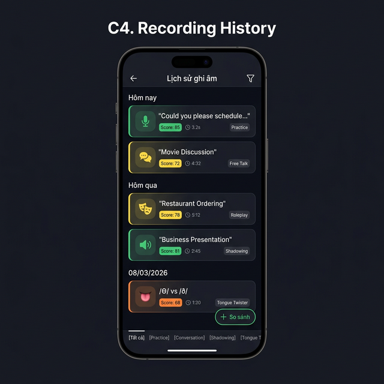
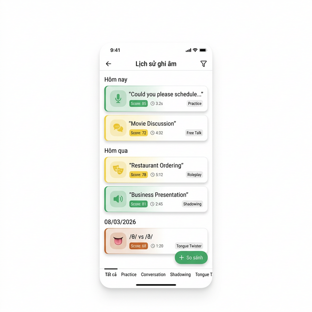
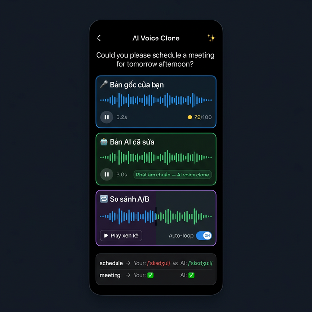
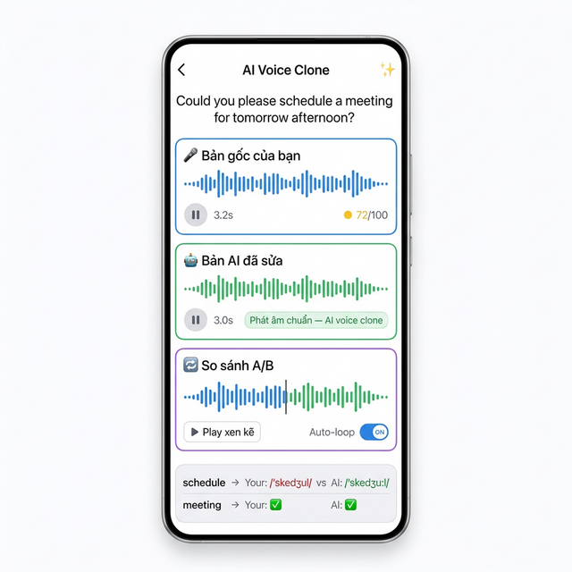
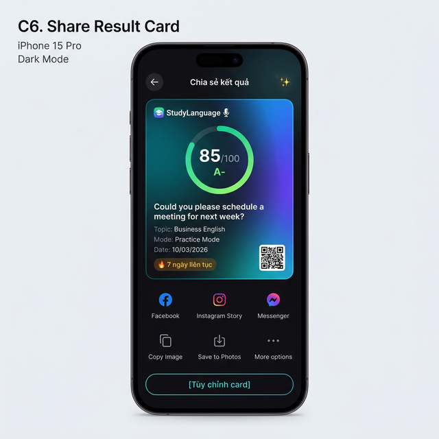
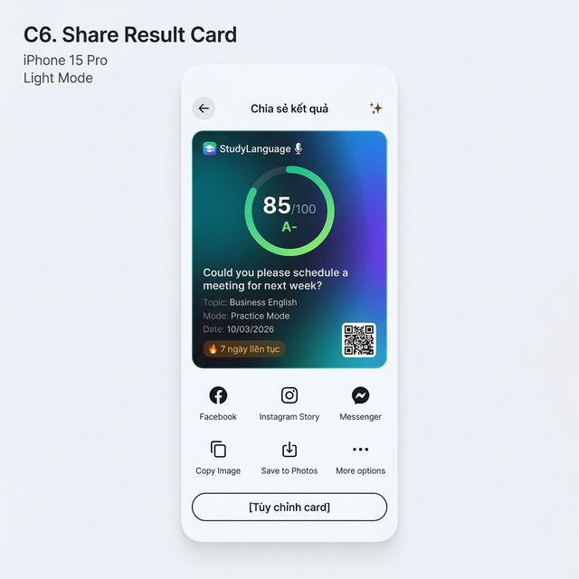

# 🛠️ Speaking — Cross-cutting Features

> **Module:** Speaking
> **Features:** TTS Settings (C2), Gamification & Dashboard (C3), Recording History (C4), AI Voice Clone (C5), Share Result (C6), Onboarding (C7)
> **Priority:** P1-P2
> **Tham chiếu chính:** [03_Speaking.md](../03_Speaking.md), [01_Navigation_PracticeMode.md](01_Navigation_PracticeMode.md)

> **Lưu ý:** C1. Custom Scenarios không có tài liệu riêng vì dùng chung DB/API/UI với Listening → xem [02_Listening.md Section 8.8](../02_Listening.md#88-custom-scenarios-module-apicustom-scenarios).

---

## Mục lục

1. [C2. TTS Settings](#1-c2-tts-settings)
2. [C3. Gamification & Progress Dashboard](#2-c3-gamification--progress-dashboard)
3. [C4. Recording History & Progress Timeline](#3-c4-recording-history--progress-timeline)
4. [C5. AI Voice Clone Replay](#4-c5-ai-voice-clone-replay)
5. [C6. Share Result](#5-c6-share-result)
6. [C7. Onboarding](#6-c7-onboarding)
7. [Shared State & Data Flow](#7-shared-state--data-flow)
8. [API Endpoints](#8-api-endpoints)
9. [Test Cases](#9-test-cases)
10. [Edge Cases](#10-edge-cases)
11. [Design Reference — Hi-Fi Mockups](#11-design-reference--hi-fi-mockups)

---

## 1. C2. TTS Settings

### 1.1 Tổng quan

TTS Settings là Bottom Sheet overlay trên Speaking Home, cho phép user cấu hình giọng AI đọc mẫu. Config **độc lập** với Listening module (Speaking cần giọng chậm/rõ ≠ Listening cần tự nhiên).

### 1.2 Requirements

| ID | Yêu cầu | Mức ưu tiên |
|----|---------|-------------|
| TTS-01 | Bottom Sheet overlay (không rời Home) | P0 |
| TTS-02 | Chọn giọng mẫu (dropdown Azure voices) | P0 |
| TTS-03 | Toggle random giọng | P2 |
| TTS-04 | Chọn cảm xúc: Cheerful / Neutral / Friendly / Newscast | P1 |
| TTS-05 | Toggle auto emotion (theo context) | P2 |
| TTS-06 | Slider tốc độ đọc (Rate): 0.5x — 2.0x | P0 |
| TTS-07 | Slider cao độ giọng (Pitch): -50% — +50% | P1 |
| TTS-08 | Lưu cài đặt (persist locally + sync server) | P0 |
| TTS-09 | Preview voice khi thay đổi setting | P1 |

### 1.3 UI Components

| Section | Component | Range/Options | Default |
|---------|-----------|---------------|---------|
| Voice | `AppDropdown` | Jenny, Sara, Guy, Aria, Davis... | Jenny |
| Random voice | `AppToggle` | ON/OFF | OFF |
| Emotion | 4× `PillChip` | Cheerful / Neutral / Friendly / Newscast | Cheerful |
| Auto emotion | `AppToggle` | ON/OFF | ON |
| Rate | `AppSlider` | 0.5x — 2.0x (step 0.1x) | 1.0x |
| Pitch | `AppSlider` | -50% — +50% (step 5%) | 0% |
| Preview | `AppButton` outlined | "🔊 Nghe thử" | — |
| Save | `AppButton` primary | "💾 Lưu cài đặt" | — |

### 1.4 State

```typescript
interface TTSSettings {
  voice: string;          // Voice ID (Azure)
  randomVoice: boolean;
  emotion: 'cheerful' | 'neutral' | 'friendly' | 'newscast';
  autoEmotion: boolean;
  rate: number;           // 0.5 - 2.0
  pitch: number;          // -50 to +50 (%)
}
```

---

## 2. C3. Gamification & Progress Dashboard

### 2.1 Tổng quan

Dashboard tổng hợp mọi tiến trình luyện Speaking: daily goal, radar chart, calendar heatmap, weak sounds, badges, weekly report. Truy cập từ Speaking Home → Daily Goal card → "Xem Dashboard →".

### 2.2 Requirements

| ID | Yêu cầu | Mức ưu tiên |
|----|---------|-------------|
| GAM-01 | Daily Goal Card: progress ring + streak + chỉnh mục tiêu | P0 |
| GAM-02 | Radar Chart: 4 axes (Pronunciation, Fluency, Vocabulary, Grammar) | P1 |
| GAM-03 | Calendar Heatmap: ngày luyện (xanh) / không (trắng) | P1 |
| GAM-04 | Weak Sounds Card: phoneme heatmap (tap → navigate Practice/Tongue Twister) | P1 |
| GAM-05 | Badge Grid: milestones (🎤100 câu, 🔥streak, 🏅perfect, 🌟shadower) | P2 |
| GAM-06 | Weekly Report: score trend + thời gian + weak sounds tuần | P2 |

### 2.3 Màn hình chi tiết

| Section | Component | Data Source | Tương tác |
|---------|-----------|-------------|-----------|
| Daily Goal | `ProgressRing` + `StreakBadge` + `EditButton` | `gamification.dailyGoal` | Tap "Chỉnh" → input dialog |
| Radar Chart | `RadarChart` (4 axes) | `gamification.radarScores` | — (view-only) |
| Calendar | `CalendarHeatmap` | `history.practicedays[]` | Tap ngày → list sessions |
| Weak Sounds | `PhonemeHeatmap` (horizontal bars) | `gamification.weakSounds[]` | Tap phoneme → navigate mode |
| Badges | Grid of `BadgeCard` | `gamification.badges[]` | Tap → detail (earned date, description) |
| Weekly Report | `WeeklyCard` (chart + stats) | `analytics.weekly` | Tap "Xem chi tiết" |

### 2.4 State

```typescript
interface GamificationState {
  dailyGoal: {
    target: number;       // Mục tiêu câu/ngày (1-100)
    completed: number;    // Số câu đã hoàn thành hôm nay
    streak: number;        // Số ngày liên tục
  };
  radarScores: {
    pronunciation: number;  // 0-100
    fluency: number;
    vocabulary: number;
    grammar: number;
  };
  practiceDays: string[];   // ISO dates: ['2026-03-10', '2026-03-09', ...]
  weakSounds: PhonemeScore[];
  badges: Badge[];
  weeklyReport: {
    scoreTrend: number[];   // [72, 75, 78, 80, 82, 85, 88]
    totalMinutes: number;
    topWeakSounds: string[];
  };
}
```

---

## 3. C4. Recording History & Progress Timeline

### 3.1 Tổng quan

Lưu trữ tất cả recordings (từ mọi mode), cho phép nghe lại và so sánh tiến bộ theo thời gian.

### 3.2 Requirements

| ID | Yêu cầu | Mức ưu tiên |
|----|---------|-------------|
| HIS-01 | Danh sách recordings grouped by ngày | P0 |
| HIS-02 | Filter by mode (Practice / Conversation / Shadowing / Tongue Twister) | P1 |
| HIS-03 | Mỗi entry: câu + score + duration + mode | P0 |
| HIS-04 | Tap entry → nghe lại recording | P0 |
| HIS-05 | So sánh 2 recordings cùng câu (khác ngày): waveform + score trend | P2 |

### 3.3 UI Components

| Section | Component | Data | Tương tác |
|---------|-----------|------|-----------|
| Header | Back + "Lịch sử ghi âm" + Filter icon | — | Filter → bottom sheet |
| Date groups | `SectionList` | Grouped by date | — |
| Entry card | `HistoryCard` (glass, colored left border by mode) | emoji + title + score badge + duration + mode tag | Tap → play audio |
| Tab bar | 5× `FilterTab` | Tất cả / Practice / Conversation / Shadowing / Tongue T. | Tap → filter list |
| Compare FAB | `FloatingButton` "So sánh" | — | Tap → select 2 entries |
| Compare view | `ComparisonView` | 2 waveforms + score trend chart | Play A/B |

### 3.4 State

```typescript
interface RecordingHistoryState {
  recordings: RecordingEntry[];
  filter: 'all' | 'practice' | 'conversation' | 'shadowing' | 'tongue-twister';
  isLoading: boolean;
  comparison: {
    isActive: boolean;
    entryA: RecordingEntry | null;
    entryB: RecordingEntry | null;
  };
}

interface RecordingEntry {
  id: string;
  mode: 'practice' | 'conversation' | 'shadowing' | 'tongue-twister';
  sentence: string;
  score: number;
  duration: number;       // Seconds
  audioUri: string;
  date: string;           // ISO date
  topic?: string;
}
```

---

## 4. C5. AI Voice Clone Replay

### 4.1 Tổng quan

Feature cho phép user nghe lại giọng mình được AI "sửa" phát âm đúng, so sánh trực tiếp Before/After. Truy cập từ Feedback Screen (Practice Mode).

### 4.2 Requirements

| ID | Yêu cầu | Mức ưu tiên |
|----|---------|-------------|
| VC-01 | Phát bản gốc user recording | P0 |
| VC-02 | Phát bản AI-corrected (voice clone) | P0 |
| VC-03 | So sánh A/B (play xen kẽ) | P1 |
| VC-04 | Toggle auto-loop | P2 |
| VC-05 | Word-level comparison: user IPA vs correct IPA | P1 |

### 4.3 UI Components

| Section | Component | Data | Tương tác |
|---------|-----------|------|-----------|
| Sentence | `AppText` centered | Target sentence | — |
| Original | `PlaybackCard` (blue border) | User waveform + play/pause + duration + score | Tap play |
| AI Fixed | `PlaybackCard` (green border) | AI waveform + play/pause + duration + label | Tap play |
| Compare | `CompareCard` (purple border) | Split waveform + [Play xen kẽ] + Auto-loop toggle | Tap play |
| Word diff | `WordComparisonRow` ×N | word → user IPA (red/green) vs AI IPA | — |

### 4.4 State

```typescript
interface VoiceCloneState {
  originalAudioUrl: string;      // User recording
  correctedAudioUrl: string;     // AI-corrected audio
  isPlayingOriginal: boolean;
  isPlayingCorrected: boolean;
  isPlayingCompare: boolean;
  autoLoop: boolean;
  wordComparison: {
    word: string;
    userIPA: string;
    correctIPA: string;
    isCorrect: boolean;
  }[];
}
```

---

## 5. C6. Share Result

### 5.1 Tổng quan

User chia sẻ kết quả luyện tập dưới dạng image card. Truy cập từ Feedback Screen hoặc Session Summary.

### 5.2 Requirements

| ID | Yêu cầu | Mức ưu tiên |
|----|---------|-------------|
| SHR-01 | Generate share card (image) với score, grade, topic, date, streak | P1 |
| SHR-02 | Preview card trước khi share | P1 |
| SHR-03 | Share via: Facebook, Instagram Story, Messenger, Copy Image, Save to Photos | P1 |
| SHR-04 | App branding + QR code trên card | P2 |
| SHR-05 | Tùy chỉnh card (chọn template) | P2 |

### 5.3 UI Components

| Section | Component | Data | Tương tác |
|---------|-----------|------|-----------|
| Header | Back + "Chia sẻ kết quả ✨" | — | Back |
| Card preview | `ShareCardView` (gradient card) | Score ring + sentence + topic + mode + date + streak + QR | — |
| Share options | Grid 6 icons | Facebook / IG Story / Messenger / Copy / Save / More | Tap → `react-native-share` |
| Customize | `AppButton` outlined | "Tùy chỉnh card" | Tap → template picker |

### 5.4 Share Card Layout

```
┌──────────────────────────────────────┐
│  📱 StudyLanguage 🎤                  │
│                                      │
│         ┌──────────┐                 │
│         │  85/100  │                 │
│         │   A-     │                 │
│         └──────────┘                 │
│                                      │
│  "Could you please schedule          │
│   a meeting for tomorrow?"           │
│                                      │
│  Topic: Business English             │
│  Mode: Practice Mode                 │
│  Date: 10/03/2026                    │
│                                      │
│  🔥 7 ngày liên tục          [QR]    │
│                                      │
└──────────────────────────────────────┘
```

### 5.5 Implementation

```typescript
/**
 * Mục đích: Capture share card → share image via native share sheet
 * Tham số đầu vào: cardRef — ref tới ShareCardView component
 * Tham số đầu ra: void (mở native share sheet)
 * Khi nào sử dụng: User tap share button trên Feedback/Summary screen
 */
async function handleShare(cardRef: React.RefObject<View>) {
  // Chụp card thành image
  const uri = await captureRef(cardRef, {
    format: 'png',
    quality: 1,
  });

  // Mở native share sheet
  await Share.open({
    url: `file://${uri}`,
    type: 'image/png',
    failOnCancel: false,
  });
}
```

---

## 6. C7. Onboarding

### 6.1 Tổng quan

Onboarding overlay hiện trên Speaking Home Screen **chỉ lần đầu** user vào Speaking tab. 5 steps giới thiệu core features. Không phải screen riêng mà là overlay trên screen 01.

### 6.2 Requirements

| ID | Yêu cầu | Mức ưu tiên |
|----|---------|-------------|
| OB-01 | Hiện overlay khi `isFirstVisit === true` | P2 |
| OB-02 | 5 steps tooltip + spotlight highlight | P2 |
| OB-03 | "Bỏ qua" để skip tất cả | P2 |
| OB-04 | "Không hiện lại" → persist flag | P2 |
| OB-05 | Dismiss → không bao giờ hiện lại | P2 |

### 6.3 Steps Chi tiết

| Step | Target Element | Spotlight | Tooltip |
|------|---------------|-----------|---------|
| 1 | Whole screen | — | "Chào mừng đến Speaking! 🎤" |
| 2 | Mic button (global) | Green glow ring | "Giữ mic để ghi âm — Nhấn giữ nút micro → nói → thả ra" |
| 3 | Feedback area | — | "AI sẽ chấm điểm phát âm của bạn ngay lập tức!" |
| 4 | Mode cards | Dim except cards | "Thử các chế độ khác nhau — Practice, AI Conversation, Shadowing, Tongue Twister" |
| 5 | CTA | — | "Bắt đầu nào! 🎉" |

### 6.4 Implementation

```typescript
/**
 * Mục đích: Kiểm tra và hiện onboarding overlay cho first-time user
 * Tham số đầu vào: không
 * Tham số đầu ra: boolean (có cần hiện overlay không)
 * Khi nào sử dụng: useFocusEffect khi Speaking Home mount
 */
function useSpeakingOnboarding() {
  const [showOnboarding, setShowOnboarding] = useState(false);

  useFocusEffect(
    useCallback(() => {
      // Kiểm tra flag trong AsyncStorage
      const isFirstVisit = await AsyncStorage.getItem('speaking_onboarding_done');
      if (!isFirstVisit) {
        setShowOnboarding(true);
      }
    }, [])
  );

  // Khi user dismiss overlay
  const dismissOnboarding = async () => {
    setShowOnboarding(false);
    await AsyncStorage.setItem('speaking_onboarding_done', 'true');
  };

  return { showOnboarding, dismissOnboarding };
}
```

**Recommended library:** `react-native-copilot` hoặc `react-native-walkthrough-tooltip`

---

## 7. Shared State & Data Flow

### 7.1 Data Flow tổng hợp

```
┌─────────────────────────────────────────────────────────┐
│                    Speaking Module                        │
│                                                          │
│  ┌─────────────┐     ┌──────────────┐                   │
│  │ TTS Settings │────→│ All Modes    │ (voice/rate/pitch)│
│  │ (C2)         │     │ use config   │                   │
│  └─────────────┘     └──────────────┘                   │
│                                                          │
│  ┌─────────────┐     ┌──────────────┐                   │
│  │ All Sessions │────→│ History (C4) │ (auto-save)       │
│  │ (B1-B5)      │     └──────┬───────┘                   │
│  └─────────────┘            │                            │
│                              ▼                           │
│                    ┌──────────────┐                      │
│                    │ Dashboard    │ (aggregated data)     │
│                    │ (C3)        │                        │
│                    └──────────────┘                      │
│                                                          │
│  ┌─────────────┐     ┌──────────────┐                   │
│  │ Feedback     │────→│ Voice Clone  │ (from Practice)   │
│  │ (B1 result)  │     │ (C5)         │                   │
│  └──────┬──────┘     └──────────────┘                   │
│         │                                                │
│         └────────────→ Share Card (C6)                   │
│                                                          │
│  ┌─────────────┐                                        │
│  │ First Visit  │────→ Onboarding (C7)                  │
│  │ Flag         │                                        │
│  └─────────────┘                                        │
└─────────────────────────────────────────────────────────┘
```

### 7.2 Shared Dependencies

| Feature | Depends On | Output To |
|---------|-----------|-----------|
| TTS Settings (C2) | — | Practice, AI Conv, Shadowing, Tongue Twister |
| Dashboard (C3) | History (C4), All Sessions | View-only |
| History (C4) | All Sessions (auto-save) | Dashboard (C3), Compare view |
| Voice Clone (C5) | Practice feedback (B1) | — |
| Share (C6) | Feedback / Summary screens | External (social media) |
| Onboarding (C7) | First visit flag (AsyncStorage) | — |

---

## 8. API Endpoints

### 8.1 TTS Settings

| Endpoint | Method | Mô tả |
|----------|--------|-------|
| `/speaking/tts-settings` | GET | Lấy TTS config |
| `/speaking/tts-settings` | PUT | Lưu TTS config |
| `/ai/generate-conversation-audio` | POST | TTS với config đã lưu |
| `/ai/voices?provider=azure` | GET | List voices khả dụng |

### 8.2 Gamification & Dashboard

| Endpoint | Method | Mô tả |
|----------|--------|-------|
| `/speaking/dashboard` | GET | Lấy dashboard data (radar, heatmap, weak sounds) |
| `/speaking/daily-goal` | GET/PUT | Lấy/cập nhật mục tiêu ngày |
| `/speaking/badges` | GET | Lấy badges đã earned |
| `/speaking/weekly-report` | GET | Lấy weekly report |

### 8.3 Recording History

| Endpoint | Method | Mô tả |
|----------|--------|-------|
| `/api/history?type=speaking` | GET | Lấy history (filter by mode) |
| `/api/history/:id` | GET | Chi tiết 1 recording |
| `/api/history/compare` | POST | So sánh 2 recordings |

### 8.4 Voice Clone

| Endpoint | Method | Mô tả |
|----------|--------|-------|
| `/speaking/voice-clone` | POST | Generate AI-corrected audio |

### 8.5 Share

Không cần API riêng — dùng `react-native-view-shot` (capture) + `react-native-share` (native share sheet).

---

## 9. Test Cases

### 9.1 TTS Settings

| TC-ID | Tên | Expected |
|-------|-----|----------|
| TTS-TC01 | Mở Settings | Bottom Sheet hiện với đủ controls |
| TTS-TC02 | Chọn voice | Dropdown hiện list voices |
| TTS-TC03 | Thay đổi rate | Slider cập nhật label |
| TTS-TC04 | Preview voice | Tap "🔊 Nghe thử" → audio phát |
| TTS-TC05 | Lưu settings | Tap "💾 Lưu" → Toast "Đã lưu" |
| TTS-TC06 | Settings persist | Close → reopen → values vẫn giữ |

### 9.2 Dashboard

| TC-ID | Tên | Expected |
|-------|-----|----------|
| GAM-TC01 | Hiển thị daily goal | Ring + streak đúng data |
| GAM-TC02 | Chỉnh mục tiêu | Input 20 → save → ring cập nhật |
| GAM-TC03 | Radar chart | 4 axes render đúng scores |
| GAM-TC04 | Calendar heatmap | Ngày luyện = xanh |
| GAM-TC05 | Weak sounds | Tap /θ/ → navigate Practice/Tongue Twister |
| GAM-TC06 | Badges | Earned = colored, locked = gray |

### 9.3 Recording History

| TC-ID | Tên | Expected |
|-------|-----|----------|
| HIS-TC01 | List recordings | Grouped by date, sorted recent first |
| HIS-TC02 | Filter by mode | Tap "Practice" → chỉ hiện Practice entries |
| HIS-TC03 | Play recording | Tap entry → audio play |
| HIS-TC04 | Compare mode | Select 2 entries → waveform + score diff |

### 9.4 Voice Clone

| TC-ID | Tên | Expected |
|-------|-----|----------|
| VC-TC01 | Play original | Tap "🎤 Bản gốc" → user audio phát |
| VC-TC02 | Play corrected | Tap "🤖 Bản AI sửa" → corrected audio phát |
| VC-TC03 | A/B compare | Tap "Play xen kẽ" → alternating playback |
| VC-TC04 | Word diff | "schedule" hiện user IPA (red) vs correct IPA (green) |

### 9.5 Share

| TC-ID | Tên | Expected |
|-------|-----|----------|
| SHR-TC01 | Preview card | Card hiện đúng score/topic/date |
| SHR-TC02 | Share Facebook | Facebook app opens with image |
| SHR-TC03 | Copy image | Image copied to clipboard |
| SHR-TC04 | Save to Photos | Image saved to camera roll |

### 9.6 Onboarding

| TC-ID | Tên | Expected |
|-------|-----|----------|
| OB-TC01 | First visit | Overlay hiện 5 steps |
| OB-TC02 | Step navigation | "Tiếp tục →" → next step |
| OB-TC03 | Skip | "Bỏ qua" → dismiss all, save flag |
| OB-TC04 | Second visit | Overlay KHÔNG hiện |

---

## 10. Edge Cases

### 10.1 TTS Settings

| Case | Xử lý | Rủi ro |
|------|-------|--------|
| Azure voices API fail | Cache last-known list locally | ⚠️ Medium |
| Preview khi offline | Toast "Cần kết nối để nghe thử" | ✅ Low |
| Rate quá cao (2.0x) | AI nói nhanh, khó nghe → warning "Rất nhanh!" | ✅ Low |

### 10.2 Dashboard

| Case | Xử lý | Rủi ro |
|------|-------|--------|
| No data (first use) | Empty state: "Chưa có dữ liệu — Bắt đầu luyện tập!" | ✅ Low |
| Streak reset | User bỏ 1 ngày → streak reset 0 → show motivation msg | ⚠️ Medium |
| Timezone mismatch | Use UTC for consistency + local timezone for display | ⚠️ Medium |

### 10.3 Recording History

| Case | Xử lý | Rủi ro |
|------|-------|--------|
| Quá nhiều recordings | Pagination (20/page) + lazy load | ✅ Low |
| Audio file deleted | Placeholder "Audio không còn khả dụng" | ⚠️ Medium |
| Compare khác mode | Disable compare nếu khác mode/sentence | ✅ Low |

### 10.4 Voice Clone

| Case | Xử lý | Rủi ro |
|------|-------|--------|
| Clone generation fail | Toast + retry | ⚠️ Medium |
| Clone chất lượng kém | Warning "AI clone chưa hoàn hảo" + original reference | ✅ Low |
| Audio overlap | Stop current audio trước khi play khác | ✅ Low |

### 10.5 Share

| Case | Xử lý | Rủi ro |
|------|-------|--------|
| Share sheet fail | Toast "Không thể chia sẻ" | ⚠️ Medium |
| No social apps | Hiện "Copy Image" + "Save to Photos" only | ✅ Low |
| Capture fail | Retry once → toast nếu vẫn lỗi | ⚠️ Medium |

---

## 11. Design Reference — Hi-Fi Mockups

| Màn hình | Dark Mode | Light Mode |
|----------|-----------|------------|
| TTS Settings |  |  |
| Progress Dashboard |  |  |
| Recording History |  |  |
| AI Voice Clone |  |  |
| Share Result Card |  |  |
