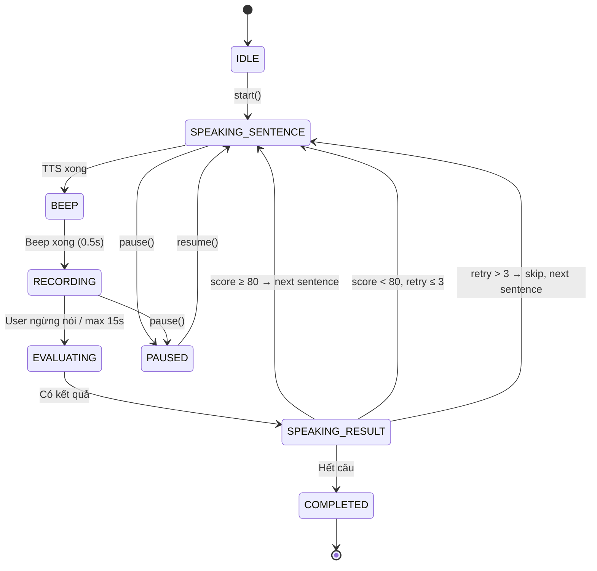
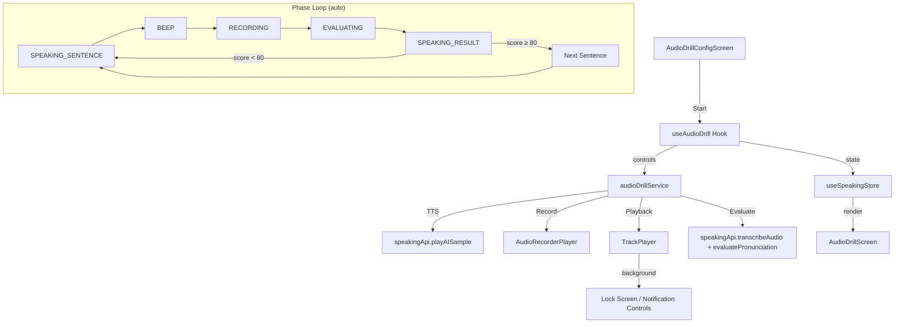

# 08. Audio Drill — Hands-Free Practice Mode

> **Status:** 🟡 Planned  
> **Priority:** P1  
> **Dependencies:** `speakingApi.transcribeAudio`, `speakingApi.evaluatePronunciation`, `speakingApi.playAISample`, `react-native-track-player`, `react-native-audio-recorder-player`

---

## 1. Overview

Audio Drill là chế độ luyện phát âm **hoàn toàn rảnh tay**. Sau khi nhấn "Bắt đầu", app tự động chạy vòng lặp liên tục:

```
AI đọc câu → Beep → User nói → AI đánh giá → Đọc kết quả → Chuyển câu tiếp (nếu ≥80)
```

User có thể **tắt màn hình**, **chuyển app khác** mà vẫn sử dụng được. Toàn bộ tương tác qua audio.

### User Value
- Luyện phát âm khi đi bộ, lái xe, nấu ăn, tập gym
- Không cần nhìn màn hình, không cần thao tác tay
- Auto-loop: tạo thói quen luyện tập liên tục
- Feedback chi tiết bằng giọng AI (từ nào sai, phát âm đúng là gì)

### Khác biệt với Shadowing Mode

| | Shadowing | Audio Drill |
|---|---|---|
| Mục tiêu | Bắt chước ngữ điệu, nhịp điệu | Đạt chuẩn phát âm accuracy |
| Feedback | Visual (waveform, phoneme heatmap) | Audio (giọng AI nói kết quả) |
| Tương tác | Cần nhìn màn hình, nhấn nút | Hoàn toàn rảnh tay |
| Use case | Ngồi học tập trung | Đi bộ, lái xe, nấu ăn, tập gym |
| Kết thúc | Manual (nhấn hoàn thành) | Auto (hết set câu) hoặc stop từ notification |
| Background | ❌ Không hỗ trợ | ✅ Chạy khi tắt màn hình/switch app |

---

## 2. User Flow

```
SpeakingHome → [🎧 Audio Drill] → AudioDrillConfigScreen
  → Chọn topic + level + threshold (mặc định 80)
  → [Bắt đầu Audio Drill]
    → AudioDrillScreen (hiển thị khi app mở)
    → Background mode (khi tắt màn hình/switch app)
      
Loop (tự động, không cần thao tác):
  1. AI đọc câu (TTS)
  2. Beep (0.5s) — tín hiệu "bắt đầu nói"
  3. Ghi âm user (max 15s, auto-stop khi im lặng 3s)
  4. Transcribe + Evaluate
  5. AI đọc kết quả chi tiết:
     - "85 điểm. Từ through phát âm chưa chuẩn, phải là /θruː/. Câu tiếp theo..."
     - Hoặc: "65 điểm. Thử lại nhé. Chú ý từ think, phải đặt lưỡi giữa hai hàm răng..."
  6. Score ≥ 80 → chuyển câu tiếp (bước 1)
     Score < 80 → lặp lại câu hiện tại (max 3 lần, sau đó skip)
     
Khi hết set câu:
  → AI đọc: "Hoàn thành! Điểm trung bình: 82. [tóm tắt kết quả]"
  → Hiện summary screen khi user mở app
```

---

## 3. State Machine

```
IDLE → SPEAKING_SENTENCE → BEEP → RECORDING → EVALUATING → SPEAKING_RESULT → (loop hoặc COMPLETED)
```

| Phase | Hành động | Chuyển tiếp |
|---|---|---|
| `IDLE` | Chờ user nhấn Start | → `SPEAKING_SENTENCE` |
| `SPEAKING_SENTENCE` | TTS đọc câu hiện tại qua TrackPlayer | → `BEEP` khi phát xong |
| `BEEP` | Phát tiếng beep ngắn (0.5s) báo hiệu user nói | → `RECORDING` |
| `RECORDING` | Ghi âm user (max 15s, auto-stop silence 3s) | → `EVALUATING` |
| `EVALUATING` | `transcribeAudio()` → `evaluatePronunciation()` | → `SPEAKING_RESULT` |
| `SPEAKING_RESULT` | TTS đọc kết quả chi tiết | → `SPEAKING_SENTENCE` (câu tiếp nếu ≥80) hoặc loop lại |
| `PAUSED` | User pause từ notification/UI | → resume về phase trước |
| `COMPLETED` | Phát thông báo hoàn thành + điểm tổng | → `IDLE` |



---

## 4. Technical Architecture



### Background Capabilities (đã có sẵn)

| Platform | Requirement | Status |
|---|---|---|
| iOS | `UIBackgroundModes: audio` trong `Info.plist` | ✅ Đã config |
| iOS | `AVAudioSession: .playAndRecord` | ✅ Đã config trong TrackPlayer |
| iOS | `DefaultToSpeaker + AllowBluetooth` | ✅ Đã config |
| Android | Foreground Service (notification) | ✅ TrackPlayer notification đã setup |
| Both | TrackPlayer remote controls (Play/Pause/Skip) | ✅ `playbackService` đã có |

---

## 5. Files to Create/Modify

### 5.1 New Files

#### `src/hooks/useAudioDrill.ts`
Hook chính điều khiển toàn bộ Audio Drill loop (state machine).

**Input:** `sentences: Sentence[]`, `config: AudioDrillConfig`
**Output:** `{ phase, currentIndex, scores, isRunning, start, stop, pause, resume }`

#### `src/services/audio/audioDrillService.ts`
Service cấp thấp quản lý audio session:
- `playTTS(text)` — TTS qua TrackPlayer
- `playBeep()` — Phát file beep ngắn
- `startRecording()` / `stopRecording()` — Ghi âm
- `speakResult(feedbackText)` — TTS đọc kết quả
- `setupBackgroundSession()` — Config cho background playback liên tục

**Quan trọng:** Xử lý chuyển đổi playback ↔ recording trên AVAudioSession (tương tự logic `PracticeScreen.tsx` L240-261).

#### `src/screens/speaking/AudioDrillScreen.tsx`
Màn hình chính khi app đang mở:
- Header: "🎧 Audio Drill" + progress
- Center: Câu hiện tại + phase indicator animation
- Controls: Play/Pause/Stop
- Score history: Scrollable list điểm các câu đã hoàn thành
- Auto-sync khi user quay lại app

#### `src/screens/speaking/AudioDrillConfigScreen.tsx`
Màn hình cấu hình (reuse pattern từ `ConfigScreen.tsx`):
- TopicSelector (reuse component sẵn có)
- Level selector (beginner/intermediate/advanced)
- Threshold slider (mặc định 80, range 60-100)
- Feedback detail toggle (simple/detailed)
- Nút "Bắt đầu Audio Drill"

#### `src/assets/audio/beep.mp3`
File âm thanh beep ngắn (~0.5s) làm tín hiệu "bắt đầu nói".

### 5.2 Modified Files

#### `src/store/useSpeakingStore.ts`
Thêm Audio Drill state:

```typescript
type AudioDrillPhase = 
  | 'idle' | 'speaking_sentence' | 'beep' 
  | 'recording' | 'evaluating' | 'speaking_result' 
  | 'paused' | 'completed';

interface AudioDrillConfig {
  autoNextThreshold: number;   // Mặc định 80
  maxRetries: number;          // Số lần thử lại tối đa mỗi câu (3)
  silenceTimeout: number;      // Auto-stop khi im lặng (3000ms)
  feedbackDetail: 'simple' | 'detailed';
}

interface AudioDrillSession {
  isActive: boolean;
  phase: AudioDrillPhase;
  currentIndex: number;
  scores: { sentenceId: string; score: number; attempts: number }[];
  retryCount: number;
  startedAt: number;
}

// Thêm vào SpeakingState
audioDrillConfig: AudioDrillConfig;
audioDrillSession: AudioDrillSession | null;

// Thêm vào SpeakingActions
setAudioDrillConfig: (config: Partial<AudioDrillConfig>) => void;
startAudioDrill: () => void;
updateAudioDrillPhase: (phase: AudioDrillPhase) => void;
recordAudioDrillScore: (sentenceId: string, score: number) => void;
endAudioDrill: () => void;
```

#### `src/navigation/stacks/SpeakingStack.tsx`
Thêm 2 routes:
```typescript
// SpeakingStackParamList
AudioDrillConfig: undefined;
AudioDrillSession: undefined;

// Stack.Screen
<Stack.Screen name="AudioDrillConfig" component={AudioDrillConfigScreen} />
<Stack.Screen name="AudioDrillSession" component={AudioDrillScreen} />
```

#### `src/screens/speaking/SpeakingHomeScreen.tsx`
Thêm card Audio Drill:
```
🎧 Audio Drill
Luyện phát âm rảnh tay — đi bộ, lái xe, nấu ăn
```

---

## 6. API Requirements

Tất cả API đã có sẵn, không cần tạo mới:

| API | Mục đích | File |
|---|---|---|
| `speakingApi.generateSentences(config)` | Sinh set câu practice | `services/api/speaking.ts` |
| `speakingApi.playAISample(text)` | TTS đọc câu/kết quả | `services/api/speaking.ts` |
| `speakingApi.transcribeAudio(uri)` | Whisper STT | `services/api/speaking.ts` |
| `speakingApi.evaluatePronunciation(original, transcript)` | Chấm điểm | `services/api/speaking.ts` |

### Feedback Audio Script Generation

Cần thêm 1 helper function tạo script feedback chi tiết:

```typescript
/**
 * Mục đích: Tạo script text cho AI đọc kết quả đánh giá
 * Tham số đầu vào: result (FeedbackResult), detail ('simple' | 'detailed')
 * Tham số đầu ra: string — script text cho TTS
 */
function generateFeedbackScript(result: FeedbackResult, detail: 'simple' | 'detailed'): string {
  if (detail === 'simple') {
    return `${result.overallScore} điểm. ${result.overallScore >= 80 ? 'Tốt lắm! Câu tiếp theo.' : 'Thử lại nhé.'}`;
  }
  
  // Chi tiết: nêu từ sai + cách phát âm đúng
  const wrongWords = result.wrongWords?.slice(0, 2)
    .map(w => `Từ ${w.word}, ${w.suggestion}`)
    .join('. ');
    
  return `${result.overallScore} điểm. ${wrongWords ? wrongWords + '.' : ''} ${
    result.overallScore >= 80 ? 'Câu tiếp theo.' : 'Thử lại nhé.'
  }`;
}
```

---

## 7. UI Components

### 7.1 AudioDrillScreen (khi app mở)

```
┌─────────────────────────────┐
│  ← Audio Drill    Câu 3/10 │
│  ═══════════════════------  │  ← progress bar
│                              │
│  ┌─────────────────────────┐ │
│  │  🎧 Đang đọc câu...     │ │  ← phase indicator
│  │                          │ │
│  │  "The weather is quite   │ │
│  │   nice today, isn't it?" │ │  ← câu hiện tại
│  │                          │ │
│  │  /ðə ˈwɛðər ɪz kwaɪt    │ │  ← IPA (optional)
│  │   naɪs təˈdeɪ/          │ │
│  └─────────────────────────┘ │
│                              │
│  ┌── Lịch sử ──────────────┐│
│  │ ✅ Câu 1: 92 điểm       ││
│  │ ✅ Câu 2: 85 điểm       ││
│  │ 🔄 Câu 3: đang xử lý...││
│  └──────────────────────────┘│
│                              │
│     ⏸️  Pause    ⏹️  Stop    │  ← controls
└─────────────────────────────┘
```

### 7.2 Lock Screen / Notification (khi app ở background)

```
┌─────────────────────────────┐
│  🎧 Audio Drill              │
│  Câu 3/10 — "The weather..." │
│                              │
│     ⏮️    ⏸️     ⏭️          │  ← TrackPlayer controls
└─────────────────────────────┘
```

### 7.3 Completion Screen

```
┌─────────────────────────────┐
│                              │
│         🎉 Hoàn thành!      │
│                              │
│         Điểm TB: 82         │
│                              │
│  ┌──────────────────────────┐│
│  │ Câu 1: ⭐⭐⭐⭐⭐ 92     ││
│  │ Câu 2: ⭐⭐⭐⭐  85       ││
│  │ Câu 3: ⭐⭐⭐⭐  80       ││
│  │ Câu 4: ⭐⭐⭐   72 (skip)││
│  │ ...                       ││
│  └──────────────────────────┘│
│                              │
│  [Luyện lại]   [Về trang chủ]│
└─────────────────────────────┘
```

---

## 8. Edge Cases

| Case | Xử lý |
|---|---|
| Không nghe được user nói (silence 3s) | Auto-stop recording → "Không nghe được, thử nói to hơn nhé" → retry |
| Network mất giữa chừng | Pause session → "Mất kết nối mạng, tạm dừng" → auto-resume khi có mạng |
| Audio interrupt (cuộc gọi đến) | Pause session → resume khi call kết thúc |
| Bluetooth disconnect | Fallback sang speaker → continue |
| Max retries (3 lần) mà vẫn < 80 | "Bỏ qua câu này, quay lại sau" → skip sang câu tiếp |
| App bị kill (force close) | Persist state vào MMKV → resume khi mở lại app |
| Battery saving mode | OS có thể kill background → hiện notification warning |
| Mic permission denied | Alert yêu cầu cấp quyền → không start session |

---

## 9. Implementation Phases

### Phase 1 (Core Engine) — 3-4 ngày
- [ ] `audioDrillService.ts` — audio session management
- [ ] `useAudioDrill.ts` — state machine hook
- [ ] Store updates (`useSpeakingStore.ts`)
- [ ] `generateFeedbackScript()` helper
- [ ] Beep audio asset

### Phase 2 (Screens + Navigation) — 2-3 ngày
- [ ] `AudioDrillConfigScreen.tsx`
- [ ] `AudioDrillScreen.tsx`
- [ ] Navigation routes (`SpeakingStack.tsx`)
- [ ] SpeakingHome card

### Phase 3 (Background + Polish) — 2-3 ngày
- [ ] Background recording test trên device thật
- [ ] Lock screen notification controls
- [ ] Session persist (MMKV) khi app bị kill
- [ ] Audio interrupt handling (phone call, etc.)

### Phase 4 (Testing) — 1-2 ngày
- [ ] Unit tests cho `useAudioDrill`
- [ ] Unit tests cho `audioDrillService`
- [ ] Manual test flow trên device thật (iOS + Android)
- [ ] Background mode test (tắt màn hình, switch app)

---

## 10. Test Cases

### Unit Tests

- [ ] TC-01: State machine transitions đúng thứ tự (idle → speaking → beep → recording → evaluating → result)
- [ ] TC-02: Auto-next khi `overallScore ≥ 80`
- [ ] TC-03: Retry cùng câu khi `overallScore < 80`
- [ ] TC-04: Skip câu sau max retries (3 lần)
- [ ] TC-05: Pause/Resume functionality
- [ ] TC-06: Session completed khi hết set câu
- [ ] TC-07: Error handling — network timeout
- [ ] TC-08: Error handling — mic permission denied
- [ ] TC-09: `generateFeedbackScript()` — simple mode output
- [ ] TC-10: `generateFeedbackScript()` — detailed mode output với wrong words

### Manual Tests (Device thật)

- [ ] TC-11: Full flow khi app mở — nghe AI → beep → nói → nghe kết quả → auto-next
- [ ] TC-12: Tắt màn hình → vẫn nghe AI đọc câu + beep
- [ ] TC-13: Nói khi tắt màn hình → vẫn ghi âm + nghe feedback
- [ ] TC-14: Switch app (mở Safari) → Audio Drill vẫn chạy
- [ ] TC-15: Lock screen controls (Play/Pause/Stop) hoạt động
- [ ] TC-16: Quay lại app → UI sync đúng phase hiện tại
- [ ] TC-17: Hết set câu → nghe thông báo hoàn thành
- [ ] TC-18: Cuộc gọi đến → session tự pause → resume sau call

---

## 11. Design References

> 📌 Sẽ tạo mockup screens trong `screens_v2/` sau khi implementation bắt đầu.

Tham khảo pattern:
- Phase indicator: tương tự apps podcast (Spotify "Đang phát")
- Config screen: reuse layout từ `05_practice_config_*.png`
- Completion screen: tương tự `ShadowingSessionSummaryScreen`
