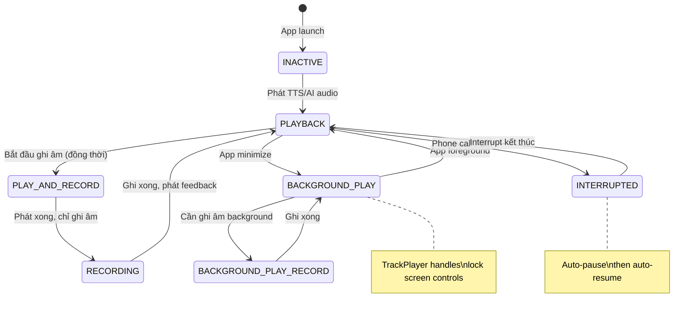

# 09. Background Audio — Nền Tảng Cho Passive Learning

> **Status:** 🔴 Blocked (P0 Foundation)  
> **Priority:** P0  
> **Dependencies:** `react-native-track-player`, `@notifee/react-native`, `react-native-audio-recorder-player`  
> **Blocks:** Tất cả passive features (Auto-Listen, Audio Drill, Shadowing Auto, Lock Screen Controls)

---

## 1. Overview

Background Audio là **nền tảng kỹ thuật bắt buộc** trước khi triển khai bất kỳ tính năng passive learning nào. Cho phép app tiếp tục phát audio + ghi âm khi:

- Màn hình tắt (screen off)
- App ở background (user chuyển sang app khác)
- Lock screen (điện thoại khóa)
- Bluetooth headphone connected (khi đi đường)

### Tại sao là P0?

```
                    ┌──────────────────────────────────┐
                    │  KHÔNG CÓ BACKGROUND AUDIO       │
                    │           =                       │
                    │  KHÔNG CÓ PASSIVE LEARNING       │
                    └──────────────────────────────────┘

  ❌ Auto-Listen     → Mic tắt khi screen off
  ❌ Audio Drill     → Loop dừng khi minimize
  ❌ Auto Shadow     → Không phát TTS ở background
  ❌ Lock Screen     → Không có controls
```

### Hiện trạng

| Capability | iOS | Android | Status |
|-----------|-----|---------|--------|
| TTS playback (foreground) | ✅ | ✅ | Hoạt động |
| TrackPlayer playback (background) | ✅ | ✅ | Hoạt động (Listening module) |
| Recording (foreground) | ✅ | ✅ | Hoạt động |
| Recording (background) | ⚠️ Chưa test | ⚠️ Chưa test | **Cần triển khai** |
| Play + Record đồng thời | ⚠️ Shadowing only | ⚠️ Shadowing only | Cần mở rộng |
| Session persist | ⚠️ Basic (MMKV) | ⚠️ Basic (MMKV) | Cần nâng cấp |
| Lock screen controls | ❌ | ❌ | **Cần triển khai** |
| Bluetooth remote | ❌ | ❌ | **Cần triển khai** |

---

## 2. Yêu Cầu Kỹ Thuật

### 2.1 iOS — AVAudioSession Configuration

```typescript
// Cấu hình AVAudioSession cho passive learning
const AUDIO_SESSION_CONFIG = {
  // Category: cho phép play + record đồng thời
  category: 'playAndRecord',
  
  // Mode: tối ưu cho voice
  mode: 'spokenAudio', // Tốt hơn 'voiceChat' cho long sessions
  
  // Options
  options: [
    'defaultToSpeaker',     // Phát qua speaker mặc định (không tai nghe)
    'allowBluetooth',       // Cho phép Bluetooth headphone
    'allowBluetoothA2DP',   // Cho phép Bluetooth A2DP (chất lượng cao)
    'mixWithOthers',        // Có thể mix với audio khác (optional)
  ],
  
  // Routing: tự động chuyển sang Bluetooth khi kết nối
  routeSharingPolicy: 'longFormAudio',
};
```

**Info.plist Requirements:**

```xml
<key>UIBackgroundModes</key>
<array>
  <string>audio</string>        <!-- Background audio playback -->
  <string>fetch</string>        <!-- Background fetch (API calls) -->
</array>

<!-- Giải thích quyền cho App Store Review -->
<key>NSMicrophoneUsageDescription</key>
<string>Cần quyền micro để ghi âm phát âm và luyện nói với AI</string>
```

### 2.2 Android — Foreground Service

```xml
<!-- AndroidManifest.xml -->
<uses-permission android:name="android.permission.FOREGROUND_SERVICE" />
<uses-permission android:name="android.permission.FOREGROUND_SERVICE_MEDIA_PLAYBACK" />
<uses-permission android:name="android.permission.RECORD_AUDIO" />

<service
  android:name="com.doublegravity.reactnativetrackplayer.service.MusicService"
  android:foregroundServiceType="mediaPlayback"
  android:exported="false" />
```

### 2.3 Audio Session State Machine



---

## 3. Architecture

### 3.1 Service Layer

```
┌────────────────────────────────────────────────────┐
│                 backgroundAudioService              │
│  ┌──────────────┐  ┌──────────────┐  ┌──────────┐ │
│  │ AudioSession │  │  TrackPlayer │  │ Recorder │ │
│  │   Manager    │  │   (playback) │  │ (mic)    │ │
│  └──────┬───────┘  └──────┬───────┘  └────┬─────┘ │
│         │                 │                │       │
│         └─────────┬───────┘────────────────┘       │
│                   │                                 │
│         ┌─────────▼──────────┐                     │
│         │  Session Lifecycle │                     │
│         │  - setup()         │                     │
│         │  - activate()      │                     │
│         │  - deactivate()    │                     │
│         │  - handleInterrupt()│                    │
│         └────────────────────┘                     │
└────────────────────────────────────────────────────┘
```

### 3.2 Files to Create/Modify

#### [NEW] `src/services/audio/backgroundAudioService.ts`

Service quản lý audio session lifecycle:

```typescript
interface BackgroundAudioService {
  /**
   * Mục đích: Khởi tạo audio session cho passive mode
   * Tham số đầu vào: config (AudioSessionConfig)
   * Tham số đầu ra: Promise<void>
   * Khi nào: Khi bắt đầu bất kỳ passive session nào
   */
  setupSession(config: AudioSessionConfig): Promise<void>;
  
  /**
   * Mục đích: Kích hoạt background audio
   * Tham số đầu vào: không
   * Tham số đầu ra: Promise<void>
   * Khi nào: Khi app chuyển sang background
   */
  activateBackground(): Promise<void>;
  
  /**
   * Mục đích: Xử lý audio interruption (cuộc gọi, Siri, etc.)
   * Tham số đầu vào: InterruptionEvent
   * Tham số đầu ra: void
   * Khi nào: OS trigger interruption
   */
  handleInterruption(event: InterruptionEvent): void;
  
  /**
   * Mục đích: Chuyển đổi giữa playback ↔ record mode
   * Tham số đầu vào: targetMode ('playback' | 'record' | 'playAndRecord')
   * Tham số đầu ra: Promise<void>
   * Khi nào: Mỗi khi cần đổi giữa phát và ghi
   */
  switchMode(targetMode: AudioMode): Promise<void>;
  
  /**
   * Mục đích: Dừng và dọn dẹp session
   * Tham số đầu vào: không
   * Tham số đầu ra: Promise<void>
   * Khi nào: Session kết thúc hoặc user dừng
   */
  teardown(): Promise<void>;
}
```

#### [MODIFY] `src/services/audio/trackPlayerService.ts`

Thêm remote control event handling cho passive features:

```typescript
// Thêm remote events
TrackPlayer.addEventListener(Event.RemotePause, () => {
  // Pause passive session
});

TrackPlayer.addEventListener(Event.RemotePlay, () => {
  // Resume passive session
});

TrackPlayer.addEventListener(Event.RemoteNext, () => {
  // Skip to next sentence (Audio Drill, Auto Shadow)
});

TrackPlayer.addEventListener(Event.RemotePrevious, () => {
  // Repeat current sentence
});
```

#### [NEW] `src/hooks/useBackgroundAudio.ts`

Hook cho component-level integration:

```typescript
/**
 * Mục đích: Quản lý background audio state trong component
 * Tham số đầu vào: sessionType ('audioDrill' | 'autoShadow' | 'autoListen')
 * Tham số đầu ra: { isBackground, isPlaying, isRecording, controls }
 * Khi nào: Mount trong bất kỳ passive session screen nào
 */
function useBackgroundAudio(sessionType: PassiveSessionType) {
  // AppState listener → detect foreground/background
  // Audio session management
  // Remote control handling
  // Interruption handling
}
```

---

## 4. Audio Interruption Handling

| Interruption Type | Hành vi |
|---|---|
| Phone call đến | Auto-pause → resume khi call kết thúc |
| Siri activation | Pause → resume khi Siri dismiss |
| Alarm/Timer | Pause → resume sau |
| Other app audio | Pause hoặc duck volume (config) |
| Bluetooth disconnect | Switch sang speaker → continue |
| Bluetooth reconnect | Auto route lại → continue |
| Headphone unplug | Pause (safety — tránh phát ra speaker giữa chỗ đông) |

---

## 5. Session Persistence (Nâng cấp)

Nâng cấp từ basic MMKV persist lên full lifecycle management:

```typescript
interface PersistedPassiveSession {
  type: 'audioDrill' | 'autoShadow' | 'autoListen';
  sessionId: string;
  
  // Trạng thái đã lưu
  currentIndex: number;
  scores: SessionScore[];
  config: Record<string, unknown>;
  
  // Timing
  startedAt: number;
  pausedAt?: number;
  totalActiveTime: number; // Thời gian thực sự hoạt động
  
  // Recovery
  lastPhase: string;      // Phase cuối cùng trước khi persist
  pendingAudioUri?: string; // Audio chưa được xử lý
}
```

### Recovery Scenarios

| Scenario | Hành vi |
|----------|---------|
| App killed bất ngờ | Persist → hiện "Tiếp tục session?" khi mở lại |
| OS kill background process | Notification "Session bị gián đoạn" → tap để resume |
| User force quit | Persist scores → hiện summary khi mở lại |
| Device restart | Clear session → fresh start |
| Idle > 30 phút | Auto-end session → save results |

---

## 6. Platform-Specific Challenges

### iOS

| Challenge | Giải pháp |
|-----------|-----------|
| Background task time limit (30s) | Dùng `AVAudioSession` active → không bị limit |
| Screen off = CPU throttle | Audio session giữ CPU active |
| App Nap | `beginBackgroundTask` cho critical operations |
| App Store rejection risk | Giải thích rõ trong review notes: "Language learning app needs continuous audio for practice sessions" |

### Android

| Challenge | Giải pháp |
|-----------|-----------|
| Doze mode kills background | Foreground service + notification |
| Battery optimization | Hướng dẫn user tắt battery optimization cho app |
| Android 12+ microphone indicator | Expected behavior — giải thích cho user |
| Manufacturer-specific kill (Xiaomi, Huawei) | Hiện toast hướng dẫn autostart settings |

---

## 7. Edge Cases

| Case | Xử lý |
|------|-------|
| Mic busy (other app using) | Alert: "Ứng dụng khác đang dùng micro" → retry khi available |
| Storage full | Warning trước khi record → skip recording, chỉ playback |
| Low battery (< 10%) | Toast: "Pin yếu, session có thể bị gián đoạn" |
| No network mid-session | Queue audio locally → retry khi có mạng |
| Airplane mode | Audio Drill: offline nếu có cache. AI Conv: pause |

---

## 8. Implementation Phases

### Phase 1: Core Audio Service (3-4 ngày)
- [ ] `backgroundAudioService.ts` — session lifecycle
- [ ] AVAudioSession config cho iOS
- [ ] Foreground service cho Android
- [ ] Play + Record đồng thời ổn định

### Phase 2: Interruption Handling (2 ngày)
- [ ] Phone call interruption
- [ ] Bluetooth connect/disconnect
- [ ] Headphone unplug
- [ ] Other app audio

### Phase 3: Session Persistence (2 ngày)
- [ ] Nâng cấp MMKV persist
- [ ] Recovery scenarios
- [ ] Auto-end idle session

### Phase 4: Testing (2-3 ngày)
- [ ] Test trên device thật iOS (background recording)
- [ ] Test trên device thật Android (Foreground service)
- [ ] Test Bluetooth headphone scenarios
- [ ] Test phone call interruption
- [ ] Test app kill + recovery

---

## 9. Test Cases

| TC-ID | Scenario | Expected |
|-------|----------|----------|
| BG-01 | Bắt đầu passive session → tắt screen | Audio vẫn phát |
| BG-02 | Background recording → nói vào mic | Ghi âm thành công |
| BG-03 | Cuộc gọi đến khi đang session | Auto-pause → resume sau call |
| BG-04 | Bluetooth headphone kết nối giữa session | Auto route → continue |
| BG-05 | Rút tai nghe giữa session | Pause → không phát qua speaker |
| BG-06 | App bị OS kill background | Persist state → resume khi mở lại |
| BG-07 | Force quit app | Lưu scores → hiện summary |
| BG-08 | Lock screen controls | Play/Pause/Skip hoạt động |
| BG-09 | 15 phút idle background | Auto-end session |
| BG-10 | Mạng mất khi background | Queue audio → retry khi có mạng |

---

## 10. Tài liệu liên quan

- [03_Speaking.md](../03_Speaking.md) — Section 1.9 Background Audio cho Coach
- [03_AI_Response_Notification_UX.md](03_AI_Response_Notification_UX.md) — Session Persist hiện có
- [08_AudioDrill.md](08_AudioDrill.md) — Dependent feature
- [13_LockScreenControls.md](13_LockScreenControls.md) — Dependent feature
- [10_Native_Features.md](../10_Native_Features.md) — Audio handling specs
