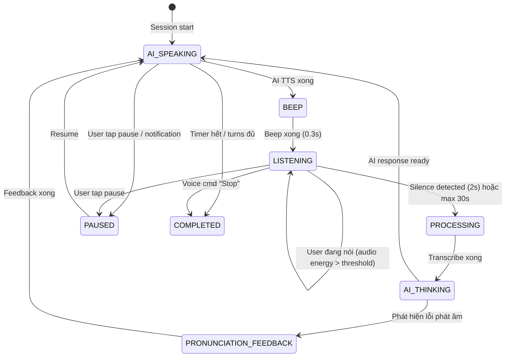

# 10. Auto-Listen Mode — AI Conversation Hands-Free

> **Status:** 🟡 Planned  
> **Priority:** P0  
> **Dependencies:** `09_BackgroundAudio.md`, `15_VoiceActivityDetection.md`  
> **Affects:** AI Conversation (Free Talk + Roleplay)

---

## 1. Overview

Auto-Listen biến AI Conversation thành chế độ **hoàn toàn hands-free**: sau khi AI nói xong, mic tự động bật, user chỉ cần nói → không cần hold-to-record.

### Before vs After

| | Hiện tại (Manual) | Auto-Listen |
|--|---|---|
| AI nói xong | User giữ nút mic | Mic **tự bật** sau tiếng beep |
| User nói xong | User thả nút mic | Mic **tự tắt** sau im lặng 2s |
| Chuyển lượt | Manual | **Tự động** |
| Text input | Hiện nút gõ text | Ẩn (chỉ voice) |
| Feedback | Visual inline | **Audio** (AI nói kết quả) |
| Suggested responses | Chip buttons | AI **đọc gợi ý** bằng giọng nói |

### Core Loop

```
┌─── AUTO-LISTEN LOOP ────────────────────────────┐
│                                                   │
│  1. AI nói (TTS response)                        │
│       │                                           │
│  2. [Beep] — "Tới lượt bạn"                     │
│       │                                           │
│  3. Mic tự bật → Recording                       │
│       │   ├─ User nói...                          │
│       │   └─ Im lặng 2s → auto-stop              │
│       │                                           │
│  4. Transcribe (Groq Whisper)                    │
│       │                                           │
│  5. AI xử lý + phản hồi                         │
│       │                                           │
│  6. (Optional) Audio feedback lỗi phát âm        │
│       │                                           │
│  └──── Quay lại bước 1 ────────────────────────  │
│                                                   │
│  KẾT THÚC: Timer hết / Đủ turns / Voice "Stop"  │
└───────────────────────────────────────────────────┘
```

---

## 2. User Flow

```
[Speaking Home] → [💬 AI Conversation] → [Conversation Setup Screen]
                    │
                    ├─ Chọn sub-mode: Free Talk / Roleplay
                    ├─ Chọn topic/scenario
                    ├─ Chọn settings...
                    │
                    ├─ 🎧 Chế độ rảnh tay    [  ON  ]  ← TOGGLE MỚI
                    │   └─ Khi bật:
                    │       ├─ Ẩn Text Input option
                    │       ├─ Hiện VAD sensitivity option
                    │       └─ Hiện info: "AI sẽ tự bật mic sau mỗi câu trả lời"
                    │
                    └─ [🎤 Bắt đầu]
                         │
                         ▼ (Nếu handsFree = ON)
                   [Auto-Listen Conversation Screen]
                     │
                     ├─ AI greeting (TTS) → auto-play
                     ├─ [Beep] → Mic tự bật
                     ├─ User nói → im lặng 2s → auto-stop
                     ├─ AI thinking → AI response (TTS)
                     ├─ (Lỗi phát âm?) → AI nói: "Từ 'three' nên phát âm /θriː/"
                     ├─ (Beginner?) → AI nói: "Bạn có thể nói: I think that..."
                     ├─ [Beep] → Mic tự bật → loop...
                     │
                     ├─ KẾT THÚC khi:
                     │   ├─ Timer hết (Free Talk)
                     │   ├─ Đủ turns (Roleplay)
                     │   ├─ Voice command: "Dừng lại" / "Stop"
                     │   └─ Notification control: Pause/Stop
                     │
                     └─ → [Session Summary] (hiện khi user mở app)
```

---

## 3. Technical Architecture

### 3.1 State Machine



### 3.2 Khác biệt với Manual Mode

```typescript
// ConversationScreen — conditional rendering
function ConversationScreen() {
  const { isHandsFreeMode } = useConversationStore();
  
  // GIỐNG: messageHistory, aiThinking, sessionTimer, turnCounter
  // GIỐNG: speakingApi.continueConversation()
  // GIỐNG: speakingApi.transcribeAudio()
  
  if (isHandsFreeMode) {
    return <AutoListenConversation />;
    // - Không hiện input bar (mic button + text input)
    // - Thêm AutoListenIndicator (pulsing mic icon)
    // - Thêm "Đang nghe..." status
    // - GIảm visual feedback, tăng audio feedback
    // - Simplified UI: chỉ chat bubbles + minimal controls
  }
  
  return <ManualConversation />; // Hiện tại
}
```

### 3.3 Auto-Listen Engine

```typescript
interface AutoListenEngine {
  /**
   * Mục đích: Bắt đầu lắng nghe sau khi AI nói xong
   * Tham số đầu vào: config (AutoListenConfig)
   * Tham số đầu ra: Promise<string> — transcript của user
   * Khi nào: Sau mỗi AI response TTS kết thúc
   */
  startListening(config: AutoListenConfig): Promise<string>;
  
  /**
   * Mục đích: Dừng lắng nghe (khi phát hiện im lặng hoặc timeout)
   * Tham số đầu vào: không
   * Tham số đầu ra: Promise<AudioUri>
   * Khi nào: VAD phát hiện silence 2s hoặc max recording time
   */
  stopListening(): Promise<string>;
}

interface AutoListenConfig {
  silenceThreshold: number;     // Mặc định 2000ms
  maxRecordingDuration: number; // Mặc định 30000ms (30s)
  beepEnabled: boolean;         // Mặc định true
  beepVolume: number;           // 0-1, mặc định 0.5
}
```

---

## 4. Audio Feedback thay Visual

Trong Auto-Listen mode, feedback chuyển từ visual → audio:

### 4.1 Pronunciation Alert (Audio)

| Hiện tại (Visual) | Auto-Listen (Audio) |
|---|---|
| Inline card: "three → /θriː/" | AI nói: "Từ 'three' nên phát âm thờ-ri, đặt lưỡi giữa hai hàm răng" |
| Tap để nghe | Auto-play sau correction |
| Visual highlight | Không cần |

### 4.2 Grammar Fix (Audio)

| Hiện tại (Visual) | Auto-Listen (Audio) |
|---|---|
| Inline: "I goed → I went" | AI nói: "Nhắc nhẹ: thay vì 'I goed', nên nói 'I went'" |
| Tap để xem giải thích | AI giải thích luôn |

### 4.3 Suggested Responses (Audio)

| Hiện tại (Visual) | Auto-Listen (Audio) |
|---|---|
| 2-3 chip buttons | AI nói: "Bạn có thể trả lời: 'I think that...' hoặc 'In my opinion...'" |
| Tap để chọn | User nói theo gợi ý hoặc tự do |

---

## 5. UI Design — Auto-Listen Mode

### 5.1 Simplified Screen (khi app mở)

```
┌──────────────────────────────────┐
│  ← AI Conversation    ⏱ 03:42   │
│     🎧 Hands-Free                │
│                                  │
│  ╭──────────────────────────╮   │
│  │ 🤖 AI                    │   │
│  │ That's interesting!      │   │
│  │ What do you think about  │   │
│  │ traveling to Japan?      │   │
│  ╰──────────────────────────╯   │
│                                  │
│  ╭──────────────────────────╮   │
│  │ 👤 You                   │   │
│  │ I think it would be      │   │
│  │ amazing to visit Tokyo   │   │
│  ╰──────────────────────────╯   │
│                                  │
│                                  │
│         ┌──────────────┐        │
│         │  🎤 Đang nghe │        │  ← Pulsing animation
│         │  ● ● ●        │        │    Hoặc "AI đang nói..."
│         └──────────────┘        │
│                                  │
│     ⏸️ Tạm dừng   ⏹️ Kết thúc   │
└──────────────────────────────────┘
```

### 5.2 Lock Screen / Background

```
┌──────────────────────────────────┐
│  🎧 AI Conversation — Hands-Free │
│  "What do you think about..."    │
│                                  │
│     ⏮️     ⏸️     ⏭️             │
│   Repeat   Pause   Skip         │
└──────────────────────────────────┘
```

---

## 6. Voice Commands

Trong Auto-Listen mode, nhận diện một số voice commands:

| Command (EN) | Command (VI) | Hành động |
|---|---|---|
| "Stop" / "End session" | "Dừng lại" / "Kết thúc" | Kết thúc session |
| "Repeat" / "Say again" | "Nói lại" / "Lặp lại" | AI nói lại câu cuối |
| "Slower please" | "Nói chậm hơn" | Giảm TTS speed |
| "Skip" | "Bỏ qua" | Skip câu hiện tại (Roleplay) |

**Implementation:** Keyword detection đơn giản trong transcript — không cần NLP phức tạp:

```typescript
const VOICE_COMMANDS = {
  stop: ['stop', 'end session', 'dừng lại', 'kết thúc'],
  repeat: ['repeat', 'say again', 'nói lại', 'lặp lại'],
  slower: ['slower', 'slow down', 'nói chậm hơn'],
  skip: ['skip', 'next', 'bỏ qua', 'tiếp theo'],
};

/**
 * Mục đích: Phát hiện voice command trong transcript
 * Tham số đầu vào: transcript (string)
 * Tham số đầu ra: VoiceCommand | null
 * Khi nào: Sau mỗi lần transcribe xong
 */
function detectVoiceCommand(transcript: string): VoiceCommand | null {
  const lower = transcript.toLowerCase().trim();
  for (const [cmd, keywords] of Object.entries(VOICE_COMMANDS)) {
    if (keywords.some(kw => lower === kw || lower.startsWith(kw))) {
      return cmd as VoiceCommand;
    }
  }
  return null;
}
```

---

## 7. Files to Create/Modify

### 7.1 New Files

| File | Mô tả |
|------|--------|
| `src/hooks/useAutoListen.ts` | Hook quản lý auto-listen loop |
| `src/components/speaking/AutoListenIndicator.tsx` | UI indicator "Đang nghe..." |
| `src/utils/voiceCommands.ts` | Voice command detection |

### 7.2 Modified Files

| File | Thay đổi |
|------|----------|
| `src/screens/speaking/ConversationSetupScreen.tsx` | Thêm toggle "Chế độ rảnh tay" |
| `src/screens/speaking/ConversationScreen.tsx` | Conditional render Auto-Listen UI |
| `src/store/useSpeakingStore.ts` | Thêm `isHandsFreeMode` flag |

---

## 8. Edge Cases

| Case | Xử lý |
|------|-------|
| User không nói gì (silence 10s) | AI hỏi: "Bạn còn đó không? Tôi sẽ chờ thêm 10 giây nữa" |
| User nói quá nhỏ | AI nói: "Tôi không nghe rõ, bạn nói to hơn được không?" |
| Background noise cao | Tăng silence threshold, AI thông báo "Có vẻ nhiều tiếng ồn" |
| User nói = voice command | Detect command → execute thay vì gửi cho AI |
| Mic bị app khác dùng | Pause session → notification |
| AI response quá dài | Max 30s TTS → chunk if needed |

---

## 9. Implementation Phases

### Phase 1: Core Auto-Listen (3-4 ngày)
- [ ] `useAutoListen.ts` — listening loop
- [ ] Auto-start mic sau TTS
- [ ] Silence detection (basic: audio energy threshold)
- [ ] Toggle trong `ConversationSetupScreen`

### Phase 2: Audio Feedback (2 ngày)
- [ ] Pronunciation feedback bằng TTS
- [ ] Grammar correction bằng TTS
- [ ] Suggested responses bằng TTS

### Phase 3: Voice Commands (1-2 ngày)
- [ ] `voiceCommands.ts` — keyword detection
- [ ] Stop/Repeat/Slower/Skip commands
- [ ] Integration với conversation loop

### Phase 4: Background + Polish (2 ngày)
- [ ] Background mode (dùng `backgroundAudioService`)
- [ ] Lock screen controls
- [ ] UI polish (AutoListenIndicator)

---

## 10. Test Cases

| TC-ID | Scenario | Expected |
|-------|----------|----------|
| AL-01 | Bật Auto-Listen → AI nói → beep | Mic tự bật, user nói → AI nghe |
| AL-02 | User im lặng 2s | Mic tự tắt → transcribe → AI phản hồi |
| AL-03 | User nói "Stop" | Session kết thúc |
| AL-04 | User nói "Nói lại" | AI repeat câu cuối |
| AL-05 | Pronunciation sai | AI đọc feedback thay vì hiện inline |
| AL-06 | Background mode | Loop tiếp tục khi app ở background |
| AL-07 | Timer hết (Free Talk) | AI nói "Hết giờ!" → summary |
| AL-08 | Đủ turns (Roleplay) | AI nói "Hoàn thành tình huống!" → summary |
| AL-09 | Noise environment | Silence threshold tự điều chỉnh |
| AL-10 | Lock screen controls | Pause/Resume hoạt động |

---

## 11. Tài liệu liên quan

- [02_AIConversation.md](02_AIConversation.md) — AI Conversation base feature
- [09_BackgroundAudio.md](09_BackgroundAudio.md) — Background audio foundation
- [11_AudioFeedback.md](11_AudioFeedback.md) — Audio feedback cross-cutting
- [15_VoiceActivityDetection.md](15_VoiceActivityDetection.md) — VAD technical doc
