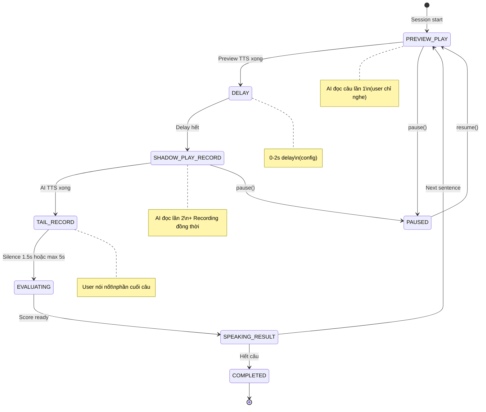

# 12. Shadowing Auto Mode — Passive Shadowing

> **Status:** 🟡 Planned  
> **Priority:** P2  
> **Dependencies:** `09_BackgroundAudio.md`, `11_AudioFeedback.md`, `15_VoiceActivityDetection.md`  
> **Affects:** Shadowing Mode (`ShadowingSessionScreen.tsx`)

---

## 1. Overview

Shadowing Auto Mode biến Shadowing — kỹ thuật học thụ động đỉnh cao — thành trải nghiệm **hoàn toàn hands-free**. Thay vì 4-phase manual flow, Auto Mode chạy loop liên tục:

```
AI đọc câu → Recording tự bật → User nhại → AI chấm bằng giọng nói → Auto-next
```

### So sánh Shadowing Manual vs Auto

| | Manual (Hiện tại) | Auto Mode (Mới) |
|--|---|---|
| **Preview phase** | Tap "Shadow!" để bắt đầu | Auto-play, không cần tap |
| **Recording** | Phải ở foreground | Background OK |
| **Score hiển thị** | Visual (waveform + breakdown) | Audio (AI đọc điểm) |
| **Next sentence** | Tap "Next" | Auto-next sau feedback |
| **Config** | Chọn mỗi session | Set 1 lần, auto-loop |
| **Use case** | Ngồi học tập trung | Đi bộ, xe bus, tập gym |

### Tại sao Shadowing phù hợp passive?

Theo phương pháp Alexander Arguelles:
- Shadowing = **bắt chước vô thức** → không cần não xử lý ý nghĩa  
- Chỉ cần **tai + miệng** → hoàn hảo cho đi đường
- Repetitive nature = **muscle memory** → càng passive càng tốt

---

## 2. User Flow

```
[Speaking Home] → [🔊 Shadowing] → [Shadowing Config Screen]
                    │
                    ├─ Chọn topic → REUSE Listening Topic Picker
                    ├─ Speed: 0.5x — 1.5x
                    ├─ Delay: 0 — 2.0s
                    │
                    ├─ 🎧 Chế độ tự động    [  ON  ]  ← TOGGLE MỚI
                    │   └─ Khi bật:
                    │       ├─ Ẩn "Scoring mode" (luôn post-recording)
                    │       ├─ Hiện "Feedback level": Minimal / Standard / Detailed
                    │       └─ Info: "AI sẽ tự đọc câu → ghi âm → chấm → chuyển câu"
                    │
                    └─ [Bắt đầu]
                         │
                         ▼ (Nếu Auto = ON)
                   [Auto Shadow Session]
                     │
                     ├─ Loop cho mỗi câu:
                     │   1. AI đọc câu (TTS với speed đã chọn)
                     │   2. Delay (0-2s theo config)
                     │   3. AI đọc LẠI + Mic tự bật (shadow đồng thời)
                     │   4. AI đọc xong → đợi user nói xong (silence 1.5s)
                     │   5. Evaluate → AI đọc score
                     │   6. Pause 1s → câu tiếp theo
                     │
                     ├─ KẾT THÚC khi:
                     │   ├─ Hết danh sách câu
                     │   ├─ Voice command: "Dừng lại"
                     │   └─ Notification: Tap Stop
                     │
                     └─ → [Session Summary] (khi mở app)
```

---

## 3. Auto Shadow Loop — Technical

### 3.1 State Machine



### 3.2 Đồng thời Play + Record

Dùng cùng approach đã có trong Shadowing Manual:
- **TrackPlayer** cho AI playback
- **AudioRecorderPlayer** cho recording
- **AVAudioSession** mode = `playAndRecord`

```typescript
/**
 * Mục đích: Chạy 1 iteration của auto shadow loop
 * Tham số đầu vào: sentence (Sentence), config (AutoShadowConfig)
 * Tham số đầu ra: Promise<ShadowScore> — score cho câu này
 * Khi nào: Mỗi câu trong danh sách
 */
async function runShadowIteration(
  sentence: Sentence, 
  config: AutoShadowConfig
): Promise<ShadowScore> {
  // Phase 1: Preview — AI đọc, user nghe
  await playTTS(sentence.text, config.speed);
  
  // Phase 2: Delay
  await delay(config.delayMs);
  
  // Phase 3: Shadow — AI đọc lại + ghi âm đồng thời
  const [, audioUri] = await Promise.all([
    playTTS(sentence.text, config.speed),
    startRecordingWithAutoStop(config.silenceTimeout),
  ]);
  
  // Phase 4: Evaluate
  const transcript = await speakingApi.transcribeAudio(audioUri);
  const score = await speakingApi.evaluatePronunciation(sentence.text, transcript);
  
  // Phase 5: Audio feedback
  const feedbackScript = assembleShadowFeedback(score, config.feedbackLevel);
  await playTTS(feedbackScript, 1.0); // Feedback luôn speed 1.0
  
  return score;
}
```

### 3.3 Score Breakdown (Shadowing-Specific)

Shadowing chấm 3 tiêu chí:

| Tiêu chí | Mô tả | Audio Feedback Ví dụ |
|----------|--------|---------------------|
| 🎵 Rhythm | Nhịp điệu | "Nhịp: 78 điểm — cần theo sát nhịp hơn" |
| 🎶 Intonation | Ngữ điệu lên/xuống | "Ngữ điệu: 85 điểm — tốt!" |
| 🎯 Accuracy | Phát âm chính xác | "Chính xác: 90 điểm" |

```typescript
/**
 * Mục đích: Tạo feedback script cho Shadowing
 * Tham số đầu vào: score (ShadowScore), level (FeedbackLevel)
 * Tham số đầu ra: string
 * Khi nào: Sau evaluate trong auto shadow loop
 */
function assembleShadowFeedback(score: ShadowScore, level: FeedbackLevel): string {
  const total = Math.round((score.rhythm + score.intonation + score.accuracy) / 3);
  
  if (level === 'minimal') {
    return `${total} điểm. ${total >= 80 ? 'Câu tiếp.' : 'Thử lại.'}`;
  }
  
  return [
    `Tổng: ${total} điểm.`,
    `Nhịp: ${score.rhythm}. Ngữ điệu: ${score.intonation}. Chính xác: ${score.accuracy}.`,
    score.tip || '',
    total >= 80 ? 'Câu tiếp theo.' : 'Thử lại câu này.',
  ].filter(Boolean).join(' ');
}
```

---

## 4. Retry Logic

| Điều kiện | Hành vi |
|-----------|---------|
| Total ≥ 80 | Auto-next |
| Total < 80, retry ≤ 2 | AI nói: "Thử lại nhé" → loop lại câu này |
| Total < 80, retry > 2 | AI nói: "Bỏ qua câu này, quay lại sau" → next |

---

## 5. UI Design

### 5.1 Foreground (khi mở app)

```
┌──────────────────────────────────┐
│  ← Auto Shadow       Câu 5/15   │
│  ════════════════════────────    │
│  🎧 Auto Mode                   │
│                                  │
│  ┌──────────────────────────┐   │
│  │  🔊 PREVIEW               │   │  ← Phase indicator
│  │                            │   │
│  │  "The quick brown fox     │   │
│  │   jumps over the lazy dog"│   │
│  │                            │   │
│  │  Speed: 0.8x  Delay: 1.0s│   │
│  └──────────────────────────┘   │
│                                  │
│  ── Lịch sử ────────────────    │
│  ✅ Câu 1: R78 I85 A90 → 84    │
│  ✅ Câu 2: R82 I88 A92 → 87    │
│  ✅ Câu 3: R70 I75 A80 → 75 ↻  │
│  ✅ Câu 4: R85 I90 A88 → 88    │
│  🔄 Câu 5: đang shadow...      │
│                                  │
│     ⏸️ Pause    ⏹️ Stop         │
└──────────────────────────────────┘
```

### 5.2 Background Notification

```
┌──────────────────────────────────┐
│  🎵 Auto Shadow — Câu 5/15      │
│  "The quick brown fox..."        │
│     ⏮️     ⏸️     ⏭️            │
└──────────────────────────────────┘
```

---

## 6. Files to Create/Modify

### New Files

| File | Mô tả |
|------|--------|
| `src/hooks/useAutoShadow.ts` | Hook cho auto shadow loop |
| `src/utils/shadowFeedback.ts` | Shadow-specific feedback scripts |

### Modified Files

| File | Thay đổi |
|------|----------|
| `src/screens/speaking/ShadowingConfigScreen.tsx` | Thêm toggle "Chế độ tự động" |
| `src/screens/speaking/ShadowingSessionScreen.tsx` | Conditional render Auto Mode |
| `src/store/useSpeakingStore.ts` | Thêm auto shadow state |

---

## 7. Edge Cases

| Case | Xử lý |
|------|-------|
| User nói quá nhỏ (headphone leaking) | Increase silence threshold |
| AEC không đủ tốt (speaker mode) | Toast: "Nên dùng tai nghe 🎧" |
| Câu quá dài (> 20s) | Chia thành chunks, shadow từng phần |
| User không nói gì | AI nói: "Không nghe thấy, thử lại" → retry 1 lần → skip |

---

## 8. Implementation Phases

### Phase 1: Core Loop (3-4 ngày)
- [ ] `useAutoShadow.ts` — state machine
- [ ] Preview → Shadow → Score → Next loop
- [ ] Reuse existing Shadowing audio logic
- [ ] Audio feedback integration

### Phase 2: UI + Config (2 ngày)
- [ ] Toggle trong Config screen
- [ ] Auto Shadow UI (simplified)
- [ ] Score history component

### Phase 3: Background + Testing (2-3 ngày)
- [ ] Background mode
- [ ] Notification controls
- [ ] Device testing (AEC, Bluetooth)

---

## 9. Tài liệu liên quan

- [04_ShadowingMode.md](04_ShadowingMode.md) — Shadowing base feature
- [09_BackgroundAudio.md](09_BackgroundAudio.md) — Background audio foundation
- [11_AudioFeedback.md](11_AudioFeedback.md) — Audio feedback system
