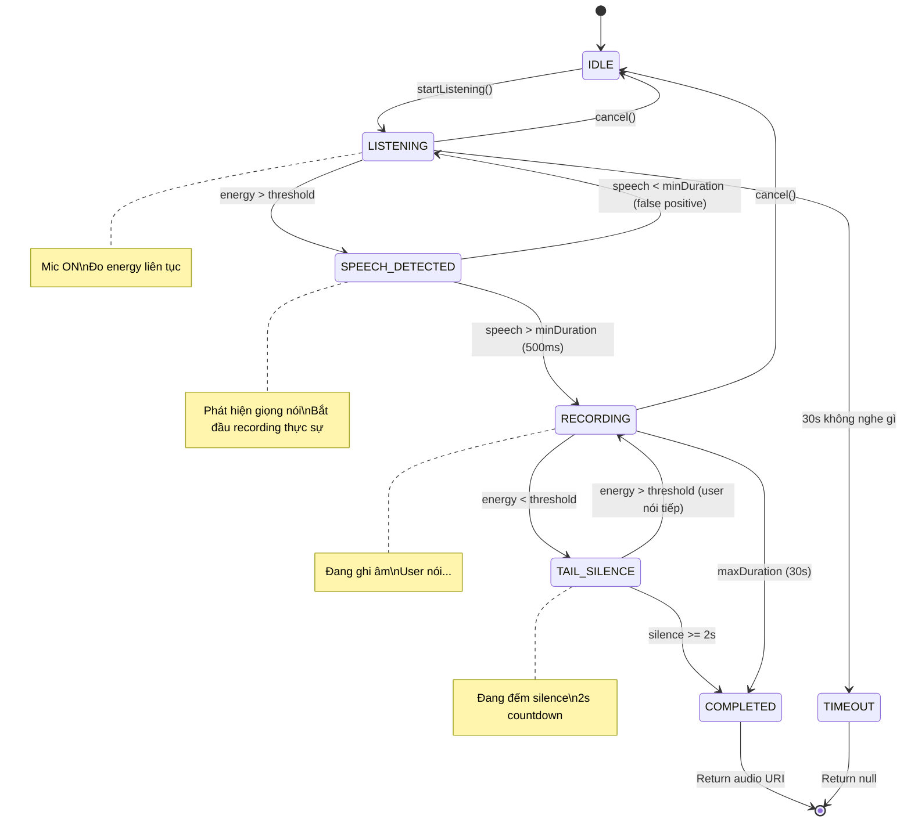

# 15. Voice Activity Detection (VAD) — Auto-Mic

> **Status:** 🟡 Planned  
> **Priority:** P2  
> **Dependencies:** `09_BackgroundAudio.md`  
> **Affects:** `10_AutoListenMode.md`, `12_ShadowingAutoMode.md`, `08_AudioDrill.md`

---

## 1. Overview

Voice Activity Detection (VAD) cho phép mic **tự động phát hiện** khi user bắt đầu/ngừng nói — thay thế hold-to-record trong tất cả passive modes.

### Vấn đề cần giải quyết

```
HIỆN TẠI:                         CẦN THIẾT:
Hold mic → Nói → Thả mic          Chỉ cần NÓI → mic tự phát hiện
     ↑                                  ↑
  Cần tay                          Hands-free
```

### VAD Flow

```
Mic ON (listening mode)
    │
    ├─ Audio energy < threshold → Im lặng → Tiếp tục chờ
    │
    ├─ Audio energy > threshold → PHÁT HIỆN GIỌNG NÓI
    │       │
    │       ├─ Bắt đầu recording (đã có audio từ đầu, không mất syllable đầu)
    │       │
    │       ├─ User đang nói... (energy vẫn > threshold)
    │       │
    │       └─ Energy < threshold liên tục 2s → NGỪNG NÓI
    │               │
    │               └─ Stop recording → Xử lý audio
    │
    └─ Timeout (30s) → Stop → "Không nghe thấy gì"
```

---

## 2. Technical Approaches

### 2.1 Approach So Sánh

| Approach | Pros | Cons | Recommend? |
|----------|------|------|------------|
| **Energy-based** (simple) | Dễ implement, nhẹ | False positives từ noise | ✅ MVP |
| **On-device ML** (@anthropic/vad) | Rất chính xác | Thêm dependency, CPU | 🟡 V2 |
| **WebRTC VAD** | Đã proven, nhẹ | Cần native bridge | 🟡 V2 |
| **Server-side** | Không cần client logic | Latency cao | ❌ |

### 2.2 Recommended: Energy-Based (MVP)

```typescript
// Ngưỡng audio energy đơn giản
const VAD_CONFIG = {
  // Ngưỡng năng lượng âm thanh (dB)
  energyThreshold: -35,        // Trên -35dB = có giọng nói
  
  // Thời gian im lặng trước khi coi là "ngừng nói"
  silenceDuration: 2000,        // 2 giây
  
  // Thời gian tối thiểu phải nói
  minSpeechDuration: 500,       // 0.5 giây (tránh false positive)
  
  // Timeout tối đa
  maxRecordingDuration: 30000,  // 30 giây
  
  // Buffer trước khi phát hiện giọng nói (giữ audio trước khi trigger)
  preRollBuffer: 300,           // 300ms — giữ 300ms audio trước trigger
                                // để không mất syllable đầu tiên
};
```

### 2.3 Energy Measurement

```typescript
/**
 * Mục đích: Đo mức năng lượng âm thanh từ mic
 * Tham số đầu vào: không (đọc từ AudioRecorderPlayer metering)
 * Tham số đầu ra: number (dB level)
 * Khi nào: Polling liên tục khi mic đang listening
 */

// react-native-audio-recorder-player hỗ trợ metering
AudioRecorderPlayer.addRecordBackListener((e) => {
  const currentDb = e.currentMetering; // iOS: -160 to 0 dB
  
  if (currentDb > VAD_CONFIG.energyThreshold) {
    // Phát hiện giọng nói
    onSpeechDetected();
  }
});
```

---

## 3. VAD State Machine



---

## 4. Implementation

### 4.1 Core Hook

```typescript
interface VADResult {
  audioUri: string | null;
  duration: number;
  didTimeout: boolean;
}

/**
 * Mục đích: Hook quản lý Voice Activity Detection
 * Tham số đầu vào: config (VADConfig)
 * Tham số đầu ra: { state, startListening, stopListening, cancel }
 * Khi nào: Trong passive mode screens/hooks
 */
function useVAD(config: VADConfig = VAD_CONFIG) {
  const [state, setState] = useState<VADState>('idle');
  const silenceTimer = useRef<NodeJS.Timeout>();
  const preRollBuffer = useRef<AudioBuffer>();
  
  const startListening = useCallback(async (): Promise<VADResult> => {
    setState('listening');
    
    // Bắt đầu ghi âm ngay (nhưng đang ở "listening mode")
    await AudioRecorderPlayer.startRecorder(undefined, {
      // iOS metering cho phép đo dB
      isMeteringEnabled: true,
      // Android
      audioEncoder: AudioEncoderAndroidType.AAC,
      audioSource: AudioSourceAndroidType.MIC,
    });
    
    return new Promise((resolve) => {
      const listener = AudioRecorderPlayer.addRecordBackListener((e) => {
        const db = e.currentMetering ?? -160;
        
        switch (state) {
          case 'listening':
            if (db > config.energyThreshold) {
              setState('speech_detected');
              // Không mất audio đầu nhờ đã recording từ đầu
            }
            break;
            
          case 'recording':
            if (db < config.energyThreshold) {
              setState('tail_silence');
              silenceTimer.current = setTimeout(() => {
                // Im lặng đủ lâu → dừng
                finishRecording(resolve);
              }, config.silenceDuration);
            }
            break;
            
          case 'tail_silence':
            if (db > config.energyThreshold) {
              // User nói tiếp
              clearTimeout(silenceTimer.current);
              setState('recording');
            }
            break;
        }
      });
    });
  }, [config]);
  
  return { state, startListening, stopListening, cancel };
}
```

### 4.2 Adaptive Threshold

Tự điều chỉnh threshold theo môi trường:

```typescript
/**
 * Mục đích: Calibrate noise floor trước khi bắt đầu session
 * Tham số đầu vào: calibrationDuration (ms)
 * Tham số đầu ra: number — recommended threshold (dB)
 * Khi nào: Đầu mỗi passive session (1-2 giây calibration)
 */
async function calibrateNoiseFloor(calibrationDurationMs = 2000): Promise<number> {
  const samples: number[] = [];
  
  // Ghi 2s ambient noise
  await AudioRecorderPlayer.startRecorder(undefined, { isMeteringEnabled: true });
  
  await new Promise<void>((resolve) => {
    const listener = AudioRecorderPlayer.addRecordBackListener((e) => {
      samples.push(e.currentMetering ?? -160);
    });
    
    setTimeout(() => {
      listener.remove();
      resolve();
    }, calibrationDurationMs);
  });
  
  await AudioRecorderPlayer.stopRecorder();
  
  // Threshold = noise floor + margin
  const avgNoise = samples.reduce((a, b) => a + b) / samples.length;
  const margin = 10; // dB trên noise floor
  
  return avgNoise + margin;
}
```

**Ví dụ:**
| Môi trường | Noise Floor | Threshold |
|-----------|-------------|-----------|
| Phòng yên tĩnh | -55 dB | -45 dB |
| Văn phòng | -40 dB | -30 dB |
| Đường phố | -25 dB | -15 dB |
| Quá ồn (> -10 dB) | — | ⚠️ Warning: "Quá ồn, khó nhận diện giọng nói" |

---

## 5. Pre-Roll Buffer

Vấn đề: Khi VAD detect giọng nói, syllable đầu tiên có thể đã bị mất.

**Giải pháp:** Ghi âm liên tục từ khi `startListening()`, trim phần silence ở đầu khi export:

```typescript
/**
 * Mục đích: Trim silence đầu file audio, giữ lại 300ms trước speech detected
 * Tham số đầu vào: audioUri (string), speechStartMs (number)
 * Tham số đầu ra: string — URI audio đã trim
 * Khi nào: Sau khi recording xong, trước khi gửi đi transcribe
 */
function trimPreSpeechSilence(audioUri: string, speechStartMs: number): string {
  const trimStart = Math.max(0, speechStartMs - 300); // Giữ 300ms buffer
  // Sử dụng native audio trimming hoặc ffmpeg-kit
  return trimmedUri;
}
```

---

## 6. Integration Points

### 6.1 Với Auto-Listen Mode

```typescript
// Trong useAutoListen.ts
const { startListening } = useVAD({
  silenceDuration: 2000,     // 2s im lặng = hết nói
  maxRecordingDuration: 30000, // Max 30s
});

// Sau khi AI nói xong
await playBeep();
const result = await startListening();
if (result.audioUri) {
  const transcript = await transcribe(result.audioUri);
  // Tiếp tục conversation...
}
```

### 6.2 Với Audio Drill

```typescript
// Trong useAudioDrill.ts
const { startListening } = useVAD({
  silenceDuration: 3000,     // 3s — dài hơn vì user đang nhại câu
  maxRecordingDuration: 15000, // Max 15s
});
```

### 6.3 Với Auto Shadow

```typescript
// Trong useAutoShadow.ts — đặc biệt: VAD hoạt động song song với playback
const { startListening } = useVAD({
  silenceDuration: 1500,     // 1.5s — ngắn hơn vì shadow theo AI
  maxRecordingDuration: 20000,
  // Cần lọc audio AI khỏi recording (AEC)
});
```

---

## 7. Edge Cases

| Case | Xử lý |
|------|-------|
| Background noise liên tục (xe cộ) | Adaptive threshold tự điều chỉnh |
| User hắt hơi / ho | minSpeechDuration 500ms lọc bớt |
| Nhạc nền (user nghe nhạc) | Không recommend; hiện warning |
| 2 người nói cùng lúc | Chấp nhận — transcribe cả 2, AI tách |
| Wind noise (ngoài trời) | Tăng threshold; recommend windscreen |
| Silence timeout | AI hỏi: "Bạn còn đó không?" |
| Very short utterances ("OK", "Yes") | minDuration 500ms vẫn capture được |

---

## 8. V2 — ML-Based VAD

Sau MVP, có thể nâng lên ML-based cho accuracy tốt hơn:

| Option | Mô tả | Size |
|--------|--------|------|
| **Silero VAD** | PyTorch model, rất chính xác | ~2MB |
| **WebRTC VAD** | Google's proven VAD | ~100KB |
| **TensorFlow Lite** | Custom model trained on speaking data | ~5MB |

→ Cân nhắc ở V2 dựa trên feedback user về false positive rate.

---

## 9. Files to Create/Modify

### New Files

| File | Mô tả |
|------|--------|
| `src/hooks/useVAD.ts` | Core VAD hook |
| `src/utils/audioCalibration.ts` | Noise floor calibration |

### Modified Files

| File | Thay đổi |
|------|----------|
| `src/hooks/useAutoListen.ts` | Integrate useVAD |
| `src/hooks/useAudioDrill.ts` | Integrate useVAD |
| `src/hooks/useAutoShadow.ts` | Integrate useVAD |

---

## 10. Implementation Phases

### Phase 1: Energy-Based VAD (3-4 ngày)
- [ ] `useVAD.ts` — state machine + energy detection
- [ ] `audioCalibration.ts` — noise floor calibration
- [ ] Pre-roll buffer handling
- [ ] Adaptive threshold

### Phase 2: Integration (2 ngày)
- [ ] Auto-Listen integration
- [ ] Audio Drill integration
- [ ] Auto Shadow integration

### Phase 3: Testing & Tuning (2-3 ngày)
- [ ] Test trong phòng yên tĩnh
- [ ] Test ngoài đường
- [ ] Test trong quán cafe
- [ ] Tune threshold defaults
- [ ] iOS vs Android calibration

---

## 11. Test Cases

| TC-ID | Scenario | Expected |
|-------|----------|----------|
| VAD-01 | Phòng yên tĩnh → user nói | Detect trong < 200ms |
| VAD-02 | User im lặng 2s | Auto-stop recording |
| VAD-03 | Noise background (cafe) | Adaptive threshold lọc noise |
| VAD-04 | User nói → pause → nói tiếp | Recording liên tục (không cắt giữa) |
| VAD-05 | Syllable đầu | Không bị mất nhờ pre-roll buffer |
| VAD-06 | 30s timeout | Trả null, hiện message |
| VAD-07 | False positive (ho, hắt hơi) | minDuration 500ms lọc |
| VAD-08 | Calibration | Threshold phù hợp môi trường |

---

## 12. Tài liệu liên quan

- [09_BackgroundAudio.md](09_BackgroundAudio.md) — Audio session foundation
- [10_AutoListenMode.md](10_AutoListenMode.md) — Primary consumer
- [12_ShadowingAutoMode.md](12_ShadowingAutoMode.md) — Consumer
- [08_AudioDrill.md](08_AudioDrill.md) — Consumer
