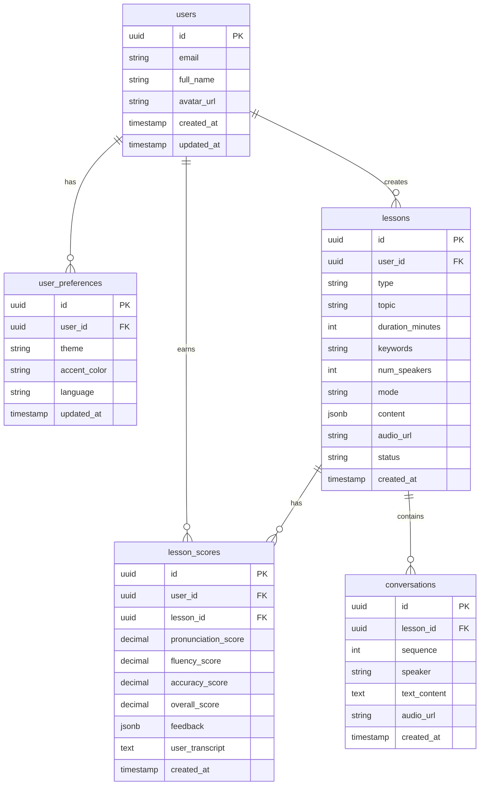

# 📊 DATABASE SCHEMA - STUDYLANGUAGE APP

**Ngày tạo:** 10/01/2026
**Database:** Supabase (PostgreSQL)

---

## 1. ERD Diagram



---

## 2. Chi tiết các Tables

### 2.1. `users`
> Thông tin người dùng (Sync từ Supabase Auth)

| Column | Type | Constraints | Description |
| :--- | :--- | :--- | :--- |
| `id` | `uuid` | PK, DEFAULT gen_random_uuid() | ID duy nhất |
| `email` | `varchar(255)` | UNIQUE, NOT NULL | Email đăng nhập |
| `full_name` | `varchar(255)` | | Tên hiển thị |
| `avatar_url` | `text` | | URL ảnh đại diện (từ Google) |
| `created_at` | `timestamptz` | DEFAULT now() | Ngày tạo |
| `updated_at` | `timestamptz` | DEFAULT now() | Ngày cập nhật |

**Indexes:**
- `idx_users_email` ON `email`

---

### 2.2. `user_preferences`
> Cài đặt cá nhân của người dùng (Theme, Language)

| Column | Type | Constraints | Description |
| :--- | :--- | :--- | :--- |
| `id` | `uuid` | PK | ID duy nhất |
| `user_id` | `uuid` | FK -> users.id, UNIQUE | 1:1 với user |
| `theme` | `varchar(10)` | DEFAULT 'light' | 'light' / 'dark' |
| `accent_color` | `varchar(50)` | DEFAULT 'fresh-greens' | Mã màu theme |
| `language` | `varchar(5)` | DEFAULT 'vi' | 'en' / 'vi' |
| `updated_at` | `timestamptz` | DEFAULT now() | Ngày cập nhật |

**Enum Values:**
- `theme`: `light`, `dark`
- `accent_color`: `fresh-greens`, `leafy-green-garden`, `cool-waters`, `bright-green`, `green-harmony`, `spring-green-harmony`
- `language`: `en`, `vi`

---

### 2.3. `lessons`
> Bài học/Bài luyện tập

| Column | Type | Constraints | Description |
| :--- | :--- | :--- | :--- |
| `id` | `uuid` | PK | ID duy nhất |
| `user_id` | `uuid` | FK -> users.id | Người tạo |
| `type` | `varchar(20)` | NOT NULL | 'listening' / 'speaking' / 'reading' / 'writing' |
| `topic` | `varchar(255)` | NOT NULL | Chủ đề bài học |
| `duration_minutes` | `int` | DEFAULT 5 | Thời lượng mong muốn |
| `keywords` | `text` | | Từ khóa liên quan (comma separated) |
| `num_speakers` | `int` | DEFAULT 2 | Số người trong hội thoại |
| `mode` | `varchar(20)` | DEFAULT 'passive' | 'passive' / 'interactive' |
| `content` | `jsonb` | | Nội dung AI sinh (script, questions, etc.) |
| `audio_url` | `text` | | URL file audio chính |
| `status` | `varchar(20)` | DEFAULT 'draft' | 'draft' / 'generating' / 'ready' / 'completed' |
| `created_at` | `timestamptz` | DEFAULT now() | Ngày tạo |

**Indexes:**
- `idx_lessons_user_id` ON `user_id`
- `idx_lessons_type` ON `type`
- `idx_lessons_created_at` ON `created_at` DESC

**Content JSONB Structure:**
```json
{
  "script": [
    { "speaker": "Person A", "text": "Hello, how are you?" },
    { "speaker": "Person B", "text": "I'm fine, thanks!" }
  ],
  "questions": [
    { "question": "What did Person A say?", "options": ["A", "B", "C"], "answer": 0 }
  ],
  "sample_text": "The paragraph for speaking practice...",
  "grammar_feedback": { ... }
}
```

---

### 2.4. `conversations`
> Chi tiết từng câu trong hội thoại (cho Listening)

| Column | Type | Constraints | Description |
| :--- | :--- | :--- | :--- |
| `id` | `uuid` | PK | ID duy nhất |
| `lesson_id` | `uuid` | FK -> lessons.id | Thuộc bài học nào |
| `sequence` | `int` | NOT NULL | Thứ tự câu (1, 2, 3...) |
| `speaker` | `varchar(50)` | NOT NULL | 'Person A' / 'Person B' / 'User' |
| `content` | `text` | NOT NULL | Nội dung câu nói |
| `audio_url` | `text` | | URL audio của câu này |
| `start_time_ms` | `int` | | Thời điểm bắt đầu (ms) - cho sync |
| `end_time_ms` | `int` | | Thời điểm kết thúc (ms) |
| `created_at` | `timestamptz` | DEFAULT now() | Ngày tạo |

**Indexes:**
- `idx_conversations_lesson_id` ON `lesson_id`
- `idx_conversations_sequence` ON `lesson_id, sequence`

---

### 2.5. `lesson_scores`
> Điểm số và feedback của bài học

| Column | Type | Constraints | Description |
| :--- | :--- | :--- | :--- |
| `id` | `uuid` | PK | ID duy nhất |
| `user_id` | `uuid` | FK -> users.id | Người làm bài |
| `lesson_id` | `uuid` | FK -> lessons.id | Bài học |
| `pronunciation_score` | `decimal(3,1)` | | Điểm phát âm (0-10) |
| `fluency_score` | `decimal(3,1)` | | Điểm trôi chảy |
| `accuracy_score` | `decimal(3,1)` | | Điểm chính xác |
| `overall_score` | `decimal(3,1)` | | Điểm tổng |
| `feedback` | `jsonb` | | Chi tiết feedback từ AI |
| `user_transcript` | `text` | | Văn bản user đã nói (từ Whisper) |
| `user_audio_url` | `text` | | URL audio user ghi âm |
| `created_at` | `timestamptz` | DEFAULT now() | Ngày tạo |

**Indexes:**
- `idx_lesson_scores_user_id` ON `user_id`
- `idx_lesson_scores_lesson_id` ON `lesson_id`

**Feedback JSONB Structure:**
```json
{
  "wrong_words": [
    { "word": "pronunciation", "user_said": "pronounciation", "suggestion": "pro-nun-see-AY-shun" }
  ],
  "tips": ["Try to slow down when saying longer words"],
  "encouragement": "Great job! Keep practicing!"
}
```

---

## 3. Storage Buckets

| Bucket Name | Public | Description | Retention |
| :--- | :---: | :--- | :--- |
| `audio-lessons` | ✅ Yes | Audio AI sinh (hội thoại, TTS) | Vĩnh viễn |
| `audio-recordings` | ❌ No | Audio user ghi âm | 24 giờ (auto-delete) |

---

## 4. Row Level Security (RLS) Policies

### `users` table
- Users can only read/update their own row

### `user_preferences` table
- Users can only CRUD their own preferences

### `lessons` table
- Users can CRUD their own lessons

### `conversations` table
- Users can read conversations of their own lessons

### `lesson_scores` table
- Users can read/create their own scores

---

## 5. SQL Migration Script (Draft)

```sql
-- Xem file: migrations/001_initial_schema.sql
```

---

*Schema này sẽ được cập nhật khi có thêm tính năng mới.*
