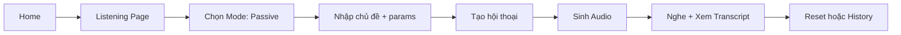
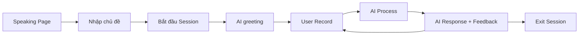

# 📱 StudyLanguage - UI/UX Overview Document

## Tổng quan tài liệu

Tài liệu này mô tả chi tiết giao diện và trải nghiệm người dùng (UI/UX) của ứng dụng StudyLanguage - một ứng dụng học tiếng Anh với 3 kỹ năng chính: **Nghe (Listening)**, **Nói (Speaking)**, **Đọc (Reading)**, **Viết (Writing)**.

> [!NOTE]
> Tài liệu này được tạo để team design có thể hiểu rõ cấu trúc hiện tại và redesign lại ứng dụng.

---

## 📐 Layout Tổng Quan (3-Column Layout)

Ứng dụng sử dụng layout **3 cột** trên desktop:

```
┌──────────────────────────────────────────────────────────────────────┐
│ ┌─────────┐  ┌─────────────────────────────────────┐  ┌────────────┐ │
│ │         │  │                                     │  │            │ │
│ │ SIDEBAR │  │         MAIN CONTENT                │  │   RIGHT    │ │
│ │  240px  │  │         (flex-grow)                 │  │   PANEL    │ │
│ │         │  │                                     │  │   320px    │ │
│ │         │  │                                     │  │            │ │
│ └─────────┘  └─────────────────────────────────────┘  └────────────┘ │
└──────────────────────────────────────────────────────────────────────┘
```

### 1. Sidebar (Cột trái - 240px, collapse được)

| Thành phần | Mô tả |
|------------|-------|
| **Logo Section** | Icon 📚 + tên app "StudyLanguage" + subtitle "Study Smart" |
| **Navigation Menu** | 4 mục: 🎧 Nghe, 🎤 Nói, 📖 Đọc, ✍️ Viết |
| **User Profile** | Avatar (chữ cái đầu email) + email |
| **Collapse Button** | Nút ← / → để thu gọn/mở rộng sidebar |

**Tương tác:**
- Click vào menu item → Navigate đến trang tương ứng
- Menu item active sẽ có màu primary + shadow
- Hover: background nhạt hơn
- Collapse: Sidebar thu về 80px, chỉ hiện icon

### 2. Right Panel (Cột phải - 320px, ẩn trên mobile < xl)

| Thành phần | Mô tả |
|------------|-------|
| **User Info** | Avatar lớn + email + nút Logout |
| **Chưa đăng nhập** | Nút "Đăng nhập với Google" |
| **Theme Switcher** | Chuyển đổi Light/Dark/System |
| **Language Switcher** | Chuyển đổi Tiếng Việt/English |
| **Tips Card** | Card glassmorphism với tip học tập |

**Tương tác:**
- Click "Đăng nhập với Google" → OAuth flow
- Click Logout → Đăng xuất
- Theme/Language switcher → Thay đổi ngay lập tức

---

## 🏠 Trang Chủ (Home Page)

**Route:** `/`

### Layout
```
┌──────────────────────────────────────────────────┐
│         Welcome back! Let's learn 🚀            │
│     Master English with AI-powered learning      │
├─────────────────┬─────────────────┬──────────────┤
│   ┌───────────┐ │   ┌───────────┐ │ ┌──────────┐ │
│   │ 🎧        │ │   │ 🎤        │ │ │ 📖       │ │
│   │ Listening │ │   │ Speaking  │ │ │ Reading  │ │
│   │ Luyện nghe│ │   │ Luyện nói │ │ │ Luyện đọc│ │
│   └───────────┘ │   └───────────┘ │ └──────────┘ │
│                 │                 │              │
│   ┌───────────┐ │                 │              │
│   │ ✍️        │ │                 │              │
│   │ Writing   │ │                 │              │
│   │ Luyện viết│ │                 │              │
│   └───────────┘ │                 │              │
└─────────────────┴─────────────────┴──────────────┘
```

### Thành phần UI
| Thành phần | Mô tả |
|------------|-------|
| **Welcome Title** | "Welcome back! Let's learn 🚀" với gradient text |
| **Subtitle** | Mô tả ngắn về app |
| **4 Skill Cards** | Grid 4 cards, mỗi card gồm: Icon tròn (gradient colors), Tên kỹ năng, Mô tả |

**Skill Cards:**
- 🎧 Listening: Gradient blue → cyan
- 🎤 Speaking: Gradient green → emerald  
- 📖 Reading: Gradient purple → pink
- ✍️ Writing: Gradient orange → amber

**Tương tác:**
- Hover card → Scale up + lift shadow
- Click card → Navigate đến trang kỹ năng

---

## 🎧 Trang Luyện Nghe (Listening Page)

**Route:** `/listening`

### 2 Mode chính:

#### Mode 1: Nghe Thụ Động (Passive Listening)

```
┌────────────────────────────────────────────────────────────────┐
│  🎧 Luyện Nghe - Smart Conversation              [📜 History] │
├────────────────────────────────────────────────────────────────┤
│  [🎧 Nghe thụ động] [🎤 Tham gia hội thoại]         (Mode tabs) │
├────────────────────────────────────────────────────────────────┤
│  ┌──────────────────────────────────────────────────────────┐  │
│  │  Tạo hội thoại mới                                       │  │
│  │  ├─ Chủ đề *          [VD: Đặt phòng khách sạn...    ]   │  │
│  │  ├─ Thời lượng (phút) [5                              ]   │  │
│  │  ├─ Số người          [2                              ]   │  │
│  │  └─ Từ khóa           [reservation, check-in...       ]   │  │
│  │                                                          │  │
│  │  [✨ Tạo hội thoại]                                       │  │
│  └──────────────────────────────────────────────────────────┘  │
└────────────────────────────────────────────────────────────────┘
```

**Form Inputs:**
| Input | Type | Bắt buộc | Mô tả |
|-------|------|----------|-------|
| Chủ đề | Text input | ✅ | Placeholder: "VD: Đặt phòng khách sạn, Mua sắm..." |
| Thời lượng | Number input | ❌ | Min: 1, Max: 15, Default: 5 |
| Số người | Number input | ❌ | Min: 2, Max: 4, Default: 2 |
| Từ khóa | Text input | ❌ | Placeholder: "reservation, check-in..." |

**Buttons:**
| Button | Trạng thái | Hành động |
|--------|------------|-----------|
| ✨ Tạo hội thoại | Active khi có chủ đề | Gọi API sinh hội thoại |
| ⏳ Đang tạo... | Loading state | Disabled |

**Sau khi tạo hội thoại:**
```
┌──────────────────────────────────────────────────────────────┐
│  🎧 Nghe hội thoại                           [🔄 Tạo mới]   │
├──────────────────────────────────────────────────────────────┤
│  ┌────────────────────────────────────────────────────────┐  │
│  │  [Audio Player với progress bar, play/pause, speed]   │  │
│  └────────────────────────────────────────────────────────┘  │
│  ┌────────────────────────────────────────────────────────┐  │
│  │  [Transcript hiển thị - highlight theo audio]          │  │
│  │  ┌─────────────────────────────────────────────────┐   │  │
│  │  │ Person A: "Hello, I'd like to book a room..."   │   │  │
│  │  └─────────────────────────────────────────────────┘   │  │
│  │  ┌─────────────────────────────────────────────────┐   │  │
│  │  │                      Person B: "Of course..."   │   │  │
│  │  └─────────────────────────────────────────────────┘   │  │
│  └────────────────────────────────────────────────────────┘  │
└──────────────────────────────────────────────────────────────┘
```

**Audio Player:**
| Thành phần | Mô tả |
|------------|-------|
| Progress bar | Thanh tiến trình có thể kéo |
| Play/Pause | Nút phát/dừng |
| Time display | Hiện thời gian hiện tại / tổng thời gian |
| Speed control | Tốc độ phát: 0.5x, 1x, 1.5x, 2x |
| 🔊 Sinh Audio | Nếu chưa có audio, hiện nút để AI tạo |

**Transcript Viewer:**
- Person A: Background xanh (blue), căn trái
- Person B: Background xanh lá (green), căn phải
- Câu đang phát: Highlight với ring + glow
- Câu đã phát: Opacity thấp hơn

---

#### Mode 2: Tham Gia Hội Thoại (Interactive Listening)

```
┌──────────────────────────────────────────────────────────────┐
│  🎤 Tham gia hội thoại                                       │
│  "Chọn chủ đề và AI sẽ tạo một cuộc hội thoại để bạn..."    │
├──────────────────────────────────────────────────────────────┤
│  Chủ đề *  [Đặt phòng khách sạn, Mua cà phê...         ]    │
│                                                              │
│  [🚀 Bắt đầu tham gia]                                       │
└──────────────────────────────────────────────────────────────┘
```

**Sau khi bắt đầu:**
```
┌──────────────────────────────────────────────────────────────┐
│  📍 Tình huống: Bạn đang ở quầy lễ tân khách sạn...         │
├──────────────────────────────────────────────────────────────┤
│  ┌───────────────────────────────────────────────────────┐   │
│  │ Receptionist: "Good evening, how may I help you?"    │   │
│  └───────────────────────────────────────────────────────┘   │
│           ┌──────────────────────────────────────────────┐   │
│           │ 🎤 LƯỢT CỦA BẠN                              │   │
│           │ "Respond to the receptionist..."             │   │
│           │                              [animate-pulse] │   │
│           └──────────────────────────────────────────────┘   │
├──────────────────────────────────────────────────────────────┤
│  [🎬 Bắt đầu] [▶️ Tiếp tục] [🎙️ Nói] [⏹️ Dừng] [← Quay lại] │
└──────────────────────────────────────────────────────────────┘
```

**Buttons theo trạng thái:**
| Trạng thái | Buttons hiển thị |
|------------|------------------|
| Chưa bắt đầu | 🎬 Bắt đầu hội thoại |
| AI đang nói | 🔊 AI đang nói... (disabled) |
| Lượt của user | 🎙️ Nói |
| Đang ghi âm | ⏹️ Dừng ghi âm (red) |
| Đang xử lý | ⏳ Đang xử lý... (disabled) |
| Hoàn thành | 🔄 Thử lại |

---

## 🎤 Trang Luyện Nói (Speaking Page)

**Route:** `/speaking`

### Setup Mode (Chọn chủ đề):

```
┌────────────────────────────────────────────────────────────────┐
│                                                  [📜 History] │
│              AI Speaking Coach 🤖                              │
│  "Chọn chủ đề và bắt đầu hội thoại 1-1 với AI Coach..."       │
├────────────────────────────────────────────────────────────────┤
│  ┌──────────────────────────────────────────────────────────┐  │
│  │  Bạn muốn nói về chủ đề gì?                              │  │
│  │  [VD: Daily Routine, My Dream Job, Environmental...  ]   │  │
│  │                                                          │  │
│  │  [🚀 Bắt đầu hội thoại]                                   │  │
│  └──────────────────────────────────────────────────────────┘  │
└────────────────────────────────────────────────────────────────┘
```

### Session Mode (Hội thoại):

```
┌──────────────────────────────────────────────────────────────────────┐
│  ● Technology                           Fluency: 85%                 │
│  AI Speaking Coach Session                                           │
├────────────────────────────────────────┬─────────────────────────────┤
│  ┌──────────────────────────────────┐  │  ┌───────────────────────┐  │
│  │                                  │  │  │ Session Transcript    │  │
│  │    [WAVEFORM VISUALIZER]         │  │  │ ─────────────────────│  │
│  │    (Hiệu ứng sóng âm khi nói)    │  │  │ AI: "Hello! Let's... │  │
│  │                                  │  │  │                       │  │
│  │                                  │  │  │ You: "I think it's..."│  │
│  │                                  │  │  │ [corrections]         │  │
│  │    🔴 Recording... / Tap Mic     │  │  │                       │  │
│  └──────────────────────────────────┘  │  │ AI: "Great point!..." │  │
├────────────────────────────────────────┴─────────────────────────────┤
│                    [⌨️] [🎤] [Exit]                                  │
└──────────────────────────────────────────────────────────────────────┘
```

**Layout:**
| Cột | Nội dung |
|-----|----------|
| Trái (flex-1) | Waveform Visualizer - hiệu ứng sóng âm động |
| Phải (400px) | Session Transcript - lịch sử hội thoại |

**Waveform Visualizer:**
- Background tối với glow effect
- Visualizer hiệu ứng sóng âm
- Text status: "Recording..." (đỏ, pulse) / "Tap Mic to Speak" / "AI is thinking..."

**Session Transcript:**
- Danh sách messages cuộn được
- AI messages: Background tối, icon AI
- User messages: Background primary, có thể có corrections highlight

**Bottom Controls:**
| Button | Mô tả |
|--------|-------|
| ⌨️ | Text input mode (ghost button) |
| 🎤 | Mic button chính, lớn (scale khi đang ghi) |
| Exit | Thoát về setup mode (red) |

**Pronunciation Alert:**
- Popup khi phát hiện lỗi phát âm
- Hiển thị: "Bạn nói: [im-por-tant]" → "Đề xuất: important /ɪmˈpɔːrtnt/"
- Buttons: [🔄 Thử lại] [→ Bỏ qua]

---

## 📖 Trang Luyện Đọc (Reading Page)

**Route:** `/reading`

### Form tạo bài đọc:

```
┌────────────────────────────────────────────────────────────────┐
│  📖 Luyện Đọc - Active Reading               [📜 History]     │
├────────────────────────────────────────────────────────────────┤
│  ┌──────────────────────────────────────────────────────────┐  │
│  │  Tạo bài đọc mới                                         │  │
│  │  ├─ Chủ đề *    [Technology, Environment, Travel...   ]  │  │
│  │  ├─ Độ khó      [Cơ bản ●] [○ Nâng cao]                  │  │
│  │                                                          │  │
│  │  [✨ Tạo bài đọc]                                         │  │
│  └──────────────────────────────────────────────────────────┘  │
└────────────────────────────────────────────────────────────────┘
```

**Form Inputs:**
| Input | Type | Mô tả |
|-------|------|-------|
| Chủ đề | Text input | Bắt buộc |
| Độ khó | Toggle buttons | "Cơ bản" (A1-A2) / "Nâng cao" (B1-B2) |

### Sau khi tạo bài:

```
┌────────────────────────────────────────────────────────────────┐
│  📝 Bài đọc                                                    │
│  💡 Click vào từ để tra từ điển                                │
│  ┌──────────────────────────────────────────────────────────┐  │
│  │  "Technology has revolutionized the way we communicate. │  │
│  │   Modern smartphones allow people to connect instantly..."│  │
│  │   (Mỗi từ có thể click được)                              │  │
│  └──────────────────────────────────────────────────────────┘  │
├────────────────────────────────────────────────────────────────┤
│  ❓ Câu hỏi đọc hiểu                                           │
│  ┌──────────────────────────────────────────────────────────┐  │
│  │  1. What has technology revolutionized?                  │  │
│  │  ┌─────────────────────┐ ┌─────────────────────┐         │  │
│  │  │ A. The way we eat   │ │ B. Communication    │ [●]     │  │
│  │  └─────────────────────┘ └─────────────────────┘         │  │
│  │  ┌─────────────────────┐ ┌─────────────────────┐         │  │
│  │  │ C. Transportation   │ │ D. Entertainment    │         │  │
│  │  └─────────────────────┘ └─────────────────────┘         │  │
│  └──────────────────────────────────────────────────────────┘  │
│                                                                │
│  [📊 Nộp bài] (disabled nếu chưa chọn hết)                    │
└────────────────────────────────────────────────────────────────┘
```

**Tính năng Clickable Text:**
- Click vào bất kỳ từ nào → Mở Dictionary Popup
- Popup hiển thị: Phát âm IPA, Loại từ, Nghĩa, Ví dụ

**Câu hỏi Quiz:**
| Trạng thái | Hiển thị |
|------------|----------|
| Chưa chọn | Background muted |
| Đã chọn | Background primary |
| Sau nộp - Đúng | Background green + ✅ |
| Sau nộp - Sai | Background red |

**Kết quả:**
```
┌──────────────────────────────────────────────────────────────┐
│           Điểm: 3/4                                          │
│        [🔄 Làm bài mới]                                      │
└──────────────────────────────────────────────────────────────┘
```

---

## ✍️ Trang Luyện Viết (Writing Page)

**Route:** `/writing`

### Form viết bài:

```
┌────────────────────────────────────────────────────────────────┐
│  ✍️ Luyện Viết - Writing Assistant            [📜 History]    │
├────────────────────────────────────────────────────────────────┤
│  ┌──────────────────────────────────────────────────────────┐  │
│  │  Viết bài của bạn                                         │  │
│  │  ├─ Chủ đề (tùy chọn)  [My favorite hobby, A trip...  ]  │  │
│  │  ├─ Nội dung bài viết *                                   │  │
│  │  │ ┌─────────────────────────────────────────────────┐   │  │
│  │  │ │ (Textarea lớn, min-height 200px)                │   │  │
│  │  │ │ Placeholder: "Viết bài tiếng Anh của bạn..."    │   │  │
│  │  │ │                                                 │   │  │
│  │  │ └─────────────────────────────────────────────────┘   │  │
│  │  │                                       Số từ: 45       │  │
│  │                                                          │  │
│  │  [🔍 Phân tích và sửa lỗi] [🔄 Viết bài mới]              │  │
│  └──────────────────────────────────────────────────────────┘  │
└────────────────────────────────────────────────────────────────┘
```

**Form Inputs:**
| Input | Type | Mô tả |
|-------|------|-------|
| Chủ đề | Text input | Tùy chọn |
| Nội dung | Textarea | Bắt buộc, đếm số từ realtime |

### Kết quả phân tích:

```
┌────────────────────────────────────────────────────────────────┐
│  ❌ Các lỗi cần sửa                            (red border)   │
│  ┌──────────────────────────────────────────────────────────┐  │
│  │  "I go to school yesterday" → "I went to school..."     │  │
│  │  💡 Sử dụng thì quá khứ đơn cho hành động đã xảy ra      │  │
│  └──────────────────────────────────────────────────────────┘  │
├────────────────────────────────────────────────────────────────┤
│  💡 Gợi ý cải thiện                                           │
│  • Sử dụng đa dạng các thì hơn                               │
│  • Thêm các từ nối để văn mạch lạc hơn                       │
├────────────────────────────────────────────────────────────────┤
│  ✨ Phiên bản cải thiện                       (green border)  │
│  ┌──────────────────────────────────────────────────────────┐  │
│  │  "Yesterday, I went to school by bus. It was a lovely   │  │
│  │   day and I enjoyed my classes very much..."             │  │
│  └──────────────────────────────────────────────────────────┘  │
└────────────────────────────────────────────────────────────────┘
```

---

## 📜 History Panel (Dùng chung)

**Trigger:** Nút [📜 History] ở góc phải header mỗi trang

### Drawer Slide-in:

```
┌─────────────────────────────────────┐
│  Lịch sử học tập         [✕ Close] │
├─────────────────────────────────────┤
│  🔍 [Tìm kiếm theo chủ đề...    ]  │
│                                     │
│  [📚 Tất cả][🎧][🎤][📖][✍️]       │ (Type tabs - nếu không filter)
│  [🔵 Tất cả][📌 Ghim][⭐ Yêu thích][🗑️]│ (Status tabs)
├─────────────────────────────────────┤
│  ┌─────────────────────────────────┐│
│  │ 📌 Ordering Coffee              ││
│  │ 🎧 Listening • 5 phút trước     ││
│  │ [📌] [⭐] [🗑️] [→ Mở]           ││
│  └─────────────────────────────────┘│
│  ┌─────────────────────────────────┐│
│  │ ⭐ Hotel Booking               ││
│  │ 🎧 Listening • 2 giờ trước      ││
│  │ [📌] [⭐] [🗑️] [→ Mở]           ││
│  └─────────────────────────────────┘│
├─────────────────────────────────────┤
│  Trang 1/3 • 25 bản ghi   [←] [→]  │
└─────────────────────────────────────┘
```

**History Card Actions:**
| Action | Icon | Mô tả |
|--------|------|-------|
| Pin | 📌 | Ghim entry lên đầu |
| Favorite | ⭐ | Đánh dấu yêu thích |
| Delete | 🗑️ | Xóa mềm (có thể restore) |
| Open | → | Mở lại entry để học tiếp |

---

## 🎨 Design System Hiện Tại

### Colors (CSS Variables)
```css
--background: hsl(240 10% 3.9%)  /* Dark background */
--foreground: hsl(0 0% 98%)      /* Light text */
--primary: hsl(142 76% 36%)      /* Green primary */
--muted: hsl(240 3.7% 15.9%)     /* Muted elements */
--accent: hsl(240 3.7% 15.9%)    /* Accent color */
```

### Glassmorphism Effects
- `backdrop-blur-xl`
- `bg-black/40` hoặc `bg-white/10`
- `border border-white/10`
- `shadow-xl` hoặc `shadow-glow`

### Animations (Framer Motion)
- Page transitions: Fade + slide
- Stagger children: Delay cho grid items
- Skeleton loading states
- Hover lift effects

### Typography
- Font: System default (Inter on macOS)
- Headings: Bold, gradient text for emphasis
- Body: Regular, line-height relaxed

---

## 📱 Responsive Design

| Breakpoint | Thay đổi |
|------------|----------|
| **Mobile (< lg)** | Sidebar ẩn, có hamburger menu |
| **Tablet (lg)** | Sidebar visible, Right Panel ẩn |
| **Desktop (xl+)** | Full 3-column layout |

### Mobile Specific:
- Bottom navigation bar (planned)
- Full-width cards
- Stacked form layout
- Touch-friendly button sizes

---

## 🔄 User Flows

### Flow 1: Luyện Nghe Passive


### Flow 2: Speaking Session


---

## ⚠️ Known UI Issues

1. **Mobile Sidebar**: Chưa implement hamburger menu
2. **Loading States**: Một số nơi chưa có skeleton
3. **Error Handling**: Cần improve error UI
4. **Accessibility**: Chưa có aria labels đầy đủ
5. **Offline Support**: Chưa có offline indicator

---

## 📋 Design Redesign Checklist

- [ ] Mobile-first responsive design
- [ ] Improved navigation on mobile (bottom nav?)
- [ ] Better loading/skeleton states
- [ ] Enhanced glassmorphism effects
- [ ] Micro-interactions và transitions
- [ ] Dark/Light theme polish
- [ ] Accessibility improvements (WCAG)
- [ ] Onboarding flow cho user mới
- [ ] Progress tracking dashboard
- [ ] Gamification elements (badges, streaks)

---

*Tài liệu được tạo ngày: 2026-01-12*
*Phiên bản hiện tại: v1.0*
